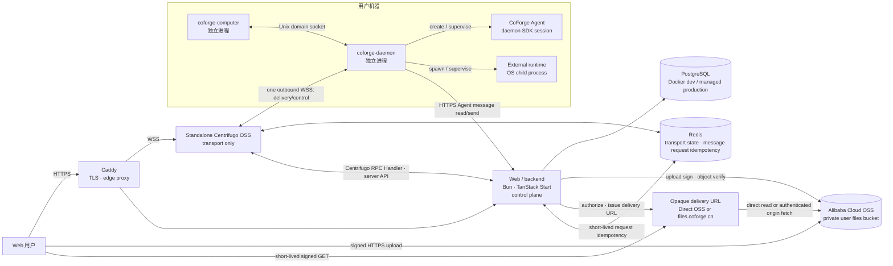

# CoForge 架构基线

状态：验证阶段架构基线

更新时间：2026-09-07

适用范围：仓库结构、云端服务、本地进程、消息投递与开发工具链

本文是 CoForge 当前架构的唯一规范来源。已确定的边界直接写在正文，仍需 ADR 的设计会明确标记为“提案”。

## 1. 架构目标

CoForge 让用户通过 Web 私聊或群聊多个 code agent，同时把 Agent 实际执行隔离在用户机器上各自的 Agent workspace 目录中。首个验证版本优先保证：

- 云端不直接进入用户机器，所有远程连接由本地主动发起；
- 一个 workspace 的崩溃、卡死或内存泄漏不拖垮其他 workspace；
- 消息在断线、重连和重复投递时不丢失且不重复交给 Agent；
- 云端业务控制面、实时传输面与本地执行面边界清晰；
- 先以最少服务跑通纵向链路，不提前引入 Kubernetes 或微服务拆分。

首版是消息系统，不是命令或工作流平台。当前垂直切片支持一个 Workspace 内 User↔Agent 的 DirectConversation，以及真人和 Agent 参与的公开频道。频道通知遵循成员 mute 设置与真人个人 mention 规则，Agent 发言不自动唤醒其他 Agent。run、stream event、generic job 和 workflow 暂不进入骨架核心。

## 2. 总体拓扑



`Web/backend ↔ Centrifugo` 的 Handler/API schema 与 RPC namespace 尚未定型；图中只固定职责与数据方向，不固定其内部 wire protocol。这里的 `Centrifugo RPC Handler` 是 Web/backend 内部接收和分派请求的组件，不是独立业务服务；认证、授权、Use Case、持久化和 Token 签发仍归 Web/backend。

## 3. 包与进程不是同一个层级

本地产品包含两个可独立构建、版本化和打包的 package component。内置 Agent runtime 可以是独立 library/runtime package，但不能成为第三个本地产品组件：

```text
apps/
└── web/
    └── Web UI 与 backend control plane

packages/
├── computer/
│   └── 机器级 setup、安装与 supervisor package component
├── daemon/
│   └── machine supervisor, per-Workspace daemon runtimes, and code-agent drivers
└── agent/
    └── 使用 Pi SDK 的内置 Agent runtime package；由 coforge-daemon 安装和启动
```

必须保持以下区别：

| 名称               | 发布边界                                                                                     | 运行时关系                                                      | 核心职责                                                      |
| ------------------ | -------------------------------------------------------------------------------------------- | --------------------------------------------------------------- | ------------------------------------------------------------- |
| `coforge-computer` | 独立 package component；唯一面向用户的本地安装入口，并在构建时依赖 `coforge-daemon` package  | 独立 OS 进程                                                    | 机器身份、安装升级、启动/停止和健康检查 Daemon role           |
| `coforge-daemon`   | 独立 package component；其 role 编译进统一 `coforge-computer` executable，不发布独立 payload | 由统一 executable 的 `__daemon` 模式启动为独立 OS 进程          | 对齐期望/实际 workspace 集合，管理子进程生命周期和崩溃恢复    |
| Agent runtime      | 不独立发布                                                                                   | CoForge 在 daemon 内创建 SDK session；外部 runtime 是 OS 子进程 | provider-neutral driver 后的 Agent 执行                       |
| `@coforge/agent`   | 可独立打包的 runtime package；不是本地产品组件或用户安装入口                                 | daemon 内创建的 SDK session                                     | 封装 Pi SDK、内置 extensions、skills 和 CoForge Agent factory |

因此禁止把 daemon runtime 拆成第三个本地产品组件。需要隔离的是运行时进程，而不是发布包。

源码分类、可独立构建边界、运行时边界与用户安装边界不是同一层级。仓库在 `packages/` 下保留两个本地 package component；`coforge-computer` 在 package/build 层依赖 `coforge-daemon`，Daemon 再依赖精确版本的 `@coforge/agent`。monorepo 开发时 Bun workspace 链接本地 package；Daemon 的独立 source build 可以继续作为测试/开发 artifact，但不得进入用户 release。发布流水线为每个 target 只生成一个统一的原生 `coforge-computer` executable，其中包含 Computer、Daemon 与 Agent CLI roles。主入口把 `__daemon` 分流到 Daemon runtime，把 `__agent-cli` 分流到现有 `@coforge/cli/runner`，普通调用进入 Computer management CLI。统一文件不会合并进程职责：Computer 启动同一文件的 `__daemon` 模式作为独立 OS 进程，双方继续通过 Unix domain socket 通信。

这是 2026-09-07 经用户批准的发行布局决策。选择单一 executable 是为了去掉双 payload 的下载、校验和版本配对面，同时保留两个 source package 的所有权边界与故障隔离。代价是 unified build 必须同时包含两侧依赖，任何一侧变化都要重新发布整个 executable，不能独立替换 Daemon bytes；构建时仍须向两个 role 注入同一个 release version，以便运行时 handshake 和诊断一致。回滚只切换完整的旧版 Computer executable。已经发布的 rc1–rc3 保持 immutable，不修改也不补兼容对象；跨越旧双 payload 布局必须 fresh bootstrap，因为旧 updater 不应被假定能理解 schema 2。不得添加 raw artifact、双 payload 或旧 manifest fallback。

本文不加限定词的 `workspace` 指云端协作、成员、权限、conversation 与 Agent 的逻辑边界。每个 Agent 另有自己的文件系统 Agent workspace 目录，它不是第二个逻辑 workspace。文档必须用限定词区分两者。

Members 是 Workspace 内的人员与 Agent 目录，不是当前用户拥有的 Agent 管理列表。经用户批准，Workspace 真人成员可读取同一 Workspace 全体人员与 Agent 的名称、简介、类型，以及 Agent 所绑定且仍关联此 Workspace 的电脑名称。目录仅返回显式选择的基本字段，不返回邮箱、头像存储键、运行配置或凭据。目录可见性不授予 Agent 私聊、资料管理、配置或重启权限；这些操作继续使用原有 owner 授权接口。无需新增 schema、邀请或角色模型。

`coforge-computer` 与 `coforge-daemon` 通过 Unix domain socket 通信。不得为了方便而给本地管理接口开放 TCP 监听端口。

## 4. 云端职责

### Caddy：边缘网关

- 申请与续期 TLS 证书；
- 提供 HTTPS/WSS 公网入口；
- 反向代理、健康检查和负载均衡；
- 与应用进程独立常驻，应用滚动更新时保持入口稳定。

验证阶段运行两个 Centrifugo 副本和两个 backend 副本。发布时一次 drain 一个副本，新连接只进入健康实例；不引入 Kubernetes。当前仓库提供单节点本地验证用的 [`infra/docker-compose.yml`](../infra/docker-compose.yml)，生产 Compose 与发布流水线仍未实现，不能复用已删除的 custom Go gateway 部署资产。

Caddy 不理解 conversation、message、Agent 或 workspace 业务。

### Web/backend：业务控制面

- 用户、机器与 workspace 的鉴权和授权；
- 私聊/群聊 conversation 与 participant；
- canonical message 的创建、持久化和路由决策；
- 使用 Redis 对消息发送 `request_id` 做短期幂等抑制；
- 向目标 Agent 发送易失 attention，并以 canonical Message/read boundary 支持恢复；
- 普通业务 API、Web 页面和 PostgreSQL migration（统一使用 Prisma，详见 [ADR 0003](adr/0003-prisma-as-postgresql-data-access.md)）；
- 接收并保存 Agent response/stream，再推送给会话参与者。

初始实现使用 Bun 1.4 与 TanStack Start，不使用 Next.js。前期保持模块化单体，只有出现清晰的扩缩容或故障隔离需求时才拆服务。生产构建使用 Nitro 的 Bun preset 生成自包含 server output，并以非 root 用户运行在不可变 Docker image 中；Nitro 3 adapter 当前仍是 beta，进入 production 前必须验证构建、启动、健康检查、优雅停止及 PostgreSQL/Centrifugo 集成路径。

消息发送方生成并在同一消息重试中复用 `request_id`。Web/backend 使用现有 Redis，以 Workspace、`user`/`agent` sender kind、稳定 sender ID 和 `request_id` 组成 key，通过带短 TTL 的原子 processing claim 抑制并发重复持久化；成功结果保留 24 小时。User→Agent 的 canonical Message 持久化在幂等执行内，Centrifugo attention publication 在外；publication 失败不影响 canonical Message，后续由 Message/read boundary 恢复。Redis 缺失或不可用时发送 fail closed，但读取不依赖 Redis。PostgreSQL Message 仍是 canonical 数据，Redis 不承担 durable replay。该短期 MVP 明确保留 PostgreSQL commit 与 Redis 结果写入之间的双写崩溃窗口；claim 过期后可能重复创建 Message，不声称提供永久 exactly-once。

#### Web Push 通知

Web/backend 自托管 standards-based Web Push。浏览器的 Service Worker 使用 Push API 接收由 push service 转发的加密 payload，因此即使 CoForge 页面已关闭也能显示 Notification；点击后先经认证 landing route 校验 Workspace membership、选择消息所属 Workspace，再通过稳定 message anchor 滚动并高亮 canonical Message。PostgreSQL 保存每个 User 的应用级 push 偏好，以及每个浏览器 profile/device 一条独立 subscription（endpoint 与该 subscription 的客户端公钥材料）。公开 VAPID 公钥只通过已认证的 settings seam 返回浏览器；稳定的 VAPID P-256 私钥仅存在于服务端 Secret。部署使用 `COFORGE_WEB_PUSH_PUBLIC_KEY`、`COFORGE_WEB_PUSH_PRIVATE_KEY_FILE` 和固定非 secret subject `COFORGE_WEB_PUSH_SUBJECT=https://coforge.cn`，不得把私钥写入环境文件、日志、客户端 bundle 或仓库。所有 Web 副本共享同一稳定 key pair；轮换必须作为会使既有 subscription 重新订阅的受控操作处理。macOS Safari 直接使用标准 Web Push；iPhone 和 iPad 按 WebKit 平台规则先通过 manifest 安装为 Home Screen app，Settings 在未安装时显示对应步骤。

Push 是 canonical Message commit 之后的 best-effort side effect，不是消息投递或恢复边界：发送失败、超时或 push service 不可用都不能回滚或重复创建 chat Message；同一个 `request_id` 的短期幂等重放不得重新发送 push。消息是否产生 push 由 Web/backend 根据接收用户偏好和 conversation 通知规则决定；channel mute 抑制普通浏览器 push，真人或 Agent 明确 `@username` 时均穿透该 User 的 channel mute。Agent-originated message 不改变 Agent 唤醒规则。push payload 按 [RFC 8291](https://www.rfc-editor.org/rfc/rfc8291) 加密，app-server identification 使用 [RFC 8292](https://www.rfc-editor.org/rfc/rfc8292) VAPID；按照 [Push API](https://www.w3.org/TR/push-api/#push-subscription) 保留浏览器提供的 opaque absolute HTTPS endpoint，不维护 push-service 域名白名单，同时拒绝包含账号密码或 fragment 的 URL。发送前使用系统 resolver 解析全部地址并拒绝任意非公网结果，再以一次性 HTTPS Agent 将连接锁定到已校验地址；TLS hostname 与证书校验仍使用原 endpoint hostname，避免 loopback、私网、link-local 和 DNS rebinding 绕过。subscription endpoint 按 bearer capability 保护并不得记录。push service 返回 HTTP 404 或 410 时删除对应无效 subscription，其他失败只记录脱敏的可观测结果。Settings 中的 test push 必须只发送到当前 browser subscription，并经过同一个后端发送 use case、加密和失效清理路径，不能有绕过生产路径的测试实现。登出时即使服务端关联清理失败，也必须在跳转前从浏览器注销当前 subscription 并关闭已显示通知，防止共享浏览器上的下一位用户收到旧账户通知。

实现固定为 Bun 1.4 下精确 pin 的 [`web-push` 3.6.7](https://github.com/web-push-libs/web-push)（MPL-2.0 dependency license）。选择依据与 trade-off：直接实现 RFC 被拒绝，因为内容加密、VAPID 和各 push service 互操作的长期安全维护成本过高；managed provider 在当前 MVP 被拒绝，因为会引入外部 domain ownership、供应商数据边界和运行依赖；`web-push` 复用成熟的 standards implementation 且不新增业务服务，但 npm 3.6.7 release 已陈旧，因此每次采纳或运行时升级前必须以精确版本执行 Bun 1.4 的 subscription、RFC 8291 payload encryption、VAPID signing、成功发送及 404/410 compatibility tests，未通过不得进入 production。浏览器行为以 MDN 的 [Notifications API](https://developer.mozilla.org/en-US/docs/Web/API/Notifications_API) 与 [Push API](https://developer.mozilla.org/en-US/docs/Web/API/Push_API) 为实现入口，传输模型遵循 [RFC 8030](https://www.rfc-editor.org/rfc/rfc8030)。

### Standalone Centrifugo：实时传输面

- 使用 standalone Centrifugo OSS 持有长期 WSS 连接并提供双向 RPC/订阅传输；
- 通过官方 HTTP/gRPC proxy 机制，经 Web/backend 内部的 `Centrifugo RPC Handler` 把需要业务判断的请求交给 backend，并执行 backend 已作出的发布与断开决策；Handler 只负责接收、校验和分派，不拥有业务逻辑；
- 使用 Redis engine 提供跨副本 fan-out、presence 与 bounded hot history；Web/backend 的
  Computer 在线状态也使用独立的 Redis 90 秒租约，由 Daemon 每 30 秒通过已鉴权的
  `daemon:connection_status` 续租；租约不是 PostgreSQL 业务事实。
- 处理连接/session lifecycle、背压、心跳、重连与 framing。

Centrifugo 不拥有业务规则，不直接读写 PostgreSQL，不适配具体 Agent，也不把 hot history 或传输 ACK 解释为 durable truth。详细边界见 [ADR 0001](adr/0001-standalone-centrifugo-and-compose-data-services.md)。

浏览器在已登录的应用布局内按当前 Workspace 只建立一条 Centrifuge WSS 连接，
Agent status 与聊天订阅复用该连接。每个打开的会话使用受保护的
`chat:<conversation_id>` client-side subscription；Web/backend 仅在确认真人是私聊成员，
或是公开频道所属 Workspace 的成员后，签发 5 分钟、精确绑定该 channel 的 subscription JWT。
Message mutation 仍通过已认证 HTTPS 完成；PostgreSQL 提交 canonical Message 后，backend
通过 Centrifugo server API 发布不含正文的 versioned `message.available.v1` 信号，其中仅有
conversation ID、message ID 和 canonical sequence。`chat` namespace 使用 Redis-backed
5 分钟 bounded history 和强制 recovery，作为短断线 hot replay，不是消息真相。

浏览器收到信号后以自身最后一次 canonical HTTP cursor 调用 `afterSequence`，按 message ID
去重并按 conversation sequence 排序；100 条一页时持续读取至 drain 完成。首次订阅、
无法恢复的重连、重新可见、恢复联网以及前台每 30 秒 safety interval 都执行同一 HTTP
reconciliation。这样 publication 102 先于 101 到达时也不会跳过 101。MVP 明确保留 PostgreSQL
commit 后、Centrifugo publication 前 backend 崩溃的窗口，不引入 transactional outbox；
该窗口由前台 safety reconciliation 修复，因此不声称每个已提交消息都在 2 秒内被 push。

Daemon 到 Web/backend 的 Agent message read/search/send 使用独立的 HTTPS RPC
边界，并携带 Daemon API key；该边界的 URL 是 daemon connection
config 的 `serverHttpUrl`（启动时可由 `COFORGE_SERVER_HTTP_URL` 注入）。未配置
时请求 fail closed，绝不回退到 WSS。Server→Daemon 的 delivery、ready、ACK
和 heartbeat/control 仍使用 daemon 唯一的 outbound WSS/RPC 连接。Daemon API key
认证出的 `(workspace_id, computer_id)` 是服务端定向投递身份；Connect Proxy 在认证连接时把它绑定到
`daemon:<workspace_id>:<computer_id>` control stream，Daemon 不再为同一 channel 发起第二次客户端订阅。
这里的 stream/channel 是 Centrifugo 的定向路由机制，不是业务实体。Agent start、message delivery、runtime usage scan
及其他面向一个 Workspace–Computer connection 的控制消息只发布到该 channel，不向同一
Computer 的其他 Workspace 或 Workspace 内其他 Daemon 广播。

#### Workspace-scoped remote Computer restart

经用户批准，Web 可为当前 Workspace 中已授权的 Computer 发布
`coforge.rpc.v1.ComputerRestartIntent`。Intent 携带稳定 `request_id`、`workspace_id` 与
`computer_id`，并只进入上述复合 scope control channel；Daemon 在当前进程内按
`request_id` 去重，再把请求交给 Computer supervisor 提供的 Workspace-scoped replacement
callback。Centrifugo 接受 publication 只表示请求已接受，不表示重启完成，90 秒 online lease
也不是完成证据。替换后的新 Daemon 进程必须在 `daemon:runtime_ready` 中报告新的
`worker_instance_id`、实际 Daemon version，以及已恢复的 restart request ID；只有这组
fresh process identity/version/recovery evidence 才可用于确认完成。Web/backend 使用现有 Redis
按 Workspace、Computer 与 request ID 保存有界的重启请求和 ready evidence。请求时记录当前 worker
process identity；只有 Agent 恢复处理成功后，同 scope 的已认证 ready 同时报告不同的实际
`worker_instance_id`、实际 Daemon version，并在 `recovered_restart_request_ids` 中包含该 request ID，
才把状态从 accepted 改为 completed。状态在 60 秒后转为 timeout，并在 5 分钟后过期；它不是
durable command mailbox，也不表示 Agent turn 完成。重发同一个 request ID 不应产生第二次
replacement；本地不新增 durable command mailbox。

Agent runtime 的授权分层如下：Web/backend 每次 launch 签发一次明文只返回
一次的 `sk_agent_...` Agent API key，仅由 Daemon 的 Credential Proxy registration 保存，
并用于 Daemon→Web/backend 的 Agent message HTTPS RPC。子进程环境和本地
CLI 只得到生命周期绑定的 opaque `sfp_...` Proxy token；二者不是同一类
授权材料，也没有 wall-clock expiry。Agent API key 绑定签发请求的 `computer_id`；
Agent message 鉴权要求同时提供的 Daemon API key 与 key 记录属于同一 Computer。
每次签发在 PostgreSQL 事务中锁定 Agent row，先撤销该 Agent 的全部旧 active key，
再创建新 key，因此崩溃遗留 key 会在下次 launch 回收，跨 backend 并发签发也按
Agent 串行。停止、退出或 shutdown 时仍按 exact key 撤销。
Daemon 通过受 Daemon API key 保护的 Agent API key HTTP
route 签发和撤销该 key；远端撤销失败必须按失败返回，不能宣称
成功。本地 Proxy registration 无论远端结果如何都先撤销。Daemon WSS 建连使用
Centrifugo 官方 Connect Proxy：Daemon API key 通过 SDK connect data 发送，由
Web/backend 校验 hash、撤销状态和 Workspace/Computer 绑定后返回连接身份，并把这条连接绑定到
Computer-directed Daemon control stream；Daemon 不额外创建同 channel subscription。普通 Daemon HTTPS 请求使用 `Authorization: Bearer
<daemon-api-key>`。用户授权的 Computer 注册仍可使用独立的用户 JWT；它不是
Daemon API key，也不会持久化到 Daemon。本地不引入 durable outbox。

Agent 的 `message search` 在 PostgreSQL canonical Message 上执行不区分大小写的
lexical/关键词匹配，不使用 embedding 或向量索引。查询同时约束当前 Workspace 和
Agent 实际加入的 Conversation；因此私聊只可搜索该 Agent 参与的私聊，频道只可搜索
该 Agent 已加入且可读的频道。可选 target、sender、时间范围和分页过滤沿用同一授权
边界；有 query 时默认使用 PostgreSQL 全文相关性排序，`--sort recent` 可显式改为时间
倒序。结果只返回 Message ID、公开 target、公开 sender、body 和创建时间，不返回内部
sequence。Agent 可用返回的 Message ID 执行 target-scoped `message read --around`。

### PostgreSQL：云端持久状态

业务授权的主体是 Web/backend 自己的 Internal User（稳定 UUID）。Authing
或其他身份提供商的 subject 只在登录映射边界通过 UserIdentity 解析，不能
作为 WorkspaceMembership、Agent 或 Computer 的业务外键。
Internal User 同时拥有稳定、全局唯一且登录后不变的 `username`；公开用户目标
统一表示为 `@username`，不得把 provider subject 或内部 UUID 暴露为聊天目标。
用户可设置独立的 `displayName` 作为界面展示名称；未设置时回退到当前身份提供商姓名，
不改变稳定 `username` 或任何业务外键。

PostgreSQL 的首要领域对象是：

- `agent`（Agent 元数据属于 Web/backend；Daemon 只消费启动意图中的 runtime config）
- `agent_activity`（已成功到达 backend 的 Agent 观测历史；不保证完整）
- `conversation`
- `participant`
- `message`

`run` 表示一次 Agent 执行，`event` 表示执行中的流式片段、工具或状态记录；二者不是 delivery 的核心，不应在骨架阶段过早锁死。最终表名、字段、索引与 migration 内容由 backend 设计评审确定，数据访问标准为 Prisma。

### Alibaba Cloud OSS：私有用户文件数据面

当前验证实现先使用 Web/backend 私有本地文件目录（`COFORGE_FILE_STORAGE_DIR`）保存聊天附件和用户头像字节，PostgreSQL 只保存稳定 object key 和 metadata。该实现不支持多 backend 共享、对象复制、孤立上传自动清理或直接上传；生产部署仍必须切换到下述 private OSS adapter。客户端通过能力接口读取服务端限制，因此切换 adapter 不改变文件契约。

首个 OSS bucket 承载聊天图片、文件附件和需要登录才能读取的用户头像，必须保持 `private`。聊天附件与头像使用独立 object key 前缀和各自的应用授权规则。Bucket 不使用 `public-read` 或 `public-read-write`；Web 静态资源和以后若需匿名公开的头像使用独立 bucket，不能与私有用户文件混放。浏览器与 OSS 之间的文件传输使用 HTTPS 数据面，不经过 Centrifugo，也不改变 daemon 只使用 WSS/RPC 的传输边界。

计划中的 production CDN 文件访问边界是 `https://files.coforge.cn/{object_key}`。私有用户文件与发行产物使用两个独立的加速域名（见 [ADR 0006](adr/0006-split-cdn-delivery-domains.md)）：`files.coforge.cn` 只回源 private user-files bucket 并开启 URL 鉴权，`releases.coforge.cn` 只回源 private release bucket 且不做客户端签名；两个域名各自独立的 RAM 权限、缓存/访问规则与日志，互相没有对方 bucket 的读取授权，因此不存在 origin 或策略 fallback。路径与 object key 一一对应，不改写业务前缀。CDN 域名不接收应用登录 cookie，应用 cookie 必须保持 host-only，CDN 也不得向 origin 转发 Cookie。CDN 配置完成前，Direct OSS adapter 仍可返回短时 provider URL；客户端把 delivery URL 视为 opaque value，数据库仍只保存 object key，因此切换到 CDN 不需要数据库 migration、对象复制或客户端发版。Bucket 名称、Region、实际 endpoint 与域名启用时间属于部署配置，确认前不得写死；启用中国内地 custom domain 前，部署检查必须确认域名已经完成 ICP 备案。

上传链路固定为：

1. Web 客户端通过已认证的 backend 控制面请求上传授权，并提供目标 workspace、conversation、文件大小和声明类型；
2. backend 校验当前用户仍是该 conversation 的 active participant，检查配额，分配稳定 `attachment_id` 与服务端生成的 `object_key`，并创建可过期的 durable upload intent；intent 绑定发起 participant、workspace、conversation、精确 object key 与预期文件 metadata；
3. backend 使用服务端 RAM 身份获取短时 STS 凭据并生成 V4 Post Policy，或直接生成等价的短时 V4 上传签名；授权只允许 intent 中的精确 object key，并限制有效期、大小、类型且禁止覆盖；
4. 浏览器使用该短时授权通过 HTTPS 直接上传到 OSS；长期 AK/SK 永远不会到达浏览器；
5. 客户端通知 backend 上传完成；backend 要求同一个发起 participant 和未过期 intent，向 OSS 校验对象存在性、key、大小和必要 metadata，匹配后把 intent 标记为可绑定；
6. 只有 intent 的创建者可以把它一次性绑定到同一 conversation 的 canonical message，绑定与 message commit 必须原子完成。过期、失败、已消费或 conversation 不匹配的 intent 都拒绝引用。

附件只有在关联到请求者可见的 committed canonical message 后才能下载或预览；未发送草稿与孤立 upload intent 不签发 GET URL。数据库只保存稳定 `object_key` 与 committed-message 附件 metadata，不保存 bucket、endpoint、delivery provider 或 OSS/CDN signed URL；物理 bucket 和域名映射属于 adapter 部署配置。Signed URL 是 bearer credential，必须短时有效且不得写入数据库、日志或 analytics；返回它的 backend 响应必须 `Cache-Control: no-store`。访问权被撤销后，已签发 URL 最长仍可用到自身过期时间，因此 TTL 就是明确的撤销延迟上界。过期、失败或未绑定 intent 对应的孤立对象由明确的 retention cleanup process 最终清理。

用户头像由登录用户通过 backend 资料接口上传、替换或移除；当前实现接受 JPG、PNG、WebP，最大 5 MB，并校验声明类型和文件头。Backend 生成不可覆盖的 object key，成功提交新头像引用后才删除旧对象。头像读取接口只服务已认证请求，不允许调用方提供 object key；数据库仅保存当前头像的 object key 与 content type。

#### 下载授权 seam

Backend 对调用方只暴露一个 `AttachmentDownloadAuthorizer` interface：

```text
authorize_attachment_download(
  authenticated_requester,
  message_id,
  attachment_id
) -> { url, expires_at }
```

这是一个深模块：它根据 `message_id` 解析 workspace 与 conversation，校验请求者的 membership 和 committed message 可见性，确认 `attachment_id` 实际绑定到该 message，再把已授权的稳定 `object_key` 交给当前 delivery adapter。调用方不提供 object key、bucket 或 provider，返回值也不暴露 provider kind；因此授权规则、对象身份和客户端契约均不依赖 OSS 或 CDN。Driver 只负责签发可交付 URL，不重做 conversation 授权，也不接受客户端提供的任意路径。

同一个内部 adapter slot 有两个实现：

- **Direct OSS adapter** 根据部署配置将稳定 object key 映射到 private bucket，并仅对该精确 key 签发短时 V4 presigned GET URL。
- **Private CDN adapter** 对 `https://files.coforge.cn/{object_key}` 的规范化路径和过期时间生成 CDN signed URL。CDN POP 在查找缓存前验证客户端签名；未签名、签名不匹配或已过期的请求拒绝。CDN 签名密钥只存在于 backend Secret 与 CDN 配置，不是 OSS 凭据。

切换 adapter 只改变部署配置和 URL 签发方式；不改变 interface、object key、message/attachment 记录，不需要复制对象或发布客户端新版本。

#### CDN 客户端鉴权、回源授权与缓存键

Private CDN driver 必须把两条授权链分开：

1. **客户端 → CDN POP** 使用 backend 生成的 CDN signed URL，只证明持有者在 TTL 内可访问该规范化 object path。Backend 在每次签发前仍执行 committed-message 可见性授权；CDN 不认识 workspace、conversation 或 requester。
2. **CDN POP → private OSS origin** 使用阿里云 CDN private-bucket origin access 的独立服务身份和只读授权。CDN 在 cache miss 时为回源请求生成 `Authorization` header；客户端 CDN 签名参数必须在回源前移除，不能被当作 OSS 签名转发，也不能与 origin header 签名叠加。Bucket 保持 private，且该 CDN 身份仅授予 user-files bucket 的回源只读能力；鉴于该功能可读取 origin bucket 内全部对象，该 bucket 除聊天附件与私有用户头像外不得混放其他业务对象。

CDN 必须先验证 signed URL，再用去掉签名、过期时间和 nonce 等鉴权材料后的 `files.coforge.cn/{object_key}` 规范化 path 作为缓存身份。这样同一 immutable object 的不同短时 URL 共享一个 cache entry，但未授权请求仍会在 cache lookup 前拒绝。`requester_id`、workspace/conversation/message id、原始文件名和 delivery-provider 不进入 URL 或 cache key。任何会改变字节、响应权限或安全相关 header 的变体都不得从 cache key 中忽略；如以后需要变体，必须给它独立的 immutable object key 或纳入 cache key。对象禁止覆盖；内容变更必须使用新 `attachment_id`/object key，以免旧缓存与数据库身份分叉。

Canonical object key 使用 workspace-first 隔离：

```text
workspaces/{workspace_id}/attachments/{attachment_id}/original
users/{user_id}/avatars/{avatar_id}/original
```

聊天附件以 workspace 前缀隔离，头像以 user 前缀隔离。消息与附件的关联、用户与当前头像的引用都保存在 PostgreSQL，不把 conversation/message 层级编码进对象路径。原始文件名只作为清洗后的 metadata 保存，不能参与权限边界或直接拼接路径。OSS CORS 只允许明确的 CoForge Web origin；服务端 RAM 用户只允许 `AssumeRole`，上传 role 只获得目标 bucket/prefix 所需的最小 `PutObject` 权限。真实 AK/SK 只能放部署 Secret，不得进入仓库、日志、命令行参数或前端构建产物。

实现依据为阿里云官方的 [client direct upload](https://www.alibabacloud.com/help/en/oss/user-guide/uploading-objects-to-oss-directly-from-clients/)、[server-side V4 signing](https://www.alibabacloud.com/help/en/oss/user-guide/obtain-signature-information-from-the-server-and-upload-data-to-oss)、[private object signed URL](https://www.alibabacloud.com/help/en/oss/developer-reference/download-objects-using-a-presigned-url-generated-with-oss-sdk-for-node-js)、[custom domain rules](https://www.alibabacloud.com/help/en/oss/user-guide/access-buckets-via-custom-domain-names)、[CDN URL signing](https://www.alibabacloud.com/help/en/cdn/user-guide/configure-url-signing)、[private OSS origin access](https://www.alibabacloud.com/help/en/cdn/user-guide/grant-alibaba-cloud-cdn-access-permissions-on-private-oss-buckets) 与 [custom cache key](https://www.alibabacloud.com/help/en/cdn/user-guide/create-custom-cache-keys)。

## 5. 本地执行面

### coforge-computer

coforge-computer 是机器级 supervisor，不执行 workspace 内的 Agent 业务。它是唯一面向用户的安装与升级入口，负责安装单一 unified executable，并管理登录后的机器身份、Daemon role 的启动停止与健康检查。

统一的 `coforge-computer` 可执行文件承载 `packages/cli` 的内部 Agent 消息命令入口 `__agent-cli`，
此入口在初始化 Computer/Daemon 日志、socket、云端连接和 Workspace 恢复之前分流。安装器在每个版本目录生成
小型 `coforge` 启动脚本，固定调用同目录 `coforge-computer __agent-cli`；Daemon 把自身可执行文件目录放在
Agent PATH 最前。用户执行 `coforge-computer`，Agent 执行 `coforge`，不额外发布第三个原生文件。Agent 授权仍由现有
局部代理 context 约束，复用二进制不合并运行时职责。发布仅提供 gzip 压缩文件；
安装器验证压缩与解压后身份，不保留旧原始文件 feed 的兼容分支，具体契约见
[`docs/release.md`](release.md)。

Computer 通过当前用户的原生进程管理器托管唯一、前台运行的机器级 Coordinator：Linux 使用
`systemd --user` unit，macOS 使用 per-user `launchd` LaunchAgent；管理器负责登录会话内启动和
崩溃重启，CLI 只通过本地 Unix Socket 发出一次性控制请求，不常驻也不拥有 Supervisor。
manager/container 不可用的环境必须显式运行 `coforge-computer foreground` 并由外部 supervisor
托管；任何普通命令都不得退化为 detached unmanaged process。安装和运行不请求 sudo，不启用
linger，不修改 root 或系统级 service。Computer 不开放 TCP 管理端口。

`login` 仍可用于单独重新认证，但普通用户不需要先执行它。推荐入口是单个 `setup` 流程：没有 User credential 时在流程内部完成 OAuth 2.0 Device Authorization Grant；先通过 RFC 8414 metadata 发现 device authorization 与 token endpoint，再按 RFC 8628 展示 user code、轮询并处理 `authorization_pending` / `slow_down`。轮询连接超时后降低请求频率并重试，单次请求必须受 device-code 剩余有效期约束。凭据不进入命令参数或日志。

本地发行包在构建时固定环境，不提供公开的 `--server` 参数：staging 的更新源
`https://releases-staging.coforge.cn` 对应业务服务器 `https://staging.coforge.cn`；
production 的更新源 `https://releases.coforge.cn` 对应 `https://coforge.cn`。
Computer 的登录、setup、start/restart 与同包 Daemon 的 HTTPS/WSS 使用同一环境；
运行时环境变量不能改变发行包的服务器。已有 Computer profile 或 Daemon config
属于另一环境时拒绝启动，不覆盖配置或携带旧凭据连接新环境。缺少服务器身份的
旧 Daemon config 也不能推断归属后自动恢复。测试通过内部模块/构造函数注入本地
服务，不为测试保留公开切换参数。Bun 构建常量替换遵循其
[define 文档](https://bun.com/docs/bundler#define)；不改变 runtime 版本或云端协议。

本地 Unix RPC handshake 返回 Daemon 的构建服务器身份 `server_url`；configure
和生命周期 command 携带 `expected_server_url`，Daemon 在凭据验证、配置写入和
运行时操作之前检查它。Computer 在登录、setup、start/restart 之前检查已有配置和
存活 socket，即使 Computer profile 不存在也不跳过；真正发送 configure/command
的连接仍须重新验证身份。不带服务器身份的旧 peer 拒绝复用。
setup 发现已注册的 launchd service 时，不改写其 plist，也不强制 kickstart；
随后仍须通过实际发送配置的 socket 验证身份。普通 `stop` 只通过已验证的 RPC
停止 Workspace 运行时和 Agent，不终止 Daemon 进程，也不卸载或停止 OS service。
`start` 和 `restart` 操作同一 Daemon 内的运行时。这避免了在 socket 验证后，
再按可被并发替换的共享 OS service label 执行破坏性停止或重启。

MVP OAuth client 使用 `client_id = coforge-computer` 与 `scope = openid offline_access`。Workspace 页面为当前 Workspace 创建一次性 setup intent，并通过 CoForge Computer setup deep link 或安装器参数传入；用户不输入 Workspace ID/slug，也不在 Computer 端选择 Workspace。`UserAccessToken` 仅用于 Computer 注册；注册响应中的 `DaemonApiKey` 是供 Daemon 连接云端的长期、可撤销 API key。Agent API key 是独立的 Agent 授权材料；三者不可混用。持久 credential 通过 Bun 的跨平台原生 credential API 写入 macOS Keychain、Linux Secret Service 或 Windows Credential Manager，不允许自动降级为明文文件。Linux 无可用 Secret Service 时 setup 以稳定错误失败并提示用户启动或解锁系统凭据服务。

`setup` 创建或恢复指定的 Workspace–Computer connection；重复 setup 同一 Workspace 更新该 binding，setup 另一 Workspace 则新增 binding，绝不替换、撤销或停止既有 binding。每个 binding 有独立 Daemon API key、配置、Workspace 数据和 Daemon 子进程。`start|stop|restart --workspace <slug>` 仅作用于该 binding；省略 scope 作用于全部本地 binding。停止只改变期望运行状态，不删除身份、凭据、Workspace 数据或 Agent workspace。

`machine_id` 是机器的稳定内部注册身份，跨 Computer、Daemon 与 daemon 的重启和升级保持不变，但不用于用户界面的展示或选择。2026-09-08 用户批准 Computer 增加 `name` 与 `displayName`：`name` 默认取系统 hostname；`displayName` 默认取人类可读的 Computer Name，macOS 使用 `scutil --get ComputerName`，Linux 使用 pretty hostname，Windows 使用系统 Computer Name，读取失败时统一回退 hostname。Web 列表、详情和 Agent 的 Computer 选择统一使用这两个名称。Computer 注册属于 setup 中的用户主动授权操作，并通过 `computer:register` RPC 完成；其精确 envelope、payload、幂等键和 machine proof 按 [ADR 0004](adr/0004-computer-daemon-rpc-topology-and-protobuf.md) 的实现 packet 固定。

### coforge-daemon

OS/Computer 只托管一个机器级 Coordinator；其源码与发布所有权仍在 `coforge-daemon` package，统一 executable 以内部模式运行它。Coordinator 持久化 binding 与期望运行集合、串行化 lifecycle/upgrade，并从第一个 Workspace 起为每个 binding 创建独立的 OS-managed Daemon instance。实例 A 永不因实例 B 被加入而迁移、重启或切换运行模式；后续 Workspace 只新增独立实例。每个实例各自持有一条 Workspace WSS 并管理该 Workspace 的 Agent session。CLI 仍是一次性调用者，不拥有 supervision 业务逻辑。

每个 Workspace 的本地 lifecycle 进度由 Coordinator 独占写入既有
`~/.coforge/daemon/bindings.json`（显式 state directory 时使用该目录）；Workspace daemon
不写这个 registry，也不拥有其他 Workspace 或机器级恢复。Frank 已批准在此文件内完成窄范围
重启状态机：先持久化 `restart {requestId, phase: stopping, previousInstanceId}`，确认旧 OS unit
停止后持久化 `starting`，启动或收养 replacement 并完成本地 readiness handshake 后，清除 pending
并保存 `completed` receipt。使用 systemd 的
[`InvocationID`](https://www.freedesktop.org/software/systemd/man/latest/systemd.exec.html#%24INVOCATION_ID)
而不是 PID 识别同一次 OS 运行周期，避免 PID 重用误判。恢复 `stopping` 不会停止一个身份不符的
新实例；恢复 `starting` 收养已启动 replacement，不为了重复请求再重启一次。

用户已批准 Workspace unit 使用 `Restart=on-failure`，由 systemd 在失败后清理旧 cgroup
并启动 replacement，`KillMode=mixed`、`SendSIGKILL=yes` 保证旧残留进程参与清理。
若此时 Coordinator 的持久阶段仍为 `stopping`，不同 InvocationID 表示 OS 已替换；
Coordinator 不再停止它，仍通过相同 stable unit 的 PID、版本与本地 handshake 验证后收养。
显式 systemctl stop 不触发自动重启；持久 disabled 在 Coordinator 恢复时继续执行 stop。
此策略受 systemd 启动频率限制，不承诺永久重试，也不新增本地 Agent 自启动扫描。
官方依据：[systemd kill](https://github.com/systemd/systemd/blob/main/man/systemd.kill.xml)、
[systemd service](https://github.com/systemd/systemd/blob/main/man/systemd.service.xml)。

2026-09-09 用户批准 macOS 对齐同一 Workspace 生命周期状态机：每个 Workspace 使用独立的
per-user launchd job，失败重启由 `KeepAlive.SuccessfulExit=false` 托管。每个外部 Agent root
另由独立的 scoped launchd job 托管，同一个 Computer executable 的内部 `__managed-agent` 模式
通过权限为 0600 的私有 Unix Socket 转发 provider-neutral stdio；命令与 Agent 环境只通过该
通道传递，不写入 plist。Workspace 启动前清理自身 scope 的旧 Agent jobs，显式停止先 bootout
Workspace，再清理该 scope 的 Agent jobs；其他 Workspace 不受影响。Coordinator 崩溃恢复
仍复用 persisted restart receipts、enabled 状态与 daemon handshake，不按旧 PID 发信号。
macOS 原生观测使用有文档的 `launchctl list` PID 和 `ps` 启动时间，并在握手前后复核；不解析
明确不属于 API 的 `launchctl print` 输出，也不把秒精度的启动时间当作 Linux InvocationID。
`AbandonProcessGroup=false` 清理 job 的残留进程组。它不是 cgroup 或敌对代码 sandbox：主动
脱离进程组的后代不在此保证内。仅机器级 Coordinator 的 LaunchAgent 在登录时注册，Workspace
与 Agent plist 位于私有状态目录，由 Coordinator 恢复；不新增产品组件或系统级服务。
官方依据：[Apple launchd.plist](https://github.com/apple-oss-distributions/launchd/blob/main/man/launchd.plist.5)、
[Apple launchd jobs](https://developer.apple.com/library/archive/documentation/MacOSX/Conceptual/BPSystemStartup/Chapters/CreatingLaunchdJobs.html)。

显式 stop 先持久化 `enabled=false` 并将 pending restart 记录为 `cancelled`，再停止 OS unit；
恢复后仍保持停止，取消请求重放失败。完成/取消 receipts 最多保留最近 128 条，幂等保证限定于
该保留窗口；旧 `restartRequestIds` 只作为历史 cloud hint，不作为本地完成证据。registry 使用
0600 临时文件、文件 sync、同目录原子 rename 与目录 sync；保存失败不提前更新内存，后续操作
重新读取磁盘以处理 rename 后错误。单个 Workspace 恢复失败不阻断其他 binding 的恢复，保留本地
控制用于 stop/retry；registry 无法读取或损坏则 fail closed。cloud ready hint 与本地 completed
receipt 不同，前者不证明后者已落盘。此状态机不扩展为通用任务系统，不改变 Agent 会话上报或
Message ACK 的语义，也不提供云端/provider transcript durability 保证。

Supervisor lifetime mutex 使用 `coforge-daemon` platform 模块导出的同步 `acquireProcessLock(path)`：
它在本机私有、本地文件系统上稳定且不会被替换的 SQLite 文件上保持
[`BEGIN IMMEDIATE`](https://sqlite.org/lang_transaction.html) transaction，返回值的
`release()` 关闭强持有的 database handle。该文件只用作锁，不创建 schema/table 或写入业务数据；
任何参与者都不得读取原始内容、truncate、unlink、rename 或用 stale-owner 判断回收它。进程退出（包括
SIGKILL）由 OS/SQLite 释放锁，文件 inode 永久保留。选择 Bun 内建
[`bun:sqlite`](https://bun.com/docs/api/sqlite) 是因为它随四个目标二进制交付；
[`fs-ext`](https://github.com/baudehlo/node-fs-ext) 的 NAN binding 没有文档化 Bun 兼容保证，
[`node-flock`](https://github.com/yodaos-project/node-flock) 的 N-API 实现自 2019 年后未维护且 dynamic
loader/source build 会增加四目标发布负担。`supervisor.lock/owner` 可以暂留为升级集成的
诊断 marker，但不具有互斥权威；只有受保护 shutdown 确认清理后才删除 owner marker。Supervisor 必须先
取得 lifetime mutex 再恢复旧 child，并在正常 shutdown 或 startup failure 后关闭 handle。该 mutex
仅承担必要的 foreground 排他与并发显式 foreground 时安全恢复 Supervisor 自有旧 child；它不扩大为
通用机器变更锁。install、upgrade、rollback 的完整 prepare/activate/restore 流程另由
`machine-mutation-lock.sqlite` 在整个操作期间串行化。这一锁方案及依赖取舍由 Frank 于
2026-09-07 明确批准。

```text
coforge-daemon Coordinator 1 ──管理──> N independent Workspace instances
each daemon instance 1 ──管理──> 1 配置 Workspace
daemon instance 1 ──管理──> N Agent runtime session
daemon 1 ──管理──> N Agent ──各自拥有──> 1 Agent workspace 目录
Agent 1 ──执行于──> 1 CoForge SDK session 或外部 runtime process
```

每个逻辑 Workspace binding 由其独立 daemon instance 直接维持云端连接。CoForge Agent session 与该 instance 同进程，外部 provider execution 才是其独立 child process；同一 Workspace 的重启不会迁移到其他 instance，新的运行实例仍使用同一个稳定 `workspace_id`，不会因此创建新的 Workspace。

每个 coforge-daemon instance 负责一个配置、WSS 生命周期、SDK session 生命周期、外部子进程创建/回收和版本兼容，但不直接解析各家 Agent 的输出协议。Coordinator 不在 instance 之间迁移运行时。替换同一 Agent 时必须先撤销旧本地权限；外部 child 需要有界等待 graceful stop，超时后终止整个进程树，并等待 direct child exited 完成父进程回收，旧 child 未确认退出前禁止新 launch。CoForge SDK session 通过 SDK abort/dispose 结束。Unix runtime 使用独立进程组并按组终止。Windows 在引入 Job Object 并能确认整个进程树为空之前 fail closed，不启动外部 Agent，不能用只检查根 PID 的 `taskkill /T` 结果伪装完整回收。MVP 不设置 capacity pool、排队或跨 Workspace 调度。

Computer 的云端在线状态由 daemon 的单条 Workspace WSS 连接实时派生；`online` 与 `last_seen_at` 不作为持久化真相。

2026-09-09 用户批准 Computer 详情的 OS、Computer Version 与 Creator 元数据。
每次 Workspace Daemon startup/reconnect ready 通过既有 `DaemonRuntimeReadyRequest`
加法可选字段 `computer_version` (11)、`platform` (12)、`os_version` (13) 报告。
Computer executable 入口把自身 build version 传入 Daemon runtime；不得以 Bun/Node 的
`process.version`、外部 Code Agent 或 Daemon package fallback 冒充 Computer Version。
OS 观测由 Daemon platform 模块共享：macOS 使用 `/usr/bin/sw_vers -productVersion`，
Linux 使用 kernel release，Windows 使用 OS release；读取失败保留未知，不把 Darwin kernel
标成 macOS 产品版本。依据：[Apple sw_vers](https://github.com/apple-oss-distributions/DarwinTools/blob/DarwinTools-1/sw_vers.1)、
[Bun os.release](https://bun.com/reference/node/os/release)。

Web 在认证 Workspace–Computer scope 和 ready identity 后，将最后非空观测保存到
PostgreSQL Computer 的 nullable `computerVersion`、`platform`、`osVersion`；
`metadataStartedAt` 沿用 ready 的进程启动时间作条件写入，旧进程不得覆盖新观测。
此值不是在线状态、审计时间或可信硬件证明。缺失/空字段不清空已有值，离线保留最后观测，
旧设备没有观测时显示 Unknown。旧注册客户端曾把 runtime version 当成 OS version，
因此注册字段不作为此快照来源；新注册客户端也修正采集，持久快照仍由 Daemon ready 更新。
迁移仅加可空字段，无猜测回填；先部署兼容 Web/迁移再升级 executable，回滚保留字段即可。

Creator 始终来自 Computer 首次注册时的不可变 `ownerId` 关联 User，显示其当前头像、
displayName（缺失回退 username）和 @username；Daemon 不上传或修改 Creator。
头像下载限定 `/api/computers/$computerId/creator-avatar?workspaceId=...`，每次请求验证
登录 User 是该 Computer 所属 Workspace 的成员后，再读取原 owner 的既有头像存储；
返回 no-store，不使用只代表当前用户的 `/api/me/avatar`，不开放任意 User ID 头像查询。

### daemon-owned Agent runtime 与 code-agent driver

Provider identity 的唯一来源是 shared protocol/domain 的 `RUNTIME_PROVIDER`
常量及其 `RuntimeProvider` 类型；`RuntimeMetadata.kind` 仍独立区分
`builtin` 与 `external`。Daemon 负责检测外部 Code Agent；Computer 注册不再承担
runtime 发现。

Daemon 直接管理同一 `workspace_id` 下的多个 Agent。每个 Agent 在本机拥有稳定的 Agent workspace，规范相对路径是 `workspaces/<workspace_id>/agents/<agent_id>`；`workspace_id` 与 `agent_id` 必须是不可变身份，目录不能由名称、provider、session 或进程 ID 派生。该目录是 Agent runtime 的 cwd；daemon 只能访问这些已声明目录和允许的环境变量。daemon 通过 provider-neutral code-agent driver 管理 Agent runtime，对上层暴露统一的启动、发送、中断、销毁以及状态/活动语义。`AgentProcessManager` 在 session 创建边界统一构建包含 Agent workspace 与 CoForge 通信规则的 standing instructions，并通过必填的 `AgentSessionOptions.instructions` 交给 driver；driver 只负责使用 provider 原生的 system/developer-instruction 机制原样注入。CoForge Agent 由 driver 在 daemon 内直接创建 SDK session；Pi、Codex、Claude Code 等用户安装 runtime 由 driver 启动 OS child process。Agent control protocol 是 driver 内部可替换的实现细节；可以使用 provider 正式支持的 native protocol、SDK 或 ACP，不作为上层 architecture contract。

CoForge Agent 的 Pi SDK 配置与 session 必须和用户安装的 Pi 分离，并且按 Agent workspace 保存：配置目录为 `<agent_workspace>/.builtin-runtime`，session 目录为 `<agent_workspace>/.builtin-sessions`；外部 Pi 使用 `<agent_workspace>/.pi-sessions`。CoForge Agent 不读取或写入用户 Pi 的全局配置、认证或 session 文件。内置 CoForge provider/model 目录在 release 时由 pinned Pi SDK 为 CoForge 支持的单 API-key provider 集合生成，并嵌入 `@coforge/agent`/Daemon；用户安装的外部 Pi 目录仍在本机动态发现。

Session 与 Skills 的作用域不同。内置 CoForge Agent 与外部 Pi 的 Session 只在当前 Agent workspace 的专属目录中创建和恢复：resume 接受精确 session ID 并按当前 cwd 过滤；路径形式的 ID、歧义或越界符号链接必须失败。确认原 ID 缺失时可以按下述可用性优先策略分配新 ID，但绝不能创建同 ID 新会话冒充恢复成功。外部 Pi 从 `.pi-sessions` 精确解析文件后传给原生 `--session <file>`，并检查 `get_state` 返回相同 ID 和文件；不让 CLI 执行 ID 前缀或全局 fallback。

2026-09-08 用户确认 Claude Code/Codex 对齐 Raft 的宿主原生存储方式，不再要求两者的 Session 文件只存 Agent workspace。二者仍以 Agent workspace 为 cwd，保留原生登录、配置和 Global Skills；不自动创建隔离 config home、不复制或改写用户 Global Skills、不扩大环境变量透传白名单。Claude 启用原生持久化，有 ID 时传 `--resume <id>`，首条 stream input 同时携带该 ID；Codex 使用持久 `thread/start(ephemeral: false)`，有 ID 时改用 stable `thread/resume(threadId)`，并验证返回相同 ID。不使用最新会话、交互式 picker 或 fork 代替指定 ID。全局存储复用不是会话所有权检查或 OS 隔离，driver 接受可信调用方传来的绑定 ID；云端将绑定限制在对应 Workspace/Computer/Agent/provider，不能开放任意用户输入的全局 Session ID。

用户随后批准可用性优先的恢复语义：已知 `empty` 或无 ID 的会话直接不下发 Session ID，
新建会话，不上报恢复错误或 recovery 提示；正常新 identity 仍需上报。非空会话优先恢复，
仅在 driver 将启动错误归类为会话缺失或可安全判定的启动期不可重放时，确认旧 runtime
已清理后重试一次 fresh session，并记录 `recovered`。认证、网络、未知错误和未确认退出
不得触发 fallback；歧义、权限、损坏和其他 I/O 错误同样保守失败。fallback 必须分配新
identity 并声明替代旧 ID，不能以相同 ID 冒充 resume。切换 runtime/provider 新建会话，
保留 Agent workspace。

用户已确认三个独立的前端操作；Reset 与 Start 是一个按钮触发的组合操作，不要求用户再点 Start：

| 操作          | 停止完成后的动作                                                        | Agent workspace                                                     |
| ------------- | ----------------------------------------------------------------------- | ------------------------------------------------------------------- |
| Restart Agent | 优先恢复原绑定；空会话直接新建，已分类的恢复错误允许一次 fresh fallback | 保留全部文件                                                        |
| Reset Session | 清除旧 Session 绑定，不下发 ID，启动新会话                              | 保留全部文件，包括 Skills 和旧本地 Session 文件                     |
| Full Reset    | 清空当前 Agent workspace，清除旧绑定，不下发 ID，启动新会话             | 删除其中全部文件，包括隐藏配置、Workspace Skills 与 Pi Session 文件 |

三种操作均先确认旧 Runtime/进程树已停止。Full Reset 必须经明确的破坏性确认；路径由
可信 Workspace/Agent 身份计算，不能由浏览器指定。删除范围不包含用户 HOME、Global
Skills、其他 Agent 目录、云端 Message 或位于原生 HOME 的 Claude/Codex Session 文件。
停止失败禁止删除或启动；删除失败禁止启动；Start 失败明确报告失败，不伪装操作成功。
Full Reset 已删除的用户文件不可因随后 Start 失败而自动还原。重新启动可重新生成必要的
运行目录；“清空”不是要求运行中的 Agent workspace 永久为空。

应用层 `AgentControl` 以固定 command chain 组合上述操作：Stop → Start、Stop →
Clear Session → Start、Stop → Reset Workspace → Clear Session → Start。前端不编排
步骤，Daemon 不接收单独的 `full-reset` 命令。Chain 表达顺序，持久化状态机以成功
回执推进；同一 Agent 的整个组合共享 request/epoch，通过条件写入拒绝其他操作插入。
Clear Session 是云端本地步骤，与下一步骤状态在同一 PostgreSQL 事务提交；Session 与
控制写入先锁 Agent 行，再重新读取关联 Session，避免旧快照覆盖新的绑定或可恢复状态。
执行结果未知时保留当前步骤，重发沿用原标识；明确失败停止推进。失败的 Full Reset
不由 ready recovery 或普通 Start 绕过，显式重试重新建立 Stop/Reset 前置条件。
这保证顺序、互斥和防重复，不是跨进程、文件系统和数据库的全有或全无事务；无通用
工作流引擎、任务队列或自动补偿。原子命令的拆分参考
[Raft 1.0.17 官方发行包](https://registry.npmjs.org/@botiverse/raft-daemon/-/raft-daemon-1.0.17.tgz)
中独立的 `agent:stop`、`agent:reset-workspace`、`agent:start` dispatch，不据此推断私有前端实现。

上述完整控制契约已获用户批准并接入 owner Profile。`AgentSession` 是 native identity
与 state 的唯一持久化所有者，并以 Agent/Workspace/Computer/provider 为 assignment scope；
`Agent.currentSessionId` 指向当前会话。`Agent.runtimeSession` JSONB 只保存上游 launch fence：
provider、Computer、start request、Daemon instance、launch ID 与 session mode；读取时从
`AgentSession` hydrate native identity/state。`Agent.controlState` JSONB 只保存当前
epoch/action/phase/sequence 控制进度，不复制 native Session ID，也不是通用任务表。新 launch
报告不同 identity 时新建 Session 行，保留旧行；同一 launch 不允许偷偷换 identity。
Session 不是 Profile 列表或 transcript 展示功能。

单条 WSS 使用独立的 `agent:stop`、`agent:reset-workspace`、`agent:start` 命令以及
`agent:control:result`、`agent:session` 回报。组合命令携带同一个 control epoch。
Web 按可信 Daemon claims、当前成员关系、assignment、
配置 revision 和 request/epoch/launch 条件落库后 ACK；旧报告不能覆盖当前绑定。创建、
配置/凭据变更、ready recovery 和启动授权共享此控制边界。初始化、identity/turn 变化、
正常停止和 reconnect 重放当前 Session/control 快照，不上传正文，不挪用 best-effort
Activity 或 runtime inventory。超时表示结果未确认，不能当作停止或删除成功。
用户确认前端不查询控制状态、不展示操作进度或按钮等待态；只发起三种操作，Full Reset
仍需删除确认，提交失败提供反馈，运行情况由现有 Agent Activity 展示。控制 request/epoch
与结果确认留在内部，不拿可能丢失的 Activity 代替执行安全检查。

Daemon 的 `AgentControl` 只负责 stop/reset-workspace/start、恢复策略与控制结果；`AgentSessions`
独立负责 native identity 更新、持久化当前 Session snapshot 及 WSS 发送/重放。
`AgentRuntimeState` 按 Agent 串行化两者对同一记录的原子更新，控制切换中的绑定捕获/清除
与控制状态一起提交，旧 launch 的延迟 Session 更新不能复活已 Reset 的绑定。启动与正常
停止由 DaemonRuntime 编排，重连先重放控制结果再重放 Session snapshot。统一 RPC callback
把 `agent:session` 交给 Session acceptance seam；带 sequence 的 snapshot 先校验上游 launch
fence，再交给独立 snapshot receiver。Session 路径与控制结果 receiver 分离，复用可信 scope
校验与数据库条件写入，但不能推进或完成控制操作。

Daemon 在 workspace 外原子持久化每 Agent 控制防护记录；Full Reset 清空后先落盘再
启动，重复 request 只重放结果，不能再次删除新文件。根/祖先 symlink 拒绝，目录内部
symlink 只删除链接。缺失/损坏防护记录、未确认清理或硬崩溃遗留 starting/running/stopping
状态 fail closed；更高云端 epoch 不能证明旧进程已退出。目前没有自动孤儿进程协调或
已有停止 workspace 的无记录收养流程，这些情况可能保持 pending，需要人工诊断，
不能把删除防护记录当作修复。启动后才发生的 provider replay 错误尚不自动 fresh fallback。

部署需要兼容 Web receiver 和加法数据库迁移，再配套升级 Daemon；旧 Daemon 没有完整
控制能力时不能以 publish 成功冒充完成。未实现协议能力协商，混合版本部署应关闭操作
入口。回滚保留 Session 数据和本地防重放记录，不能让旧版本绕过未完成 Reset；已删除
文件不可回滚。数据库迁移和发布需另行授权，本切片只在本地 orb 验证。

目录检查发生在 provider discovery 前，但不是 OS sandbox，也不声称阻止同一 OS 用户在检查之后替换文件。实现依据为 Pi v0.84.3 的 [SessionManager](https://github.com/earendil-works/pi/blob/v0.84.3/packages/coding-agent/src/core/session-manager.ts)（`open` 接收文件路径，传入 `sessionDir` 不自动限制该路径）、[CLI session resolution](https://github.com/earendil-works/pi/blob/v0.84.3/packages/coding-agent/src/main.ts)，以及 [Claude CLI flags](https://code.claude.com/docs/en/cli-reference) 和 [Codex app-server](https://developers.openai.com/codex/app-server)。不通过修改 HOME 来实现 session 隔离，不改变 provider 安装或现有登录配置。

`running_command` Activity 的 `message` 保留 provider 上报命令的前 100 个 Unicode 字符，超出部分由 Daemon 截断，然后通过云端持久化并展示。`reading_file`、`writing_file`、`editing_file` 和 `using_tool` 完整保留 adapter 上报的原始 `message`，不截断或替换。这些 Activity 不做参数脱敏，因此可能包含命令参数、文件路径、工具明细或其他敏感文本。

一台 Computer 始终随 Daemon 交付内置 CoForge Agent runtime；此外允许存在零个或多个用户安装的 code-agent runtime。内置 runtime 不通过本机扫描发现，其版本来自当前 Daemon build；用户安装的 Pi、Codex 与 Claude Code 通过各自真实 `--version`/native handshake 检测可执行文件和版本。Daemon 在启动完成及每次 WSS 重连 ready 后扫描有效 executable search path；除服务进程继承的 `PATH` 外追加各平台常用的用户安装目录、mise/asdf/Volta shim，以及 macOS Homebrew 目录，避免依赖 interactive shell 初始化；同一搜索路径用于后续启动，不能出现“检测到但无法启动”。Daemon 通过 Pi RPC 与 Codex app-server `model/list` 尽力读取当前账号可用的模型目录。Claude Code 的初始化输出不提供可靠的模型目录，因此已安装 Claude Code 时直接上报维护中的静态模型与 reasoning 目录；当前静态目录包含 `opus`、`fable`、`sonnet`、`haiku` 及 8 个版本化 Claude ID，不设置推荐模型。该目录是 CoForge 的可维护支持列表，不声称是当前账号权限或 Raft 内部实现的完整镜像。`daemon_runtime:code_agents_update` 同时上报完整 runtime 快照和模型目录；模型项包含 code-agent provider、模型 ID、显示名称、Pi 的底层 model provider，以及该模型支持的 reasoning 值。Backend 校验外部输入大小和字段后，对可信 Workspace–Computer scope 事务性更新 PostgreSQL 快照；已有 runtime 的公开状态在库存更新时保留，新探测到的 runtime 默认仅 Computer 所有者可见。所有者始终可以选择自己的外部 runtime，并可逐个向当前 Workspace 公开或再次设为私有；其他 Workspace 成员只能查看和选择已公开项，公开不允许跨 Workspace 访问。Computer 页面只向请求者显示其可见的 Provider 与版本；Agent 创建页面按所选 Computer 展示请求者可见的已安装 Provider 的模型和 reasoning 选项。安装新 Provider 或账号模型权限变化后只需重启或重连 Daemon，不需要重新注册 Computer。未选择模型或 reasoning 时使用 provider 默认值；选择值时 Backend 必须按该 Computer 最近上报的目录和公开状态校验，Daemon driver 必须把选择转换成对应 provider 的原生启动配置。静态 Claude Code 目录不保证当前账号拥有每个模型；实际不可用时由 Claude Code 返回明确错误。Agent 对产品和 Web 只暴露 `online`、`offline` 两种业务状态：Agent runtime process 存在且由 AgentProcessManager 持有时为 `online`，进程退出或被停止后为 `offline`。该状态从本地进程生命周期派生，不单独维护或持久化。daemon 使用两个上报通道提供 Agent 信息：`agent:status` 只携带 `online` 或 `offline`，`agent:activity` 携带 starting、stopping、turn、工具、错误和警告明细；activity 不新增 Agent 状态。Activity 是观测数据：Daemon 通过 WSS 向专用 `activity:<workspace_id>` namespace 发起 best-effort publication，不等待业务确认、不重试、不写本地 spool，失败也不影响 Agent 生命周期或消息处理。Centrifugo publish proxy 校验可信 connection metadata、Workspace、Computer、Agent 与 payload scope；Backend 把成功接收的 observation 幂等写入 PostgreSQL，供 Agent Profile 和 Activity tab 查询，并从可信 connection metadata 记录 Computer。observer 失败仍允许丢弃，因此持久历史可能缺项，不承担 Agent 状态、审计或业务事实。没有可用的用户 runtime 不阻止 Computer 或 Daemon 启动，安装并配置合适 runtime 前不能执行对应 Agent。

PostgreSQL 中的 Code Agent installation 与 model catalog 快照以可信的
`(workspace_id, computer_id, provider)` 为复合身份；同一 Computer 的不同 Workspace 各自保存
库存和 `is_public`，任何读取、替换或可见性修改都必须带 Workspace scope。
从旧的仅 Computer-scoped inventory 迁移时，若任一旧 Computer 不能唯一映射到一个
Workspace connection，迁移必须 fail closed 并停止；不得猜测、复制到多个 Workspace 或把
全局库存当作 scoped catalog。迁移成功后所有 runtime 与 model catalog 读写都使用该复合 scope。

浏览器先加载最近 100 条 Activity 历史，再以当前 Workspace 成员专属 token 订阅
`activity:<workspace_id>` 的 protobuf 连接；此连接与 JSON status 连接分离。
历史与实时事件按 launch ID/client sequence 去重，重连补取 best-effort 历史，不承诺完整回放。
Idle 仅表示正常 turn 结束，不表示用户任务成功。后续恢复会移除 Profile 上的旧失败提示，
但 Activity 历史保留失败记录。Profile/Activity tabs 固定在独立滚动内容区之外。

内置 `coforge` 使用的模型 Provider API key 属于单个 Agent runtime config，不是 User 或
Computer 的共享凭据。同一 User 的两个 Agent 可以配置不同 key。只有 Agent owner
可以设置、替换或删除；其他 Workspace 成员不能查看凭据是否存在。Web/backend 使用
应用独立的 256-bit 主密钥和带随机 96-bit nonce 的 AES-GCM 加密后，将密文 envelope
保存在 `runtimeConfig.provider.apiKey`；认证附加数据绑定 `agent_id` 与 `provider_id`。
持久化的 Runtime Config 使用 `runtime`、`provider`、`model`、`reasoning` 结构，CoForge Agent
的 provider 使用 `kind = coforge`、`providerId` 和加密的 `apiKey`。Agent detail 只返回
不含 `apiKey` 的 Runtime Config 和 owner 可见的末四位提示。

`agent:status` 是 volatile lease state，协议携带 `daemon_instance_id`、`client_seq`、`observed_at_ms`。`observed_at_ms` 在一个 daemon instance 内固定为该 instance 的启动时间；同一 instance 按 sequence 排序，不同 instance 按该启动时间排序，避免旧 instance 的延迟状态覆盖替代它的新 instance。lease renewal 可以重放同一逻辑状态记录。浏览器 live event 与 reconnect snapshot 使用同一排序合并规则，equal active lease refresh 只延长、不缩短 expiry。

Agent 启动时，Daemon 使用绑定到 Agent owner 与 Computer 的启动授权 HTTPS 请求取得
Agent API Key；Web/backend 在同一个响应中解密并返回 provider config。Daemon ready
recovery 和其他 `agent:start` intent 只通过 WSS 发送非敏感 provider config。Daemon
runtime 不判断具体 Runtime 或解释 provider config，只将其传给选中的 code-agent driver。Pi driver 只向
内置 SDK factory 仅在 daemon 进程内接收 launch-only provider config，不启动 `coforge-agent`；明文
删除，并在创建 session 前调用 Pi `ModelRuntime.setRuntimeApiKey(providerId, apiKey)`。
明文不得写入数据库、文件、日志、Activity 或 Daemon 的长期 runtime state。AES-GCM 的选择
遵循 [Web Crypto `SubtleCrypto.encrypt`](https://developer.mozilla.org/en-US/docs/Web/API/SubtleCrypto/encrypt)
对 authenticated encryption 与 12-byte IV 的建议；Bun 官方
[Web APIs](https://bun.com/docs/runtime/web-apis) 声明支持 `crypto` 与 `SubtleCrypto`。

2026-09-08 用户明确批准对齐 Raft 的指定执行权限：Codex `thread/start` 和 `thread/resume` 显式发送 `sandbox: "danger-full-access"`、`approvalPolicy: "never"`；Claude Agent 启动显式发送 `--dangerously-skip-permissions --permission-mode bypassPermissions`。这些指定字段覆盖 provider 全局同名设置，其余全局设置仍由 provider 加载，CoForge 的工作目录选择、环境变量过滤与现有工具配置不扩大。关闭 provider sandbox 后，工作目录不是文件访问安全边界；systemd cgroup 只提供进程生命周期约束，不是恶意代码隔离。此安全决策不批准其他 Raft 架构、会话引用存储或 restart 持久化策略。官方依据：[Codex start](https://github.com/openai/codex/blob/main/codex-rs/app-server-protocol/schema/typescript/v2/ThreadStartParams.ts)、[Codex resume](https://github.com/openai/codex/blob/main/codex-rs/app-server-protocol/schema/typescript/v2/ThreadResumeParams.ts)、[Claude CLI](https://code.claude.com/docs/en/cli-reference)。无需额外添加 `--allow-dangerously-skip-permissions`。

CoForge 内置 SDK 使用显式 session ID，未指定时使用稳定 Agent ID，在该 Agent 的 `.builtin-sessions` 中查找并打开对应会话；不迁移无法确定归属的旧会话。恢复的是已落盘历史而非存活进程，SDK 首条 assistant 消息前的缓冲不保证落盘。

2026-09-08 用户批准云端会话引用闭环：Workspace Daemon ready 仅报告当前运行集合，Web/backend 决定启动哪些 Agent，并在现有 `agent:start` 中选择 `AgentSession` 保存的原始 provider `session_id`。native ID/state 只存于独立 `AgentSession` 表；`Agent.runtimeSession` 不保存它们，只保存 provider、Computer、start request、Daemon instance、launch ID 与 session mode 组成的上游 launch fence。provider 或 Computer 改变时不复用旧 Session；显式 session 选择优先，当前 Daemon 的既有 launch 必须先 stop 再切换 session，不能用 wake 默默替换。云端没有兼容 CoForge Session 时分配新 UUID，不借 SDK 的稳定 Agent 默认值复活旧 provider 历史；SDK 独立使用仍支持稳定默认值。Daemon 不扫描本地历史来决定启动 Agent，机器 Coordinator 不理解 provider 会话。

Provider-neutral identity callback 通过同一条 WSS 的 typed `agent:session` RPC 上报，携带 request/workspace/computer/agent/provider/session/start-request/daemon-instance/launch 身份。Web 校验可信 Daemon scope、当前 assignment/provider、云端选择和 current Daemon fence，并用 PostgreSQL JSON compare-and-set 接受引用；重复报告幂等，旧 launch 不可覆盖新 launch。重复 start 保留原 launch 的 start fence，并携带云端最后接受的 `previous_launch_id`，以便恢复 ACK 丢失后的失败 launch。现有易失、由云端输入触发的进程退出后 wake 保留该 start 授权，新 launch 报告 `previous_launch_id`，只能接替最后接受的 launch；stop 或 Daemon recreation 清除此本地缓存，缓存不是启动目录或持久 inbox。

`AgentSessionReport` 保留既有 tag 1–12，并以 tag 13 `control_epoch`、tag 14 `sequence`、
tag 15 `session_state` 加法扩展。`agent:start` 保留 tag 16 `previous_launch_id`、tag 17
`session_mode`，并以 tag 18 携带 `control_epoch`。用户批准 `session_mode` 及 runtimeSession fence 中的
`sessionMode: create | resume`。云端新分配的 CoForge UUID 是 create reservation；首次引用
报告 ACK 后成为 resume。未 ACK 的 reservation 跨 recreation 仍允许 create（若对应文件已写则
重开相同 ID）。用户后续明确选择：确认历史不存在时创建新 ID，而不是停止 Agent；旧已存引用默认 resume。
共同 mode 字段是 CoForge 的选择，不是 Raft 协议的逐字复制。
Claude 首个真实输入不等待 init；fresh/resume 的 init 缺失或无效、resume ID 不符，或未验证 init 即收到 result，均锁存
terminal recovery error 并清理进程树，不再上报矛盾身份、完成事件或接受后续输入。

缺失后的新 ID 用既有 `AgentSessionReport.replaced_session_id`（可选 tag 12）声明替代旧 ID。
Web 仍校验原有作用域及 start/daemon/launch fence，并要求被替代 ID 与当前选择一致，再做 JSON CAS；
重复报告同一新 ID 幂等，旧 ID 的晚到报告不可改回引用。ACK 后发布普通 Activity 提示新会话已启动、
旧上下文未恢复；提示仍是 best-effort，不把它变成可靠业务消息。
CoForge/Pi 在 Agent 私有 session 目录直接读取 JSONL header 匹配 ID（支持重命名文件），
不使用会吞掉 I/O 错误的 SDK list() 判定不存在。真实缺失才分配新 UUID；权限、损坏、歧义仍报错。
Pi 用官方 `--session-id` 创建新 ID；Codex 仅在 `thread/resume` 返回官方
`-32600` / `no rollout found for thread id <selected ID>` 时调用 `thread/start`，保留原有权限/config。
其他错误不自动重试。Claude 对齐已检查的 Raft native18 客户端缺失恢复路径：仅在旧进程树清理、
输出读完后，识别包含指定 ID 的完整 `No conversation found with session ID: <ID>` 原生诊断，
去掉 `--resume` 新开一次。已直接运行 Claude CLI 2.1.260 验证：不存在的有效 UUID 会在 control
initialize 成功之前输出该 stderr，以及 `result/error_during_execution`、`is_error: true`、
单项 `errors` 的同文错误，再退出；该特定拒绝结果不视为成功 turn，也不要求先发送真实输入。
如果初始化已成功、首条输入已写出而尚无有效 init 或模型/工具进展，则只保留该首条输入供新进程使用；
新进程重新 initialize，新 ID 通过上述 fenced replacement 上报。后续通知仍等真实首 turn 边界。
generic exit、其他/混合诊断、invalid init、输出损坏、auth failure 或任何已观察执行进展均不触发重试；
显式 dispose/interrupt 不触发 fallback。Raft 的错误文本匹配不是 provider 的稳定结构化错误码，
也不是 provider 自动 fallback 默认值；未知版本/诊断保守失败，不猜测不存在或重放可能已执行的输入。
Raft native18 的检查依据为解包内容 SHA256 `20f16da1a37173925bb8707254329dd6e0df4b694c809c53b3f35f38ab00fd0e`，
`resumeSessionRecoveryReason` 和进程 close 分支；这不证明 Raft 服务端持久化或 ACK 行为。
已核查本机 Claude CLI 2.1.260 的 `--help`，其 background-agent 列表不是 transcript existence query。
官方 Agent SDK 0.3.263 虽有 `getSessionInfo(id, {dir})`，但文档声明 undefined 也可能是
sidechain 或无可提取摘要；已发布实现还吞掉 stat 失败。因此不能将 undefined 当成确认缺失，
也没有为此增加 SDK 依赖或绕过原生目录规则。
依据：[Pi startup](https://github.com/badlogic/pi-mono/blob/v0.84.3/packages/coding-agent/src/main.ts)、
[Codex thread processor](https://github.com/openai/codex/blob/main/codex-rs/app-server/src/request_processors/thread_processor.rs)、
[Codex error codes](https://github.com/openai/codex/blob/main/codex-rs/app-server/src/error_code.rs)、
[Claude SDK published package](https://www.npmjs.com/package/@anthropic-ai/claude-agent-sdk/v/0.3.263)。

Codex 用官方 `thread/resume(threadId)` 并验证返回 ID；Pi 用 `--session` 并验证 `get_state.sessionId`；CoForge SDK 在 Agent 独立目录中 list/open；Claude 用 `--resume`。Codex/Pi/CoForge 的早期 identity callback 完成 ACK 后才返回 session 创建成功。Claude control initialize 与会话 ID 不同步：首条云端输入不等待 ID，官方 `system/init` 和顶层 `result`（turn-end）分别排队上报已观察的同一 ID，重复 init 不抑制 turn-end 确认。上报串行但不阻塞事件读取；失败显示 runtime error，不声称云端已保存。新 Claude session 的后续 notify 等待真实首个 result；已知 resume ID 验证后可以在原有完整 tool boundary 接受 notify。退出/dispose 拒绝等待通知，不伪造 prompt 或改变 Message ACK 的 accepted-notify 边界。

RPC ACK 只证明 Web 接受会话引用，不证明 provider transcript 已 flush，也不证明存活进程可 attach。ID 观察、引用 ACK、首 turn 边界、provider 磁盘持久化是不同事实；在首次身份上报前崩溃没有已保存引用保证。Workspace daemon 重启会重建其 Agent runtime，再由云端选择 ID 恢复可用历史；其他 Workspace instance 不受影响。官方依据：[Claude sessions](https://code.claude.com/docs/en/sessions)、[Claude CLI](https://code.claude.com/docs/en/cli-reference)、[Codex app-server](https://github.com/openai/codex/tree/main/codex-rs/app-server)、[Pi RPC](https://github.com/badlogic/pi-mono/blob/v0.84.3/packages/coding-agent/docs/rpc.md)、[Pi SessionManager](https://github.com/badlogic/pi-mono/blob/v0.84.3/packages/coding-agent/src/core/session-manager.ts)。Workspace restart receipt/phase 的独立批准及所有权见上方 lifecycle 状态机。

Claude Code Usage 使用两种来源：按需扫描优先调用 CLI 的 `/usage` print-mode 结果，常驻 Agent 流同时接收 `rate_limit_event` 作为被动观测。被动事件只提供限流状态、窗口类型和重置时间，因此不得伪造使用百分比；Daemon 仅在内存中保留尚未过期的最新窗口，并在按需来源不可用时回退到该观测结果。

Agent Profile Skills 对齐 Raft 的按需查询，不属于 Computer runtime inventory。Agent owner
在当前 Workspace 内可查询该 Agent 所用 runtime 的 Global 与 Workspace **目录元数据**，
无需同时是 Computer owner。浏览器只提供 Agent ID；Web 从 canonical assignment 确定
Computer/provider，通过现有 daemon WSS 发送 `coforge.rpc.v1.AgentSkillsListRequest`，
Daemon 经 `agent:skills:list_result` 返回同版本结果。协议包含 request/Workspace/Computer/
Agent/provider 完整关联、扫描时间及两组目录状态、名称、描述、来源标签；没有正文、绝对
HOME 路径、Session ID 或 `loaded` 承诺。不增加 PostgreSQL schema，不通过 Activity 或
inventory JSON 偷渡结果。Redis 保存 30 秒 request-scoped pending/result；首个合法结果
胜出，过期、未请求或关联不符的结果不接收。Web 最多等待结果 5 秒，返回前重验当前
membership、Agent ownership、assignment 和 runtime config。旧 Daemon 不支持查询时
超时，不呈现“空列表成功”。

查询由 `code-agent/agent-skills.ts` 只读枚举明确的 provider-native roots；不执行 provider、
reload 或写文件，不复制或改写 Global Skills。仅当前 Agent workspace 与所用 runtime
的声明全局来源可扫描；不跟随越界链接，不枚举其他 Agent、祖先目录、插件或任意 settings
扩展来源。内置 CoForge 的 shared Global 查询暂为 unsupported，不改变其加载行为。
扫描限制为每 scope 256 条、2,048 个访问节点、深度 8，每文件 256 KiB、总 wire 1 MiB、
协作式 3 秒检查预算；一次 Daemon 最多执行一次扫描，超出或损坏项标 partial，繁忙/异常
返回 error。文件系统 I/O 本身可能超过检查预算，因此它不是 OS 强制超时或 sandbox。
目录缺失是正常空来源。Profile 刷新只重新观察文件，不证明运行中的 Session 已加载变更。
具体目录表、公开 Raft 证据、兼容与验证记录见
[Skills 调查与实现切片](implementation-slices/agent-skills.md)。

首批 driver 使用常驻 CoForge Agent、Codex 与 Claude Code 子进程。`@coforge/agent` 是可独立打包并随 Daemon 交付的内置 Agent runtime，当前使用官方 Pi SDK 创建 session，并复用 Pi SDK 的 JSONL run mode 作为 daemon driver 的内部 control。Codex 和 Claude Code 不随 CoForge 打包；driver 从用户环境的 `PATH` 启动用户已安装、登录和配置的 `codex` / `claude` CLI，分别使用官方 app-server JSONL stdio 与 print-mode 双向 stream-json。CoForge 分配给 Agent 的 Skills 必须在启动前写入该 Agent workspace 下 provider 原生的 project scope：Pi 为 `.pi/skills/<skill>/SKILL.md`，Codex 为 `.agents/skills/<skill>/SKILL.md`，Claude Code 为 `.claude/skills/<skill>/SKILL.md`。CoForge 不复制、改写或接管用户 HOME 下的 provider 全局 Skills；各 CLI 按自身规则继续发现它们。三侧都必须在报告启动成功前完成 skills discovery：CoForge Agent 先完成 Pi `ResourceLoader` reload，Codex driver 先执行 `skills/list(forceReload: true)` 再创建 thread，Claude Code driver 完成 stream control `initialize` 并确认返回已加载的 commands/skills。control protocol 不固定为长期架构。选择、版本、license、失败边界和回滚见 [ADR 0002](adr/0002-provider-native-code-agent-subprocesses.md)。Agent provider 的特殊 command、envelope、活动与错误逻辑必须留在各自 package/driver 内，不能泄漏到 Centrifugo、Web/backend 或共享领域模型。

Agent start intent (`agent:start`) 使用现有 `coforge.rpc.v1` WSS/RPC control path；intent 必须包含目标 `computer_id`、完整的非敏感 runtime config，并以 `workspace_id` 做 scope 校验。Web/backend 必须确认目标与 Agent 当前绑定的 Computer 一致，再发布到 `daemon:<workspace_id>:<computer_id>`，只有该 Workspace–Computer connection 对应的 Daemon 可以接收。Provider config 使用 `kind` 和可选的 `provider_id`；Agent Runtime Provider API Key 以 AES-GCM 加密后保存在 Agent 的 runtime config JSON 中，不通过 WSS 发送。Daemon 在现有、绑定到 Agent owner 与 Computer 的启动授权 HTTPS 请求中取得 Agent API Key 和解密后的 provider config，再原样交给 driver；Daemon 主流程不根据 Runtime 类型解释这些字段。Pi 的模型选择同时携带 `model_provider` 与 `model`，避免不同底层 provider 的同名模型冲突；Codex 和 Claude Code 使用各自目录中的模型 ID。无 session_id 创建新 session，有 session_id 由 driver 尝试 provider resume；driver 无法确认 resume 时必须返回明确错误，不得伪造成功。每次实际 launch 生成新的 `launch_id`，Activity 携带该 launch 内递增的 `client_seq` 和 `occurred_at`；Daemon current-launch gate 是旧 launch 隔离的生产保证，丢弃旧 session 的延迟 event/onExit。`agent:activity` 复用同一条 daemon WSS，但只向受限 Activity namespace 做 best-effort publication，不走业务 RPC。断线时 transport 内存仅保留每个 Agent 最新一条，并只在同一 launch 内按 `client_seq` 拒绝倒退；它不比较 UUID，也没有可信事实可独立判断首次观察到的两个 launch 的新旧。重连最多刷新一条；不落盘、不等待 ACK。Web 校验可信 scope 和字段并持久化成功到达的 observation，但没有跨连接 current-launch 事实来源，因此不声称已实现服务端 stale rejection。

Agent 配置编辑保持当前 Computer assignment 不变。名称和描述只更新 Web/backend
中的 canonical Agent metadata，不重启 Runtime。Provider、模型、reasoning 或 Agent
专属 Provider API Key 变化时，Web/backend 按顺序发布独立、版本化的 `agent:stop`，
持久化新配置，再发布 `agent:start`；协议不存在 `agent:replace`。Daemon 对同一 Agent
保存正在执行的 stop Promise，后续 start 只等待该 Promise，不建立通用启动队列；旧
Session 或外部进程未确认退出前不得创建替代 Runtime，停止失败则本次启动失败。Activity
表现与 Raft 1.0.17 对齐：stop 请求本身不产生 `stopping` Activity；停止完成后先报告
inactive status，再报告 `stopped` Activity；新 Runtime 创建成功后先报告 active status，
再报告 `starting` Activity。启动失败报告 inactive 与 `launch_failed`，不能伪装在线。
Web/backend 使用按 Agent ID 获取的 PostgreSQL session advisory lock 串行化配置修改、
凭据修改、手动重试与重连恢复，且恢复在锁内重新读取 canonical runtime config，避免旧配置
start 插入 stop 与替代 start 之间；metadata-only 写入不得覆盖 runtime config。

## 6. 消息投递语义

当前 MVP 不引入本地 durable message inbox/outbox 或完整的 per-Agent delivery ledger。云端 canonical Message 与每个参与者的 read boundary 是消息恢复真相；Agent Activity 不进入本地 spool，也不 replay。

Daemon 仅为被 Web/backend 暂缓的 Agent response 保存短期 continuation draft，使明确的 `--send-draft` 在 Daemon 重启后仍可继续。每个 Agent 使用 `${COFORGE_CLI_DRAFT_STATE_DIR:-<OS temp>}/coforge-cli-attested-send/<encoded-agent-id>/continue-state.json` 私有原子替换文件；versioned envelope 内的 draft 只含 target、body、opaque hold token 和 `savedAt`，并在 10 分钟后过期。普通 send 总是以新 body 创建或替换 draft 并移除旧 token；Web/backend 接受 send 后立即清除对应 draft。该状态不包含 API key、canonical Message、request id、delivery state 或重试队列，不会自动发送，因此不是 durable message outbox；过期或缺失 draft 的明确发送会失败。

稳定身份分为：

- `message_id`：云端 canonical message 的身份；
- `conversation_seq`：云端分配的会话总顺序；
- `request_id`：消息发送方生成的幂等键，跨断线重试不变；
- connection id 与 attempt number：只用于诊断，不承担业务身份。

### 6.1 云端到 Agent

1. backend 先持久化 canonical Message，再通过 Centrifugo 向目标 daemon 发布 attention；Centrifugo 不读取 PostgreSQL 或自行决定目标；
2. daemon 按 Workspace、conversation 与 Agent scope 定位 `AgentSession`，调用 provider-neutral `notify`；
3. 只有 `AgentSession`/`notify` 成功接受 attention 后，daemon 才返回 ACK；拒绝或失败不得 ACK。Claude Code 对齐 [Raft 1.0.17](https://registry.npmjs.org/@botiverse/raft-daemon/-/raft-daemon-1.0.17.tgz)：空闲时或允许的原生运行边界成功写入 stdin 即视为 `notify` 成功，不等待 user-message 回显；ACK 不证明 provider 已理解或处理通知。Pi/Codex 仍以各自 SDK/RPC 的原生接受响应确认；
4. ACK 只表示 attention 已被当前 Agent session 接受，不表示 Agent 执行开始、完成或产生 response；Web 仅接受已认证 Computer 为该 Agent 当前 assignment 的 ACK，并继续校验完整 delivery tuple；
5. attention 是易失提示，断线、进程退出或 ACK 丢失都可能造成丢失或重复。每个 Agent ConversationMember 持久化单调递增的 `agentReadThroughSequence`；无锚点的普通 read 从当前 canonical boundary 的下一条消息开始，成功返回的连续查询范围可包含并跨越该 Agent 自己已发送的已知消息，但绝不能跳过查询未返回的 User 消息。`before`、`after`、`around` 等显式历史跳转与 delivery ACK 都不推进阅读位置；conversation sequence 是总顺序，不声称仅由 User 消息组成或具有额外的无缺口保证；
6. Daemon 每次 ready（包括 reconnect 与 ready retry）都从当前实际 runtime 快照动态上报 `runningAgentIds`，并为该次请求生成新 `requestId`。Web/backend 对不在该集合中的 persisted Agent 从 canonical read boundary 读取私聊恢复上下文并发布 `agent:start`；对仍在运行的 Agent 不发布 start，而是从 persisted `AgentMessageDelivery` ledger 按创建时间、delivery ID 确定性 oldest-first 读取全部尚未 ACK（`receivedAt` 为 null）的记录，以稳定的 message ID、delivery ID 和原正文重新发布现有 `agent:deliver`（每次重投可使用新的 request ID）。这一路径不推进 canonical read boundary，也不依赖或声称 Centrifugo 自动 history recovery。`agent:start` 的 `resumeMessages` 包含 message ID、delivery ID、conversation ID、sequence、target、latest sender 与正文；每个 Agent 总计最多 100 条，并从各 target 最老未读开始。`unreadSummary` 严格只是公共 `@username` target 到完整未读总数的映射，不含正文、ID、sequence 或 cursor；超出批次或仅有 summary 的 target 必须由 Agent 显式读取；
7. 对未运行 Agent，Daemon 在新 runtime 启动后先把完整 `wakeMessage`、`resumeMessages` 与 `unreadSummary` 恢复上下文注册到易失 attention index，并将正文作为 Agent 的 model input，再处理启动期间按到达顺序缓存的 live delivery；仍在共享 launch 中、尚未进入运行集合的 Agent 同样接收该完整上下文。Ready 的 `runningAgentIds` 只包含已通过 shared launch/recovery gate 且不在 stopping 中的可投递 Agent。若收到的 `agent:start` 对应已运行 Agent，Daemon 保留原进程、session 与 config，只立即处理 `wakeMessage`，明确忽略该 start 的 `resumeMessages` 与 `unreadSummary`。Agent replacement launch 或 session exit 会清除且仅清除该 Agent 的易失代际去重状态；旧 session 的延迟 notify completion 不得写入新代际。恢复批次不进入 standing instructions、不产生专用 recovery ACK，也不形成 durable local queue。

### 6.2 Agent 到云端

1. Agent 通过 daemon Credential Proxy 的独立 HTTPS RPC 读取消息和发送 response，不经 WSS message publish；
2. 每次逻辑 send 生成稳定 `request_id`，网络失败或结果未知时以相同 `request_id` 重试；
3. Web/backend 用 Workspace、稳定 sender identity 与 `request_id` 组成 Redis 幂等 scope，再提交 canonical response；
4. backend 返回已提交的 `message_id` 与 `conversation_seq`。MVP 不为该请求增加本地 durable outbox。

共同语义：

- response、Agent execution 状态与 delivery ACK 是不同维度；
- WebSocket attention 与连接内写队列只负责唤醒，不是 durable source of truth；
- attention 丢失后的恢复依赖 canonical Message/read boundary；恢复正文被 model 接受后，Daemon 在该 Agent 随后的 `send` side effect 上附带可信 `seenUpToSequence`，Web 据此为精确授权的会话单调推进且不超过当前 sequence。它不是专用恢复回执，也不表示 turn 完成；delivery ACK、start ACK 和 `unreadSummary` 都不是阅读确认；
- 不使用数据库 command mailbox 或 claim/lease，除非先形成新的架构决策。

### 6.3 消息 Thread

Thread 适用于现有 User–Agent DirectConversation 与 Workspace 公开频道，不引入群聊、独立随机
thread ID、独立会话或进程。一个 Agent 在主聊天、频道和所有 Thread 中继续使用同一个
既有 runtime session。Thread 的身份是顶层 Message 的 UUID；首条回复创建讨论，
打开空讨论或输入草稿不创建 durable Thread。回复只属于该 Thread，不支持嵌套。

公开主目标为 `@alice`。Agent 输入可使用 `@alice:<root UUID 的前 8 位十六进制字符>`，但
Web/backend 生成的 Thread target（包括投递、读取结果和恢复）始终为
`@alice:<完整 root UUID>`。sender 始终为 `@alice`，不带 root 后缀。短消息 ID 在授权
conversation 内解析；必须恰好匹配一个顶层 Message，否则明确报错并要求完整 UUID，不得猜测。
Daemon 在筛选 attention、读取或保存草稿、检查 model-visible position 和发送前，通过对父目标的
已认证 HTTPS `around` 读取把短输入解析为完整 target；不缓存别名，也不把该 root lookup 展示给
Agent 或推进阅读位置。频道 Thread 使用同样规则，公开主目标为 `#general`，Agent 输入可用
`#general:<root UUID 的前 8 位>`，Web/backend 输出完整 root UUID。主聊天、主频道与 Thread 的普通读取仍从
各自未读边界开始；`before`、`after`、`around`、`limit` 保持范围读取能力，显式
历史跳转不推进 canonical 或 Daemon 的阅读位置。背景通过普通父目标读取获得，
例如 `message read --target @alice --around 12345678`；notice/check 不自动插入
root 正文。不新增 `--root`、`--id`、消息分块或 AI 摘要。

Message 的可空 `threadRootId` 引用同一 conversation 的顶层 Message。主聊天继续
使用 ConversationMember 原有的 Agent 阅读位置；ThreadRead 按参与者和 root Message
保存独立、单调递增的阅读位置。conversation sequence 仍为会话总顺序，过滤后的
Thread 范围可有间隔，不能用 sequence 差计算待读条数。read、恢复、freshness hold
与回复附带的可信 model-visible position 都限制到精确目标，绝不能清除主聊天或
其他 Thread 的未读。附件继续使用已授权 conversation 内 committed Message 绑定。

Daemon 的易失 Inbox 按完整 target 聚合，notice 仅携带目标、数量与 sender；
check 返回该目标新消息。恢复批次同样按目标的独立阅读位置取消息，不改变已有
runtime 生命周期和单条 WSS。Web 使用会话实时信号与 canonical HTTP reconciliation；顶层消息提供回复数量和未读入口，
桌面右侧讨论面板、移动端完整讨论视图及返回保留主聊天滚动位置；各目标草稿独立。

交互目标格式参考已批准的 [Raft 1.0.17 官方发行包](https://registry.npmjs.org/@botiverse/raft-daemon/-/raft-daemon-1.0.17.tgz)，
不继承其未知默认 read 或自动 root 注入语义。持久化沿用
[Prisma relation queries](https://www.prisma.io/docs/orm/prisma-client/queries/relation-queries)
与 [PostgreSQL INSERT ON CONFLICT](https://www.postgresql.org/docs/current/sql-insert.html)
的原子单调更新，无新服务或依赖。

`mise run test:thread` 在显式提供 `THREAD_TEST_DATABASE_URL` 的本地 PostgreSQL 上
验证发送、授权、前缀冲突和 read/recovery/hold 隔离；只创建和清理该测试自己的数据。
该 `.integration.ts` 文件通过专用命令运行，不属于无数据库的普通 Bun 测试发现范围。

### 6.4 Workspace 公开频道

公开仅指同一 Workspace：现有真人成员可以发现频道、读取完整历史及已发送的附件，
Workspace 外部用户无权访问。任意现有真人成员可创建频道；创建者自动加入，
其他成员主动加入后才能发送消息或上传附件。Workspace 人类成员分为 owner、admin、member：
创建者成为不可转让的 owner；owner/admin 可通过用户名邀请 admin/member，被邀请人接受后加入；
owner 不可离开或被移除。频道层不另建角色体系，也不引入私有频道。
每个 Workspace 有一个保留名称 `#general`，所有真人成员与 Agent 自动加入；迁移回填旧数据，
Workspace 创建事务写入默认频道，Agent 创建事务同步加入，频道发现和打开时补齐现有成员。

频道复用 Conversation、ConversationMember、Message 和 Attachment。Conversation 的
`directKey` 与 `channelName` 恰有一个非空；频道名称在 Workspace 内唯一，限制为
1–32 位小写字母、数字、下划线或连字符，首位为字母或数字。消息持久化使用
conversation 行锁分配单调 sequence，沿用 Redis 请求幂等机制；senderMemberId
标识发送者，不能因同为真人就将他人的消息显示成自己的消息。

Web 复用聊天气泡、输入框和附件，增加频道列表、创建与加入入口；未加入时只读。
沿用会话实时信号和 canonical Message 历史恢复，不新增真人持久化未读游标。
Agent 通过已有独立 HTTPS RPC 使用 CLI `#channel` target 读写已加入的频道，
仍复用单 Agent runtime session，不创建频道 session。当前不新增非默认频道的 Agent 加入入口。
频道 Thread 的 root 必须是同频道顶层 Message；Workspace 真人可随父频道可见性读取，只有
已加入成员可回复或上传附件。主频道与每个 Thread 的 Agent/Human ThreadRead 独立；读取
`#general:<root>` 只返回并推进该 Thread 回复，root 与父频道上下文需另用
`message read --target '#general' --around <root>` 读取，该显式 range read 不推进位置。
投递、恢复、freshness hold、可信 model-visible position 与附件均绑定精确 Thread target。

`ThreadFollow` 按 ConversationMember 与 root Message 持久化。真人或 Agent 在频道 Thread
回复时自动 follow；被该 Thread 中的个人 mention 命中时自动或重新 follow。已 follow Thread
的普通真人回复独立于父频道 mute 产生通知；unfollow 只停止后续普通通知，不撤销读取、回复
或附件权限。Web 提供 follow/unfollow 控件；Agent 用
`coforge thread unfollow --target '#general:<root>'`。follow/unfollow 与消息创建使用同一
conversation 行锁排序。Agent 发言（包括 mention）仍不唤醒其他 Agent，但被 mention 的真人
可按既有 browser push 规则获知并成为 follower。

ConversationMember 的 `channelMuted` 默认 false；Agent 使用自身凭证执行
`coforge channel mute|unmute --target '#general'`。已加入且未 mute 的 Agent 可以接收
普通真人消息通知；mute 后仅真人明确 `@agent-name` 或已 follow Thread 的普通真人回复穿透。
Agent 发言及互相 mention
均不自动唤醒，避免回复循环。mute 不等于 leave，不撤销主动读取历史或发送权限。

mute 变更与消息创建使用同一 conversation 行锁串行化，仅影响之后创建消息的通知资格。
消息事务按当时的成员偏好和 mention 写入 AgentMessageDelivery，重试沿用既有 delivery 身份，
不按新的 mute 状态重算接收者。unmute 不补发静音期间的普通消息；此前合法产生的通知
保留恢复资格。Agent check 与恢复只选择具有该 Agent delivery 的消息；显式 read 仍可读取
已加入频道的历史。恢复沿用 canonical Message/read 边界，不建立新 inbox 或完整执行账本。
频道 live notice 与启动恢复不把正文或历史注入模型，Agent 自主 check/read；不将普通频道
消息解释为必须回复。共享 session 的保密提示属于行为约束，并不提供严格的跨受众上下文隔离。

这些默认与时间规则是用户确认的 CoForge 决策。与 Raft 公开指令逐项比较：两者都以顶层
消息为 root、首回复创建、禁止嵌套、参与或被 mention 后自动 follow、允许 unfollow，且父频道
mute 不压制已 follow Thread。CoForge 额外要求短 target 经父频道 authenticated `around`
canonicalization、Web/backend 始终输出完整 UUID、主频道/各 Thread 分别维护 read/recovery/
freshness 边界、notice 与 channel recovery 不含正文，并保持单 Agent shared runtime session。
CoForge 当前缺少 Raft 的显式 Agent channel join/leave、private channel、channel member/admin、
DM Thread follow/unfollow、task/reviewer-isolation 与 reaction/resolve 能力；standing instructions
不得声称或复制这些能力。Raft 官方默认频道名为
[#all](https://docs.raft.build/features/messaging/channels/)，不是 #general；官方
[Thread 文档](https://docs.raft.build/features/messaging/threads/)定义上述 follow/unfollow 行为；
已核对的 [Raft 1.0.17 官方发行包](https://registry.npmjs.org/@botiverse/raft-daemon/-/raft-daemon-1.0.17.tgz)
还明确给出 `raft thread unfollow`、mention 恢复 follow 和父频道 mute 例外。官方
[mute 上线说明](https://raft.build/resources/blog/how-a-feature-ships-for-raft-on-raft/)
支持实际投递控制与 mention 例外，但不据此推断其服务端补投实现。

`mise run test:channel` 使用显式本地 PostgreSQL/Redis 连接验证公开范围、默认加入、
主动加入发送、附件权限、稳定发送者、并发消息顺序、Thread target/read/follow 隔离及
Agent mute/mention/恢复资格；
不属于普通无数据库测试发现范围。

### 6.5 Agent Reminder

用户在本次 Reminder 实现中批准参考 Raft 1.0.17 的分工：Web/backend 保存权威计划，
Workspace Daemon 本地计时，到期先请求服务端裁决，再进入 Agent App Inbox。
这不是云端 cron，也不是通用 jobs/command mailbox。只借鉴
[官方发布包](https://registry.npmjs.org/@botiverse/raft-daemon/-/raft-daemon-1.0.17.tgz)
可核实的行为，不复制其代码或推断私有服务端实现；发布包 SHA-1 为
`374ad1f8b99b0f19d3110b9ea2caeb4aa808f942`。

Agent 通过 `coforge reminder schedule|list|update|snooze|cancel|log` 调用已有
Credential Proxy，再以独立 Agent＋Daemon 凭据调用 HTTPS `agent:reminder`。
身份来自凭据绑定，不接受调用者声明其他 Agent 身份。真人浏览器沿用自己的登录会话，
Agent Profile 的 Reminders 标签页只向 Agent owner 提供待触发提醒的只读列表，不展示历史；Workspace
中其他 Profile 查看者不能据此读取私人提醒。聊天里的 created/fired 系统提醒则按
原会话的可见范围展示，并隔离主聊天与具体 Thread，不伪造 User/Agent Message sender，
不产生普通 Message attention，不唤醒其他 Agent。

Reminder 的 `title` 是完整提醒正文，不是短标题；创建、更新、同步、持久化和列表
保留长文本及换行、制表符，不施加 Inbox 的 120 字预览限制。仅在生成 Agent App
Inbox item 时归一化控制字符和空白，并截取最多 120 个 UTF-16 code unit（不拆开
代理对）的单行预览；原始正文和 occurrence receipt 不被截断。仍拒绝空白正文和
除 tab、CR、LF 外的 C0/DEL 控制字符。此处对齐 Raft 1.0.17 发布包的正文与预览
分离，不据客户端 schema 推断其私有服务端长度上限。协议字段及数据库结构不变，
但旧版 Daemon 的 120 字校验无法接收长正文，发布时须配套更新 Web 与本地客户端。

PostgreSQL 的 Reminder 保存 owner、Workspace、Computer、canonical Message 锚点、
完整 target、版本、计划时间及周期；ReminderEvent 保存创建、更新、推迟、取消、触发
历史，并快照当时标题和计划时间。数据库事务内的 Agent 行锁串行化计划修改、容量检查
和到期裁决；ReminderOperationReceipt 与 ReminderFireReceipt 保留幂等请求结果。
它们不是待执行命令。相同请求身份重放结果，跨 owner/Workspace/Computer 或不同输入
不得复用。PostgreSQL 锁与隔离采用现有 Prisma 事务，不新增队列服务；依据为
[Prisma transactions](https://www.prisma.io/docs/orm/prisma-client/queries/transactions)
及 [PostgreSQL row locks](https://www.postgresql.org/docs/current/explicit-locking.html#LOCKING-ROWS)。

计划通过既有单条 WSS 上的 typed `ReminderSync` snapshot/upsert/cancel 同步；Daemon
ready 声明 `reminder:v1`，能力租约随连接状态续租。未具备该能力时创建明确失败。
Daemon 第一次收到当前 Agent 的权威 snapshot 后才计时；重启不根据本地旧计划自启动。
到期先原子保存 occurrence-bound receipt，再通过 `reminder:fire` 发送稳定 request ID。
服务端使用自身时间，返回 accepted（含 fired）、premature（含重计时延迟）或 obsolete；
premature 不是永久幂等结果，不能让未来的重试永远停在“尚未到期”。

只有 accepted 且 fired=true 才创建 `system.reminder/due` App item，其稳定身份为
`reminder:<id>:<revision>`，然后调用 provider-neutral Inbox 唤醒。版本更新只替代计划，
不能抹掉此前已提交但未完成的 occurrence。Daemon 私有 receipt 位于 state directory，
不位于 Agent workspace；保存本次请求、到期 payload、服务端裁决、唤醒及消费进度。
它是本次明确批准的 reminder 专用恢复状态，不扩展为 chat Message durable inbox/outbox。
重试从 1 秒指数退避、单次上限 60 秒，最多 8 次尝试且受 15 分钟截止限制；不承诺无限
补投或 exactly-once Agent 执行。`coforge reminder ack|dismiss --id <UUID> --revision <n>`
精确确认一个到期项，先持久化消费再移除 Inbox item；不取消周期，也不证明任务完成。

单次支持明确时区的绝对时间或正整数相对秒数；周期支持 `every:<n>m|h|d`、
`daily@HH:mm` 与 `weekly:mon,fri@HH:mm`。默认周期时区为 Asia/Shanghai，可用 `--tz`
覆盖。错过多个周期只处理当前一次待确认 occurrence，下一时间严格晚于服务端当前时间；
interval 保持原 cadence，日历周期的 DST 重叠取第一次、缺失时刻跳过该日。这些是
CoForge 明确选择，不声称是 Raft 私有 recurrence 算法。每 Agent 最多 50 个 scheduled
reminder；CLI 列表超过当前有界返回能力明确报错而不静默丢项，Profile 使用分页。
会话提醒通过现有可见页面 30 秒 reconciliation 更新，不声称即时 push；Profile 按需读取。

迁移随 Web 交付，旧 Daemon 不会被当作支持 reminder。回滚应用前停止新计划创建并保留
提醒/回执表及本地状态，不删除已提交数据；部署和生产迁移仍须单独授权。本实现不增加
依赖或服务，代价是本地回执恢复与云端版本裁决的维护成本。未确认完成的工作必须由 Agent
根据提醒日志和实际输出核对，不能把 fired 当作 ran。

数据库集成检查使用显式的隔离 PostgreSQL：
`REMINDER_TEST_DATABASE_URL=... mise exec -- bun test ./apps/web/test/reminder.integration.ts`。
普通 `mise run test` 不运行这个 `.integration.ts` 专项；执行前应在隔离库应用当前迁移。

### 6.6 消息 Task

2026-09-09 用户批准参考 Raft 实现 Task，先完成频道 Thread 并独立验证，再并行实现
Task 业务、Agent RPC/CLI 和 Web。Task 是同一 Workspace、同一 Conversation 内顶层
Message 的跟踪元数据，不是执行进程、调度队列或 claim/lease worker。频道与现有私聊
均支持；Thread 回复不能成为 Task。一个消息最多一个 Task，编号在 Conversation 内
单调分配。Task 创建与根 Message 必须原子提交，转换保留原消息和讨论。

首版提供 create、convert、list、claim、unclaim、update。状态集合为 todo、in_progress、
in_review、done、closed。claim 原子地取得单一 ConversationMember owner 并进入
in_progress；相同 owner 重复 claim 幂等，不允许抢占他人 Task。unclaim 由 owner 发起，
以 expected revision 原子地清空 owner 并回到 todo，且不能用于 done/closed；终态必须通过
显式 update 为 todo 重新打开，重新打开清空 owner。owner 可提交状态变更，已加入会话的真人可验收、关闭或重新打开；Agent 不修改
其他成员持有的 Task。所有操作重新校验 Workspace 与会话权限，公开频道的未加入真人
只可读，私聊只限其参与者。客户端携带 revision 的 update 与 unclaim 写入拒绝旧快照覆盖新状态。

用户明确选择：真人在 Task Thread 中正常回复验收意见，Agent 根据明确验收将自己
Task 标记 done；不要求真人点击看板，不加 human-only Done 限制。工作前先 claim、
claim 失败不得开始冲突执行、完成先 in_review、收到明确验收再 done 是 Agent instructions
规则，不声称服务端能识别自然语言批准、验证工作成果或阻止模型违背规则。

Web/backend 的 TaskBoard 拥有权限、编号、认领和状态持久化；Web Server Functions 与
Agent 专用 versioned Task RPC 共用该 seam。Agent RPC 复用既有双凭据 HTTPS endpoint
和 Credential Proxy，不借 Agent Activity 或 message body 偷渡 Task 数据。Daemon 只校验
本地 Agent context 并转发，不拥有 Task 数据或调度器。沿用 Bun、Prisma/PostgreSQL、
Centrifugo 与现有会话通知规则，不新增服务、依赖、runtime 版本或 license。创建 Task
仍遵循真人消息通知资格；Task 元数据变更不自动唤醒 Agent。Thread 和同一 Agent session
保持现有行为；claim 不额外隐式 follow，讨论回复/mention 仍按 Thread 规则 follow。

实现依据：[Raft Tasks](https://docs.raft.build/features/collaboration/tasks.md)、
[Divide the work](https://docs.raft.build/divide-the-work.md) 及
[官方 daemon 1.0.17](https://registry.npmjs.org/@botiverse/raft-daemon/-/raft-daemon-1.0.17.tgz)
（SHA-256 `76b1249c6987ffba3657948f2074e7f0b6c64775181ec9a00b8ac5e95b5186d2`）。
公开源码未证明私有服务端事务、状态矩阵或 human-only 审批门；上述权限与并发规则是
CoForge 的显式选择。未照搬 Raft 的 assign/unassign、amend/history、资源 receipt、
reviewer isolation 或结构化子任务/依赖调度。子任务首版只是各自独立的普通 Task。
复用现有工具链比引入外部任务框架更符合消息所有权且无新运行服务成本；代价是维护
小型任务状态与授权实现。迁移仅加法保留既有消息；回滚旧代码保留 Task 数据，不执行
生产迁移或发布。验证 seam 为 TaskBoard 的真实 PostgreSQL 行为、Agent RPC/CLI 和
浏览器交互，重点覆盖并发认领、越权、幂等、旧 revision 与消息/Thread 无回归。

## 7. 端到端链路

```text
用户 User↔Agent 私聊消息，以及符合通知资格的真人频道消息
→ Web/backend：鉴权、会话成员校验、canonical message 持久化、路由
→ standalone Centrifugo：唯一 `agent` channel 上的 `agent:message` publication
→ 目标 daemon：通过 payload 的 `agent_id` 查找本地 runtime，并校验 Workspace/conversation scope
→ provider-neutral code-agent driver
→ provider-specific control（当前为 CoForge Agent SDK runner / Codex app-server / Claude Code stream-json，可替换）
→ 常驻 Agent runtime process
→ Agent 通过独立 HTTPS RPC read/send，并为同一 send 重用 request_id
→ Web/backend：按 request_id 幂等持久化并推送给 conversation participants
```

## 8. 工具链与版本治理

开发工具与运行时版本统一由根目录 `mise.toml` 管理。开发机和 CI 都应执行同一套 mise task，避免依赖未声明的全局版本。

当前初始基线为：

| 组件                 | 技术基线                                      |
| -------------------- | --------------------------------------------- |
| Edge                 | Caddy 2.11.4                                  |
| 实时传输             | Standalone Centrifugo OSS                     |
| Web/backend          | Bun 1.4 + TanStack Start + Nitro Bun preset   |
| 本地 package/runtime | Bun 1.4                                       |
| CI workflow 检查     | actionlint 1.7.12 + ShellCheck 0.11.0         |
| 数据库               | PostgreSQL（开发 Docker；生产可托管）+ Prisma |

精确版本以 `mise.toml` 为准。升级版本时必须同时更新锁文件、CI 和本文，不能只改本机环境。

验证阶段采用轻量 [GitHub Flow](https://docs.github.com/en/get-started/using-github/github-flow)：短生命周期 feature branch → CR/PR → `main`，不维护长期 `dev` 分支，禁止直接向 `main` 提交或推送。规范性的决策门槛、评审、检查与合并规则统一由根目录 [`AGENTS.md`](../AGENTS.md) 维护。

本地安装包与 release feed 的 consumer boundary 是 `https://releases.coforge.cn/`。它与聊天附件使用两个独立的加速域名（见 [ADR 0006](adr/0006-split-cdn-delivery-domains.md)）：release 域名只回源 private release bucket，不开启客户端 URL 鉴权——安装与更新必须匿名可取，完整性由 HTTPS、schema 2 manifest 中的 SHA-256 与 Computer checksum sidecar 承担；附件域名只回源 attachment bucket 且必须签名。两个域名各自独立的 RAM 权限、缓存/访问规则与日志，任一域名都没有对方 bucket 的读取授权，因此不存在 origin fallback；两者都禁止接收或向 origin 转发应用登录 cookie。

云端应用与 standalone data services 的生产 Compose 和发布流水线尚未实现；本地 Centrifugo、Redis 与 PostgreSQL 验证 Compose 已落在 `infra/`，生产实现时必须使用按 digest 固定的镜像，不能恢复 custom Go gateway 或使用 `latest`。本地 source 保留 `coforge-computer` 与 `coforge-daemon` 两个 package component，并在统一构建时注入同一 release version；每个平台的 release 只包含一个 `coforge-computer.gz` 及 checksum sidecar。用户只安装 Computer；本地安装、升级、Computer 后台启动与回滚全部限于当前用户的系统标准目录，不要求 sudo / 管理员权限；只有 Computer shim 进入用户 PATH，Daemon role 由 Computer 通过 active version 的同一 executable 以 `__daemon` 启动。macOS 的用户级 `launchd` LaunchAgent 是 Daemon 自启动的明确例外，不注册系统级 service。完整的发布、健康检查、审计与回滚契约见 [`docs/release.md`](release.md)。

提交与 CR 保持小而单一，使用简洁的英文 Conventional Commit：`<type>(optional-scope): imperative summary`。

## 9. 稳定性与安全约束

- 所有跨网络命令和事件都必须带协议版本、稳定标识、sequence 与幂等键；
- workspace 与 Agent 使用显式状态机，不用多个布尔值拼接生命周期；
- 凭据不得进入仓库、日志、命令行参数或生成物；
- Unix socket 使用最小文件权限并验证对端身份；
- Agent 只能在声明的 Agent workspace 目录中运行；
- Caddy、Centrifugo、backend 和本地进程都需要结构化日志和关联 id，但日志不得包含 secret；Computer、Daemon、daemon 和 Agent runtime process 的本地分类、滚动、保留、脱敏与失败契约见 [本地日志契约](local-logging.md)。Computer 与 Workspace Daemon 已写入各自 state directory 下的滚动 JSONL；连接、Connect Proxy control-stream binding、ready/reconnect、Agent session/start 及 runtime inventory 探测失败记录稳定关联字段，不记录 credential、消息正文或原始 provider 输出；
- 开发与 validation 阶段先使用 Docker PostgreSQL 与托管 PostgreSQL，不引入 Kubernetes。
- WebSocket 依附于 TCP，所属 Centrifugo 进程死亡时一定会断开；保证目标是 committed message 不丢、自动重连、按序 replay 与重复抑制，而不是宣称连接永不断。

## 10. 变更规则

以下变更必须先在 `#coforge` 对齐，并与本文同一次提交：

- 新增或拆分 app/package；
- 改变进程所有权或 IPC/WSS/code-agent driver seam；
- 改变 ACK、去重、sequence 或重连语义；
- 让 Centrifugo 访问业务数据库或承担业务规则；
- 引入新的持久队列、缓存、服务发现或编排平台；
- 修改主干策略或 runtime 技术栈。

## 11. 协议提案与待决 ADR

Server→Daemon delivery/control 使用版本化 typed RPC over WSS，不照搬 Multica 事件名；Agent→Web message read/send 则使用前述独立 HTTPS RPC。WSS 建议的最小方法族：

- `session:hello` / `session:ready` / `session:resume`

每个 envelope 携带 protocol version、request id、workspace/session scope 与必要 deadline。未知 major version 必须拒绝；minor capability 在 handshake 协商。浏览器 API 与 cloud internal RPC 是独立契约，“daemon 不用 HTTP”不禁止浏览器用 HTTPS 完成认证、bootstrap 和普通读取。

以下项目在实现锁定前必须写 ADR：

1. Protobuf package、生成工具与 envelope 的 exact schema；
2. Centrifugo 到 Web/backend 的 Handler/API schema 和跨副本连接定位；
3. `conversation_seq` 的并发分配；
4. 除 ADR-0002 已批准 Pi/Codex/Claude Code 最小映射外，新增 provider 的 capability mapping 与 cancellation；
5. reconnect、drain deadline 与可测量恢复 SLO；
6. 设备身份、密钥轮换与 workspace revoke。

## 12. 多 Workspace lifecycle 与整机升级

Supervisor 保存多个 binding 及各自 desired-running 状态。Workspace scoped restart 只能由
该 Workspace 的可信 Daemon control scope 发起，并必须以新 OS process identity、版本和恢复
结果确认完成；accepted 只表示已接收，不能用 90 秒 online lease 或 runtime instance id 冒充完成。

Upgrade 是机器级统一 executable 切换。独立短生命周期 coordinator 在停止旧进程前下载并
验证候选、持有完整 machine mutation lock、暂停新 launch 并快照精确运行集合。Coordinator 必须
位于被停止 user service 的 kill scope 外，再通过 `systemd --user` / per-user `launchd` 停止和启动
Supervisor；激活后只恢复快照中原本运行的 binding。健康验证要求新的 Supervisor identity、目标
version，以及每个原运行 binding 的新 child process identity；失败时切回旧 immutable installation，
恢复同一集合并重新验证，若两侧均不健康则保持 launch hold 供显式恢复。显式 foreground 模式由外部
supervisor 所有，当前升级实现不能停止它，必须先从外部停止后再升级。

Web frontend 只提供 Workspace-scoped Daemon restart，不提供整机 restart/upgrade。远端全局所有权和
machine-owner 授权模型仍未解决；在形成并批准该安全边界前，不得从单个 Workspace admin 权限推断
整机控制权，也不得增加远端全局操作入口。

## 13. 首批故障验证

以下是持续故障验证项；当前自动化测试仅覆盖 read boundary/range 分页、启动期 FIFO、恢复通知失败隔离等已实现语义，其余项目仍需端到端故障注入验证：

1. `notify` 拒绝或失败时不 ACK，成功接受后 ACK，但 ACK 不代表 Agent 执行完成；
2. daemon 断线或重启造成 attention 丢失后，Agent 能通过 HTTPS read RPC 与 read boundary 找回未读 canonical Message；
3. 重复 attention 不造成不可控的重复 Agent 执行；
4. Agent→Web send 在结果未知时以相同 `request_id` 重试并收敛到同一 canonical Message；
5. 单副本滚动时另一副本接受重连；
6. Agent Activity 发布失败不阻塞 Agent；断线期间每个 Agent 只保留最新快照，重连只刷新该快照，不执行历史 replay；
7. 跨重连保持 conversation 顺序；
8. workspace revoke 后停止 attention、恢复读取与 code-agent 执行。

## 14. 参考，不是模板

- [Multica Agent message delivery contract](https://github.com/LRM-Teams/multica/blob/dev/docs/agent-message-delivery-contract.md)
- [Multica Computer/Daemon/WorkspaceDaemon ownership ADR](https://github.com/LRM-Teams/multica/blob/dev/docs/adr/0020-converge-computer-daemon-workspace-daemon.md)

这些资料只提供故障模式与 ownership 的历史参考。CoForge 当前 MVP 采用本文定义的易失 attention ACK、canonical Message/read-boundary 恢复，以及独立 HTTPS Agent read/send，不继承 Multica 的 durable inbox/outbox 或 delivery-ledger 设计。
