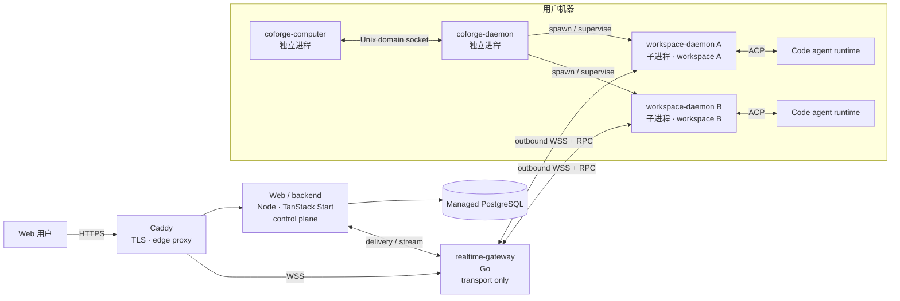

# CoForge 架构基线

状态：验证阶段架构基线

更新时间：2026-08-26

适用范围：仓库结构、云端服务、本地进程、消息投递与开发工具链

本文是 CoForge 当前架构的唯一规范来源。`architecture.html` 是便于阅读和分享的同内容版本；出现冲突时以本文为准。已确定的边界直接写在正文，仍需 ADR 的设计会明确标记为“提案”。

## 1. 架构目标

CoForge 让用户通过 Web 私聊或群聊多个 code agent，同时把 Agent 实际执行隔离在用户机器的 workspace 中。首个验证版本优先保证：

- 云端不直接进入用户机器，所有远程连接由本地主动发起；
- 一个 workspace 的崩溃、卡死或内存泄漏不拖垮其他 workspace；
- 消息在断线、重连和重复投递时不丢失且不重复交给 Agent；
- 云端业务控制面、实时传输面与本地执行面边界清晰；
- 先以最少服务跑通纵向链路，不提前引入 Kubernetes 或微服务拆分。

首版是消息系统，不是命令或工作流平台。核心对象保持为 conversation、participant、message、per-Agent delivery 与 workspace binding；run、stream event、generic job 和 workflow 暂不进入骨架核心。

## 2. 总体拓扑



`Web/backend → realtime-gateway` 的具体内部接口尚未定型；图中只固定职责与数据方向，不固定实现协议。

## 3. 包与进程不是同一个层级

本地只发布两个 app package：

```text
apps/
├── coforge-computer/
└── coforge-daemon/
    └── 内部实现 workspace-daemon 子进程角色
```

必须保持以下区别：

| 名称 | 发布边界 | 运行时关系 | 核心职责 |
| --- | --- | --- | --- |
| `coforge-computer` | 独立 package | 独立 OS 进程 | 机器身份、安装升级、启动/停止和健康检查 coforge-daemon |
| `coforge-daemon` | 独立 package | 独立 OS 进程 | 对齐期望/实际 workspace 集合，管理子进程生命周期和崩溃恢复 |
| `workspace-daemon` | 不独立发布 | coforge-daemon 启动的子进程；一个实例对应一个 workspace | 维护该 workspace 的 WSS、投递边界、ACP adapter 和 Agent 生命周期 |

因此禁止新增 `apps/workspace-daemon`。需要隔离的是运行时进程，而不是第三个发布包。

`coforge-computer` 与 `coforge-daemon` 通过 Unix domain socket 通信。不得为了方便而给本地管理接口开放 TCP 监听端口。

## 4. 云端职责

### Caddy：边缘网关

- 申请与续期 TLS 证书；
- 提供 HTTPS/WSS 公网入口；
- 反向代理、健康检查和负载均衡；
- 与应用进程独立常驻，应用滚动更新时保持入口稳定。

验证阶段运行两个应用副本。发布时一次 drain 一个 gateway/backend 副本，新连接只进入健康实例；不引入 Kubernetes。

Caddy 不理解 conversation、message、Agent 或 workspace 业务。

### Web/backend：业务控制面

- 用户、机器与 workspace 的鉴权和授权；
- 私聊/群聊 conversation 与 participant；
- canonical message 的创建、持久化和路由决策；
- 每个目标 Agent 的 delivery ledger；
- 普通业务 API、Web 页面和 PostgreSQL migration；
- 接收并保存 Agent response/stream，再推送给会话参与者。

初始实现使用 Node 24 LTS 与 TanStack Start，不使用 Next.js。前期保持模块化单体，只有出现清晰的扩缩容或故障隔离需求时才拆服务。

### realtime-gateway：实时传输面

- 使用 Go 实现长期 WSS 连接和双向 RPC 传输；
- 根据 backend 已作出的路由决策转发 delivery 和 stream；
- 处理连接生命周期、背压、心跳、重连与协议版本协商。

realtime-gateway 不拥有业务规则，不直接读写 PostgreSQL，不适配具体 Agent，也不把传输 ACK 解释为任务完成。

### PostgreSQL：云端持久状态

PostgreSQL 的首要领域对象是：

- `conversation`
- `participant`
- `message`
- `agent_message_delivery`

`run` 表示一次 Agent 执行，`event` 表示执行中的流式片段、工具或状态记录；二者不是 delivery 的核心，不应在骨架阶段过早锁死。最终表名、字段、索引与 migration 方案由 backend 设计评审确定。

## 5. 本地执行面

### coforge-computer

coforge-computer 是机器级 supervisor，不执行 workspace 内的 Agent 业务。它管理登录后的机器身份、安装/升级、coforge-daemon 的启动停止与健康检查。

### coforge-daemon

coforge-daemon 管理一台机器上所有 workspace-daemon：

```text
coforge-daemon 1 ──管理──> N workspace-daemon
workspace-daemon 1 <──绑定──> 1 workspace
```

它负责期望状态与实际状态收敛、子进程创建/回收、崩溃恢复、资源治理和版本兼容，但不直接解析各家 Agent 的输出协议。

### workspace-daemon 与 ACP

每个 workspace-daemon 是独立子进程，只能访问自己的 workspace 根目录和允许的环境变量。它通过 ACP 与 Codex、Claude Code、Pi 等 Agent runtime 通信，对上层暴露统一的启动、发送、中断、恢复、销毁和事件语义。

Agent provider 的特殊逻辑必须留在 ACP adapter 边界内，不能泄漏到 realtime-gateway、Web/backend 或共享领域模型。

**提案：每个 workspace 子进程拥有独立的本地 SQLite spool。** 它存放已接管的 inbound delivery、等待云端确认的 Agent response、重连 cursor 与最小去重状态。数据库放在应用数据目录而不是用户仓库内；加密、保留期限与损坏恢复需要单独 ADR。

## 6. 消息投递语义

Multica 的 delivery / ACK 机制用于验证故障模式，不作为 1:1 实现模板。CoForge 使用自己的协议 vocabulary，并补齐 Agent response 从间歇联网设备返回云端的对称可靠性。

稳定身份分为：

- `message_id`：云端 canonical message 的身份；
- `conversation_seq`：云端分配的会话总顺序；
- `delivery_id`：一条 message 到一个目标 Agent 的稳定投递身份；
- `client_message_id`：消息发送方生成的幂等键，跨断线重试不变；
- connection id 与 attempt number：只用于诊断，不承担业务身份。

### 6.1 云端到 Agent

1. backend 在同一事务内持久化 canonical message，并为每个目标 Agent 创建 delivery；
2. backend 通过尚待 ADR 确定的内部接口唤醒 realtime-gateway，gateway 不读取 PostgreSQL；
3. gateway 经目标 workspace child 自己的 WSS 发送 `delivery.offer`；
4. workspace child 先按 `delivery_id` 写入本地 durable inbox，再返回 `delivery.accepted`；
5. backend 校验 workspace、Agent、delivery id 与 sequence 后记录接管时间；
6. child 按 Agent context 顺序交给 ACP；重连时由 backend 按原 sequence replay 未确认 delivery。

`delivery.accepted` 只表示“本机已耐久接管”，不表示 Agent 已执行完成。ACK 丢失会触发相同 `delivery_id` 的重发，本地唯一约束把它变成幂等 no-op。

### 6.2 Agent 到云端

1. Agent 最终 response 先写入 workspace child 的 durable outbox，并生成稳定 `client_message_id`；
2. child 经 WSS RPC 发送 `message.publish`；
3. gateway 只转发给 backend；backend 用 `(sender_participant_id, client_message_id)` 幂等提交 canonical response；
4. backend 返回 `message.committed(client_message_id, message_id, conversation_seq)`；
5. child 收到确认后标记本地 outbox 项已提交。断线时持续重试相同 `client_message_id`。

共同语义：

- transport 是 at-least-once，不声称 end-to-end exactly-once execution；
- response、Agent execution 状态与 delivery ACK 是不同维度；
- WebSocket 连接内写队列与通知只负责提速，不是 durable source of truth；
- 队列满时必须背压或断开并 replay，不能静默丢弃 durable delivery；
- 不使用数据库 command mailbox 或 claim/lease，除非先形成新的架构决策。

## 7. 端到端链路

```text
用户私聊/群聊消息
→ Web/backend：鉴权、会话成员校验、canonical message 持久化、路由
→ realtime-gateway：WSS/RPC 传输
→ 目标 workspace-daemon：durable inbox、去重、接管与 ACK
→ ACP
→ code agent runtime
→ response 写入本地 durable outbox
→ realtime-gateway：WSS/RPC 转发
→ Web/backend：按 client_message_id 幂等持久化并推送给 conversation participants
```

## 8. 工具链与版本治理

开发工具与运行时版本统一由根目录 `mise.toml` 管理。开发机和 CI 都应执行同一套 mise task，避免依赖未声明的全局版本。

当前初始基线为：

| 组件 | 技术基线 |
| --- | --- |
| Edge | Caddy 2.11.4 |
| realtime-gateway | Go 1.26.7 |
| Web/backend | Node 24 LTS + TanStack Start |
| 本地 app/runtime | Bun 1.4 |
| 数据库 | Managed PostgreSQL |

精确版本以 `mise.toml` 为准。升级版本时必须同时更新锁文件、CI 和本文，不能只改本机环境。

验证阶段采用轻量 [GitHub Flow](https://docs.github.com/en/get-started/using-github/github-flow)：短生命周期 feature branch → CR/PR → `main`，不维护长期 `dev` 分支，禁止直接向 `main` 提交或推送。MVP 分支只承载一个小目标，原则上当天合并或关闭。普通代码与文档由一位 Agent review，通过短检查后立即 squash/rebase 合并，目标从发起评审到合并为 5–10 分钟，不要求 Frank 逐个审批；架构、数据库 schema、通信协议、许可证、安全边界及其他影响广泛或难以逆转的事项仍须 Frank 明确批准。多人并行时必须保持分支职责单一，在最终评审前 rebase 最新 `origin/main`，禁止 force-push `main` 或其他贡献者的分支。

提交与 CR 保持小而单一，使用简洁的英文 Conventional Commit：`<type>(optional-scope): imperative summary`。MVP 必需检查保持短小，仅包含格式/lint、类型检查、相关测试与构建；慢检查只有在风险收益值得延迟时再加入。未合并分支上的错误应通过 amend/rebase 整理，不以 revert commit 清理；`main` 使用项目批准的 squash/rebase merge 策略保持线性历史，合并后删除 feature branch。

## 9. 稳定性与安全约束

- 所有跨网络命令和事件都必须带协议版本、稳定标识、sequence 与幂等键；
- workspace 与 Agent 使用显式状态机，不用多个布尔值拼接生命周期；
- 凭据不得进入仓库、日志、命令行参数或生成物；
- Unix socket 使用最小文件权限并验证对端身份；
- Agent 只能在声明的 workspace 根目录中运行；
- Caddy、gateway、backend 和本地进程都需要结构化日志和关联 id，但日志不得包含 secret；
- validation 阶段先使用常规主机与托管 PostgreSQL，不引入 Kubernetes。
- WebSocket 依附于 TCP，所属 gateway 进程死亡时一定会断开；保证目标是 committed message 不丢、自动重连、按序 replay 与重复抑制，而不是宣称连接永不断。

## 10. 变更规则

以下变更必须先在 `#coforge` 对齐，并与本文同一次提交：

- 新增或拆分 app/package；
- 改变进程所有权或 IPC/WSS/ACP 边界；
- 改变 ACK、去重、sequence 或重连语义；
- 让 realtime-gateway 访问业务数据库或承担业务规则；
- 引入新的持久队列、缓存、服务发现或编排平台；
- 修改主干策略或 runtime 技术栈。

## 11. 协议提案与待决 ADR

daemon 到 cloud 使用版本化 typed RPC over WSS，不照搬 Multica 事件名。建议的最小方法族：

- `session.hello` / `session.ready` / `session.resume`
- `delivery.offer` / `delivery.accepted` / `delivery.rejected`
- `message.publish` / `message.committed`
- `heartbeat.ping` / `heartbeat.pong`

每个 envelope 携带 protocol version、request id、workspace/session scope 与必要 deadline。未知 major version 必须拒绝；minor capability 在 handshake 协商。浏览器 API 与 cloud internal RPC 是独立契约，“daemon 不用 HTTP”不禁止浏览器用 HTTPS 完成认证、bootstrap 和普通读取。

以下项目在实现锁定前必须写 ADR：

1. WSS encoding 与 schema generation；
2. gateway 到 backend 的内部传输和跨副本连接定位；
3. SQLite schema、加密、保留与损坏恢复；
4. `conversation_seq` 的并发分配；
5. ACP capability mapping 与 cancellation；
6. reconnect、drain deadline 与可测量恢复 SLO；
7. 设备身份、密钥轮换与 workspace revoke。

## 12. 首批故障验证

1. 重复 `delivery.offer` 在本地接管后最多进入 ACP 一次；
2. workspace child 接管后崩溃，重启能从 local inbox 继续；
3. Agent response 离线排队，重连后只形成一条 canonical message；
4. gateway 在 publish 中途死亡，重试不产生双写；
5. 单副本滚动时另一副本接受重连；
6. 内部 wakeup 丢失后仍能由 reconciliation / replay 修复；
7. 跨重连保持 conversation 顺序；
8. workspace revoke 后停止 replay 与 ACP 执行。

## 13. 参考，不是模板

- [Multica Agent message delivery contract](https://github.com/LRM-Teams/multica/blob/dev/docs/agent-message-delivery-contract.md)
- [Multica Computer/Daemon/WorkspaceDaemon ownership ADR](https://github.com/LRM-Teams/multica/blob/dev/docs/adr/0020-converge-computer-daemon-workspace-daemon.md)

CoForge 保留其中已验证的 ownership 与 ACK 原则，同时增加双向本地 outbox、幂等 Agent-response publish、版本协商和自己的协议 vocabulary。
