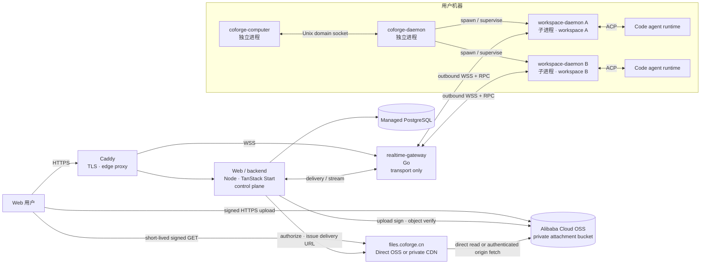

# CoForge 架构基线

状态：验证阶段架构基线

更新时间：2026-08-26

适用范围：仓库结构、云端服务、本地进程、消息投递与开发工具链

本文是 CoForge 当前架构的唯一规范来源。已确定的边界直接写在正文，仍需 ADR 的设计会明确标记为“提案”。

## 1. 架构目标

CoForge 让用户通过 Web 私聊或群聊多个 code agent，同时把 Agent 实际执行隔离在用户机器上各自的 Agent workspace 目录中。首个验证版本优先保证：

- 云端不直接进入用户机器，所有远程连接由本地主动发起；
- 一个 workspace 的崩溃、卡死或内存泄漏不拖垮其他 workspace；
- 消息在断线、重连和重复投递时不丢失且不重复交给 Agent；
- 云端业务控制面、实时传输面与本地执行面边界清晰；
- 先以最少服务跑通纵向链路，不提前引入 Kubernetes 或微服务拆分。

首版是消息系统，不是命令或工作流平台。核心对象保持为 conversation、participant、message、per-Agent delivery 与 workspace binding；run、stream event、generic job 和 workflow 暂不进入骨架核心。

## 2. 总体拓扑



`Web/backend → realtime-gateway` 的具体内部接口尚未定型；图中只固定职责与数据方向，不固定实现协议。

## 3. 包与进程不是同一个层级

本地只发布两个 app package：

```text
apps/
├── coforge-computer/
└── coforge-daemon/
    └── 内部实现 workspace-daemon 子进程角色
```

必须保持以下区别：

| 名称 | 发布边界 | 运行时关系 | 核心职责 |
| --- | --- | --- | --- |
| `coforge-computer` | 独立 package | 独立 OS 进程 | 机器身份、安装升级、启动/停止和健康检查 coforge-daemon |
| `coforge-daemon` | 独立 package | 独立 OS 进程 | 对齐期望/实际 workspace 集合，管理子进程生命周期和崩溃恢复 |
| `workspace-daemon` | 不独立发布 | coforge-daemon 启动的常驻子进程；一个实例对应一个逻辑 workspace | 维护该 workspace 的 WSS、投递边界、ACP adapter 和 Agent 生命周期 |

因此禁止新增 `apps/workspace-daemon`。需要隔离的是运行时进程，而不是第三个发布包。

本文不加限定词的 `workspace` 指云端协作、成员、权限、conversation 与 Agent 的逻辑边界。每个 Agent 另有自己的文件系统 Agent workspace 目录，它不是第二个逻辑 workspace。文档必须用限定词区分两者；目录在代码和协议中的确切字段名留待实现前单独确认。

`coforge-computer` 与 `coforge-daemon` 通过 Unix domain socket 通信。不得为了方便而给本地管理接口开放 TCP 监听端口。

## 4. 云端职责

### Caddy：边缘网关

- 申请与续期 TLS 证书；
- 提供 HTTPS/WSS 公网入口；
- 反向代理、健康检查和负载均衡；
- 与应用进程独立常驻，应用滚动更新时保持入口稳定。

验证阶段运行两个应用副本。发布时一次 drain 一个 gateway/backend 副本，新连接只进入健康实例；不引入 Kubernetes。

Caddy 不理解 conversation、message、Agent 或 workspace 业务。

### Web/backend：业务控制面

- 用户、机器与 workspace 的鉴权和授权；
- 私聊/群聊 conversation 与 participant；
- canonical message 的创建、持久化和路由决策；
- 每个目标 Agent 的 delivery ledger；
- 普通业务 API、Web 页面和 PostgreSQL migration；
- 接收并保存 Agent response/stream，再推送给会话参与者。

初始实现使用 Node 24 LTS 与 TanStack Start，不使用 Next.js。前期保持模块化单体，只有出现清晰的扩缩容或故障隔离需求时才拆服务。

### realtime-gateway：实时传输面

- 使用 Go 实现长期 WSS 连接和双向 RPC 传输；
- 根据 backend 已作出的路由决策转发 delivery 和 stream；
- 处理连接生命周期、背压、心跳、重连与协议版本协商。

realtime-gateway 不拥有业务规则，不直接读写 PostgreSQL，不适配具体 Agent，也不把传输 ACK 解释为任务完成。

### PostgreSQL：云端持久状态

PostgreSQL 的首要领域对象是：

- `conversation`
- `participant`
- `message`
- `agent_message_delivery`

`run` 表示一次 Agent 执行，`event` 表示执行中的流式片段、工具或状态记录；二者不是 delivery 的核心，不应在骨架阶段过早锁死。最终表名、字段、索引与 migration 方案由 backend 设计评审确定。

### Alibaba Cloud OSS：聊天附件数据面

首个 OSS bucket 只承载聊天图片与文件附件，必须保持 `private`。Bucket 不使用 `public-read` 或 `public-read-write`；公开头像和 Web 静态资源以后使用独立 bucket，不能与聊天附件混放。浏览器与 OSS 之间的文件传输使用 HTTPS 数据面，不经过 realtime-gateway，也不改变 daemon 只使用 WSS/RPC 的传输边界。

计划中的稳定文件访问域名是 `files.coforge.cn`。这个名称表达业务用途而不是当前基础设施：最初可以直连 OSS，以后可以在不改变客户端和数据库引用的情况下把同一域名切到 CDN。`cdn.coforge.cn` 不作为 canonical 文件域名。Bucket 名称、Region、实际 endpoint 与域名启用时间属于部署配置，确认前不得写死；启用中国内地 custom domain 前，部署检查必须确认域名已经完成 ICP 备案。

上传链路固定为：

1. Web 客户端通过已认证的 backend 控制面请求上传授权，并提供目标 workspace、conversation、文件大小和声明类型；
2. backend 校验当前用户仍是该 conversation 的 active participant，检查配额，分配稳定 `attachment_id` 与服务端生成的 `object_key`，并创建可过期的 durable upload intent；intent 绑定发起 participant、workspace、conversation、精确 object key 与预期文件 metadata；
3. backend 使用服务端 RAM 身份获取短时 STS 凭据并生成 V4 Post Policy，或直接生成等价的短时 V4 上传签名；授权只允许 intent 中的精确 object key，并限制有效期、大小、类型且禁止覆盖；
4. 浏览器使用该短时授权通过 HTTPS 直接上传到 OSS；长期 AK/SK 永远不会到达浏览器；
5. 客户端通知 backend 上传完成；backend 要求同一个发起 participant 和未过期 intent，向 OSS 校验对象存在性、key、大小和必要 metadata，匹配后把 intent 标记为可绑定；
6. 只有 intent 的创建者可以把它一次性绑定到同一 conversation 的 canonical message，绑定与 message commit 必须原子完成。过期、失败、已消费或 conversation 不匹配的 intent 都拒绝引用。

附件只有在关联到请求者可见的 committed canonical message 后才能下载或预览；未发送草稿与孤立 upload intent 不签发 GET URL。数据库只保存稳定 `object_key` 与 committed-message 附件 metadata，不保存 bucket、endpoint、delivery provider 或 OSS/CDN signed URL；物理 bucket 和域名映射属于 adapter 部署配置。Signed URL 是 bearer credential，必须短时有效且不得写入数据库、日志或 analytics；返回它的 backend 响应必须 `Cache-Control: no-store`。访问权被撤销后，已签发 URL 最长仍可用到自身过期时间，因此 TTL 就是明确的撤销延迟上界。过期、失败或未绑定 intent 对应的孤立对象由明确的 retention cleanup process 最终清理。

#### 下载授权 seam

Backend 对调用方只暴露一个 `AttachmentDownloadAuthorizer` interface：

```text
authorize_attachment_download(
  authenticated_requester,
  message_id,
  attachment_id
) -> { url, expires_at }
```

这是一个深模块：它根据 `message_id` 解析 workspace 与 conversation，校验请求者的 membership 和 committed message 可见性，确认 `attachment_id` 实际绑定到该 message，再把已授权的稳定 `object_key` 交给当前 delivery adapter。调用方不提供 object key、bucket 或 provider，返回值也不暴露 provider kind；因此授权规则、对象身份和客户端契约均不依赖 OSS 或 CDN。Adapter 只负责签发可交付 URL，不重做 conversation 授权，也不接受客户端提供的任意路径。

同一个内部 adapter slot 有两个实现：

- **Direct OSS adapter** 根据部署配置将稳定 object key 映射到 private bucket，并仅对该精确 key 签发短时 V4 presigned GET URL。
- **Private CDN adapter** 对 `https://files.coforge.cn/{object_key}` 的规范化路径和过期时间生成 CDN signed URL。CDN POP 在查找缓存前验证客户端签名；未签名、签名不匹配或已过期的请求拒绝。CDN 签名密钥只存在于 backend Secret 与 CDN 配置，不是 OSS 凭据。

切换 adapter 只改变部署配置和 URL 签发方式；不改变 interface、object key、message/attachment 记录，不需要复制对象或发布客户端新版本。

#### CDN 客户端鉴权、回源授权与缓存键

Private CDN adapter 必须把两条授权链分开：

1. **客户端 → CDN POP** 使用 backend 生成的 CDN signed URL，只证明持有者在 TTL 内可访问该规范化 object path。Backend 在每次签发前仍执行 committed-message 可见性授权；CDN 不认识 workspace、conversation 或 requester。
2. **CDN POP → private OSS origin** 使用阿里云 CDN private-bucket origin access 的独立服务身份和只读授权。CDN 在 cache miss 时为回源请求生成 `Authorization` header；客户端 CDN 签名参数必须在回源前移除，不能被当作 OSS 签名转发，也不能与 origin header 签名叠加。Bucket 保持 private，且该 CDN 身份仅授予附件 bucket 的回源只读能力；鉴于该功能可读取 origin bucket 内全部对象，附件 bucket 不得混放其他业务对象。

CDN 必须先验证 signed URL，再用去掉签名、过期时间和 nonce 等鉴权材料后的 `files.coforge.cn` 规范化 object path 作为缓存身份。这样同一 immutable object 的不同短时 URL 共享一个 cache entry，但未授权请求仍会在 cache lookup 前拒绝。`requester_id`、workspace/conversation/message id、原始文件名和 delivery-provider 不进入 URL 或 cache key。任何会改变字节、响应权限或安全相关 header 的变体都不得从 cache key 中忽略；如以后需要变体，必须给它独立的 immutable object key 或纳入 cache key。对象禁止覆盖；内容变更必须使用新 `attachment_id`/object key，以免旧缓存与数据库身份分叉。

Canonical object key 使用 workspace-first 隔离：

```text
workspaces/{workspace_id}/attachments/{attachment_id}/original
```

消息与附件的关联保存在 PostgreSQL，不把 conversation/message 层级编码进对象路径。原始文件名只作为清洗后的 metadata 保存，不能参与权限边界或直接拼接路径。OSS CORS 只允许明确的 CoForge Web origin；服务端 RAM 用户只允许 `AssumeRole`，上传 role 只获得目标 bucket/prefix 所需的最小 `PutObject` 权限。真实 AK/SK 只能放部署 Secret，不得进入仓库、日志、命令行参数或前端构建产物。

实现依据为阿里云官方的 [client direct upload](https://www.alibabacloud.com/help/en/oss/user-guide/uploading-objects-to-oss-directly-from-clients/)、[server-side V4 signing](https://www.alibabacloud.com/help/en/oss/user-guide/obtain-signature-information-from-the-server-and-upload-data-to-oss)、[private object signed URL](https://www.alibabacloud.com/help/en/oss/developer-reference/download-objects-using-a-presigned-url-generated-with-oss-sdk-for-node-js)、[custom domain rules](https://www.alibabacloud.com/help/en/oss/user-guide/access-buckets-via-custom-domain-names)、[CDN URL signing](https://www.alibabacloud.com/help/en/cdn/user-guide/configure-url-signing)、[private OSS origin access](https://www.alibabacloud.com/help/en/cdn/user-guide/grant-alibaba-cloud-cdn-access-permissions-on-private-oss-buckets) 与 [custom cache key](https://www.alibabacloud.com/help/en/cdn/user-guide/create-custom-cache-keys)。

## 5. 本地执行面

### coforge-computer

coforge-computer 是机器级 supervisor，不执行 workspace 内的 Agent 业务。它管理登录后的机器身份、安装/升级、coforge-daemon 的启动停止与健康检查。

`machine_id` 是机器的稳定身份，跨 computer、daemon 与 workspace 子进程的重启和升级保持不变。它的具体签发方式、存储位置、唯一性范围与云端 computer 表结构由单独评审确定，本文不预先锁定。

### coforge-daemon

coforge-daemon 管理一台机器上所有已绑定逻辑 workspace 的常驻 workspace-daemon：

```text
coforge-daemon 1 ──管理──> N 常驻 workspace-daemon
workspace-daemon 1 <──绑定──> 1 逻辑 workspace
workspace-daemon 1 ──管理──> N Agent ──各自拥有──> 1 Agent workspace 目录
```

一个逻辑 workspace 分配到这台机器后，coforge-daemon 为其维持一个 workspace-daemon。常驻表示该子进程在两条消息之间也保持运行；进程崩溃或升级后可以被替换，但新的进程仍使用同一个稳定 `workspace_id`，不会因此创建新的 Workspace。

coforge-daemon 负责期望状态与实际状态收敛、子进程创建/回收、崩溃恢复、资源治理和版本兼容，但不直接解析各家 Agent 的输出协议。

Computer 的云端在线状态由当前 workspace-daemon WSS 连接集合实时派生：该 Computer 至少有一个 workspace-daemon WSS 在线时，该 Computer 在线。具体连接如何关联稳定的服务端 Computer 记录由后续 binding 与认证设计确定；`online` 与 `last_seen_at` 不作为这项状态的持久化真相。

### workspace-daemon 与 ACP

每个 workspace-daemon 是独立子进程，只能管理同一个 `workspace_id` 下的 Agent。每个 Agent 拥有自己的文件系统 Agent workspace 目录；子进程只能访问这些已声明目录和允许的环境变量。workspace-daemon 通过 ACP 与 Codex、Claude Code、Pi 等 Agent runtime 通信，对上层暴露统一的启动、发送、中断、恢复、销毁和事件语义。

一台 Computer 允许安装零个或多个 code-agent runtime。零 runtime 是有效机器状态，不阻止 computer 或 daemon 启动；安装并配置合适 runtime 前不能执行 Agent。

Agent provider 的特殊逻辑必须留在 ACP adapter 边界内，不能泄漏到 realtime-gateway、Web/backend 或共享领域模型。

**提案：每个 workspace 子进程拥有独立的本地 SQLite spool。** 它存放已接管的 inbound delivery、等待云端确认的 Agent response、重连 cursor 与最小去重状态。数据库放在应用数据目录而不是用户仓库内；加密、保留期限与损坏恢复需要单独 ADR。

## 6. 消息投递语义

Multica 的 delivery / ACK 机制用于验证故障模式，不作为 1:1 实现模板。CoForge 使用自己的协议 vocabulary，并补齐 Agent response 从间歇联网设备返回云端的对称可靠性。

稳定身份分为：

- `message_id`：云端 canonical message 的身份；
- `conversation_seq`：云端分配的会话总顺序；
- `delivery_id`：一条 message 到一个目标 Agent 的稳定投递身份；
- `client_message_id`：消息发送方生成的幂等键，跨断线重试不变；
- connection id 与 attempt number：只用于诊断，不承担业务身份。

### 6.1 云端到 Agent

1. backend 在同一事务内持久化 canonical message，并为每个目标 Agent 创建 delivery；
2. backend 通过尚待 ADR 确定的内部接口唤醒 realtime-gateway，gateway 不读取 PostgreSQL；
3. gateway 经目标 workspace child 自己的 WSS 发送 `delivery.offer`；
4. workspace child 先按 `delivery_id` 写入本地 durable inbox，再返回 `delivery.accepted`；
5. backend 校验 workspace、Agent、delivery id 与 sequence 后记录接管时间；
6. child 按 Agent context 顺序交给 ACP；重连时由 backend 按原 sequence replay 未确认 delivery。

`delivery.accepted` 只表示“本机已耐久接管”，不表示 Agent 已执行完成。ACK 丢失会触发相同 `delivery_id` 的重发，本地唯一约束把它变成幂等 no-op。

### 6.2 Agent 到云端

1. Agent 最终 response 先写入 workspace child 的 durable outbox，并生成稳定 `client_message_id`；
2. child 经 WSS RPC 发送 `message.publish`；
3. gateway 只转发给 backend；backend 用 `(sender_participant_id, client_message_id)` 幂等提交 canonical response；
4. backend 返回 `message.committed(client_message_id, message_id, conversation_seq)`；
5. child 收到确认后标记本地 outbox 项已提交。断线时持续重试相同 `client_message_id`。

共同语义：

- transport 是 at-least-once，不声称 end-to-end exactly-once execution；
- response、Agent execution 状态与 delivery ACK 是不同维度；
- WebSocket 连接内写队列与通知只负责提速，不是 durable source of truth；
- 队列满时必须背压或断开并 replay，不能静默丢弃 durable delivery；
- 不使用数据库 command mailbox 或 claim/lease，除非先形成新的架构决策。

## 7. 端到端链路

```text
用户私聊/群聊消息
→ Web/backend：鉴权、会话成员校验、canonical message 持久化、路由
→ realtime-gateway：WSS/RPC 传输
→ 目标 workspace-daemon：durable inbox、去重、接管与 ACK
→ ACP
→ code agent runtime
→ response 写入本地 durable outbox
→ realtime-gateway：WSS/RPC 转发
→ Web/backend：按 client_message_id 幂等持久化并推送给 conversation participants
```

## 8. 工具链与版本治理

开发工具与运行时版本统一由根目录 `mise.toml` 管理。开发机和 CI 都应执行同一套 mise task，避免依赖未声明的全局版本。

当前初始基线为：

| 组件 | 技术基线 |
| --- | --- |
| Edge | Caddy 2.11.4 |
| realtime-gateway | Go 1.26.7 |
| Web/backend | Node 24 LTS + TanStack Start |
| 本地 app/runtime | Bun 1.4 |
| 数据库 | Managed PostgreSQL |

精确版本以 `mise.toml` 为准。升级版本时必须同时更新锁文件、CI 和本文，不能只改本机环境。

验证阶段采用轻量 [GitHub Flow](https://docs.github.com/en/get-started/using-github/github-flow)：短生命周期 feature branch → CR/PR → `main`，不维护长期 `dev` 分支，禁止直接向 `main` 提交或推送。规范性的决策门槛、评审、检查与合并规则统一由根目录 [`AGENTS.md`](../AGENTS.md) 维护。

提交与 CR 保持小而单一，使用简洁的英文 Conventional Commit：`<type>(optional-scope): imperative summary`。

## 9. 稳定性与安全约束

- 所有跨网络命令和事件都必须带协议版本、稳定标识、sequence 与幂等键；
- workspace 与 Agent 使用显式状态机，不用多个布尔值拼接生命周期；
- 凭据不得进入仓库、日志、命令行参数或生成物；
- Unix socket 使用最小文件权限并验证对端身份；
- Agent 只能在声明的 Agent workspace 目录中运行；
- Caddy、gateway、backend 和本地进程都需要结构化日志和关联 id，但日志不得包含 secret；
- validation 阶段先使用常规主机与托管 PostgreSQL，不引入 Kubernetes。
- WebSocket 依附于 TCP，所属 gateway 进程死亡时一定会断开；保证目标是 committed message 不丢、自动重连、按序 replay 与重复抑制，而不是宣称连接永不断。

## 10. 变更规则

以下变更必须先在 `#coforge` 对齐，并与本文同一次提交：

- 新增或拆分 app/package；
- 改变进程所有权或 IPC/WSS/ACP 边界；
- 改变 ACK、去重、sequence 或重连语义；
- 让 realtime-gateway 访问业务数据库或承担业务规则；
- 引入新的持久队列、缓存、服务发现或编排平台；
- 修改主干策略或 runtime 技术栈。

## 11. 协议提案与待决 ADR

daemon 到 cloud 使用版本化 typed RPC over WSS，不照搬 Multica 事件名。建议的最小方法族：

- `session.hello` / `session.ready` / `session.resume`
- `delivery.offer` / `delivery.accepted` / `delivery.rejected`
- `message.publish` / `message.committed`
- `heartbeat.ping` / `heartbeat.pong`

每个 envelope 携带 protocol version、request id、workspace/session scope 与必要 deadline。未知 major version 必须拒绝；minor capability 在 handshake 协商。浏览器 API 与 cloud internal RPC 是独立契约，“daemon 不用 HTTP”不禁止浏览器用 HTTPS 完成认证、bootstrap 和普通读取。

以下项目在实现锁定前必须写 ADR：

1. WSS encoding 与 schema generation；
2. gateway 到 backend 的内部传输和跨副本连接定位；
3. SQLite schema、加密、保留与损坏恢复；
4. `conversation_seq` 的并发分配；
5. ACP capability mapping 与 cancellation；
6. reconnect、drain deadline 与可测量恢复 SLO；
7. 设备身份、密钥轮换与 workspace revoke。

## 12. 首批故障验证

1. 重复 `delivery.offer` 在本地接管后最多进入 ACP 一次；
2. workspace child 接管后崩溃，重启能从 local inbox 继续；
3. Agent response 离线排队，重连后只形成一条 canonical message；
4. gateway 在 publish 中途死亡，重试不产生双写；
5. 单副本滚动时另一副本接受重连；
6. 内部 wakeup 丢失后仍能由 reconciliation / replay 修复；
7. 跨重连保持 conversation 顺序；
8. workspace revoke 后停止 replay 与 ACP 执行。

## 13. 参考，不是模板

- [Multica Agent message delivery contract](https://github.com/LRM-Teams/multica/blob/dev/docs/agent-message-delivery-contract.md)
- [Multica Computer/Daemon/WorkspaceDaemon ownership ADR](https://github.com/LRM-Teams/multica/blob/dev/docs/adr/0020-converge-computer-daemon-workspace-daemon.md)

CoForge 保留其中已验证的 ownership 与 ACK 原则，同时增加双向本地 outbox、幂等 Agent-response publish、版本协商和自己的协议 vocabulary。
