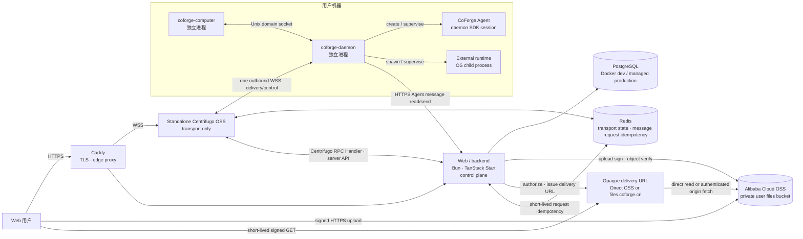

# CoForge 架构基线

状态：验证阶段架构基线

更新时间：2026-08-27

适用范围：仓库结构、云端服务、本地进程、消息投递与开发工具链

本文是 CoForge 当前架构的唯一规范来源。已确定的边界直接写在正文，仍需 ADR 的设计会明确标记为“提案”。

## 1. 架构目标

CoForge 让用户通过 Web 私聊或群聊多个 code agent，同时把 Agent 实际执行隔离在用户机器上各自的 Agent workspace 目录中。首个验证版本优先保证：

- 云端不直接进入用户机器，所有远程连接由本地主动发起；
- 一个 workspace 的崩溃、卡死或内存泄漏不拖垮其他 workspace；
- 消息在断线、重连和重复投递时不丢失且不重复交给 Agent；
- 云端业务控制面、实时传输面与本地执行面边界清晰；
- 先以最少服务跑通纵向链路，不提前引入 Kubernetes 或微服务拆分。

首版是消息系统，不是命令或工作流平台。当前垂直切片只支持一个 Workspace 内 User↔Agent 的 DirectConversation、ConversationMember 和 Message；群聊暂不进入 MVP。run、stream event、generic job 和 workflow 暂不进入骨架核心。

## 2. 总体拓扑



`Web/backend ↔ Centrifugo` 的 Handler/API schema 与 RPC namespace 尚未定型；图中只固定职责与数据方向，不固定其内部 wire protocol。这里的 `Centrifugo RPC Handler` 是 Web/backend 内部接收和分派请求的组件，不是独立业务服务；认证、授权、Use Case、持久化和 Token 签发仍归 Web/backend。

## 3. 包与进程不是同一个层级

本地产品包含两个可独立构建、版本化和打包的 package component。内置 Agent runtime 可以是独立 library/runtime package，但不能成为第三个本地产品组件：

```text
apps/
└── web/
    └── Web UI 与 backend control plane

packages/
├── computer/
│   └── 机器级 setup、安装与 supervisor package component
├── daemon/
│   └── 单 Workspace daemon 与 code-agent driver package component
└── agent/
    └── 使用 Pi SDK 的内置 Agent runtime package；由 coforge-daemon 安装和启动
```

必须保持以下区别：

| 名称               | 发布边界                                                                                      | 运行时关系                                                      | 核心职责                                                      |
| ------------------ | --------------------------------------------------------------------------------------------- | --------------------------------------------------------------- | ------------------------------------------------------------- |
| `coforge-computer` | 独立 package component；唯一面向用户的本地安装入口，并依赖 `coforge-daemon` package           | 独立 OS 进程                                                    | 机器身份、安装升级、启动/停止和健康检查 coforge-daemon        |
| `coforge-daemon`   | 独立 package component；作为 Computer 的构建/分发依赖随 Computer 安装，不单独提供用户安装入口 | 独立 OS 进程                                                    | 对齐期望/实际 workspace 集合，管理子进程生命周期和崩溃恢复    |
| Agent runtime      | 不独立发布                                                                                    | CoForge 在 daemon 内创建 SDK session；外部 runtime 是 OS 子进程 | provider-neutral driver 后的 Agent 执行                       |
| `@coforge/agent`   | 可独立打包的 runtime package；不是本地产品组件或用户安装入口                                  | daemon 内创建的 SDK session                                     | 封装 Pi SDK、内置 extensions、skills 和 CoForge Agent factory |

因此禁止把 daemon runtime 拆成第三个本地产品组件。需要隔离的是运行时进程，而不是发布包。

源码分类、可独立打包边界、运行时边界与用户安装边界不是同一层级。仓库在 `packages/` 下保留两个本地 package component；`coforge-computer` 在 package/build 层依赖 `coforge-daemon`，Daemon 再依赖精确版本的 `@coforge/agent`。monorepo 开发时 Bun workspace 链接本地 package，发布时 Daemon 安装同版本的独立 package artifact。发布流水线为每个平台组装一个 Computer installation bundle，其中包含已验证兼容的 Computer、Daemon 和 CoForge Agent payload。用户只安装、升级和调用 Computer，Daemon 与内置 Agent 由 Daemon 进程承载，外部 Agent 才是独立 OS 进程。bundle 的具体封装形式属于后续实现选择；无论采用哪种形式，都不能把这些运行时职责合并为 Computer 进程。

本文不加限定词的 `workspace` 指云端协作、成员、权限、conversation 与 Agent 的逻辑边界。每个 Agent 另有自己的文件系统 Agent workspace 目录，它不是第二个逻辑 workspace。文档必须用限定词区分两者。

`coforge-computer` 与 `coforge-daemon` 通过 Unix domain socket 通信。不得为了方便而给本地管理接口开放 TCP 监听端口。

## 4. 云端职责

### Caddy：边缘网关

- 申请与续期 TLS 证书；
- 提供 HTTPS/WSS 公网入口；
- 反向代理、健康检查和负载均衡；
- 与应用进程独立常驻，应用滚动更新时保持入口稳定。

验证阶段运行两个 Centrifugo 副本和两个 backend 副本。发布时一次 drain 一个副本，新连接只进入健康实例；不引入 Kubernetes。当前仓库提供单节点本地验证用的 [`infra/docker-compose.yml`](../infra/docker-compose.yml)，生产 Compose 与发布流水线仍未实现，不能复用已删除的 custom Go gateway 部署资产。

Caddy 不理解 conversation、message、Agent 或 workspace 业务。

### Web/backend：业务控制面

- 用户、机器与 workspace 的鉴权和授权；
- 私聊/群聊 conversation 与 participant；
- canonical message 的创建、持久化和路由决策；
- 使用 Redis 对消息发送 `request_id` 做短期幂等抑制；
- 向目标 Agent 发送易失 attention，并以 canonical Message/read boundary 支持恢复；
- 普通业务 API、Web 页面和 PostgreSQL migration（统一使用 Prisma，详见 [ADR 0003](adr/0003-prisma-as-postgresql-data-access.md)）；
- 接收并保存 Agent response/stream，再推送给会话参与者。

初始实现使用 Bun 1.4 与 TanStack Start，不使用 Next.js。前期保持模块化单体，只有出现清晰的扩缩容或故障隔离需求时才拆服务。生产构建使用 Nitro 的 Bun preset 生成自包含 server output，并以非 root 用户运行在不可变 Docker image 中；Nitro 3 adapter 当前仍是 beta，进入 production 前必须验证构建、启动、健康检查、优雅停止及 PostgreSQL/Centrifugo 集成路径。

消息发送方生成并在同一消息重试中复用 `request_id`。Web/backend 使用现有 Redis，以 Workspace、`user`/`agent` sender kind、稳定 sender ID 和 `request_id` 组成 key，通过带短 TTL 的原子 processing claim 抑制并发重复持久化；成功结果保留 24 小时。User→Agent 的 canonical Message 持久化在幂等执行内，Centrifugo attention publication 在外；publication 失败不影响 canonical Message，后续由 Message/read boundary 恢复。Redis 缺失或不可用时发送 fail closed，但读取不依赖 Redis。PostgreSQL Message 仍是 canonical 数据，Redis 不承担 durable replay。该短期 MVP 明确保留 PostgreSQL commit 与 Redis 结果写入之间的双写崩溃窗口；claim 过期后可能重复创建 Message，不声称提供永久 exactly-once。

### Standalone Centrifugo：实时传输面

- 使用 standalone Centrifugo OSS 持有长期 WSS 连接并提供双向 RPC/订阅传输；
- 通过官方 HTTP/gRPC proxy 机制，经 Web/backend 内部的 `Centrifugo RPC Handler` 把需要业务判断的请求交给 backend，并执行 backend 已作出的发布与断开决策；Handler 只负责接收、校验和分派，不拥有业务逻辑；
- 使用 Redis engine 提供跨副本 fan-out、presence 与 bounded hot history；
- 处理连接/session lifecycle、背压、心跳、重连与 framing。

Centrifugo 不拥有业务规则，不直接读写 PostgreSQL，不适配具体 Agent，也不把 hot history 或传输 ACK 解释为 durable truth。详细边界见 [ADR 0001](adr/0001-standalone-centrifugo-and-compose-data-services.md)。

Daemon 到 Web/backend 的 Agent message read/send 使用独立的 HTTPS RPC
边界，并携带 Daemon API key；该边界的 URL 是 daemon connection
config 的 `serverHttpUrl`（启动时可由 `COFORGE_SERVER_HTTP_URL` 注入）。未配置
时请求 fail closed，绝不回退到 WSS。Server→Daemon 的 delivery、ready、ACK
和 heartbeat/control 仍使用 daemon 唯一的 outbound WSS/RPC 连接。Daemon API key
认证出的 `computer_id` 是服务端定向投递身份；Connect Proxy 只允许该连接订阅
`daemon:<computer_id>` control channel。Agent start、message delivery、runtime usage scan
及其他面向单台 Computer 的控制消息只发布到该 channel，不向 Workspace 内其他
Daemon 广播。`workspace_id` 继续用于业务授权和 payload scope 校验，不参与连接定位。

Agent runtime 的授权分层如下：Web/backend 每次 launch 签发一次明文只返回
一次的 `sk_agent_...` Agent API key，仅由 Daemon 的 Credential Proxy registration 保存，
并用于 Daemon→Web/backend 的 Agent message HTTPS RPC。子进程环境和本地
CLI 只得到生命周期绑定的 opaque `sfp_...` Proxy token；二者不是同一类
授权材料，也没有 wall-clock expiry。Agent API key 绑定签发请求的 `computer_id`；
Agent message 鉴权要求同时提供的 Daemon API key 与 key 记录属于同一 Computer。
每次签发在 PostgreSQL 事务中锁定 Agent row，先撤销该 Agent 的全部旧 active key，
再创建新 key，因此崩溃遗留 key 会在下次 launch 回收，跨 backend 并发签发也按
Agent 串行。停止、退出或 shutdown 时仍按 exact key 撤销。
Daemon 通过受 Daemon API key 保护的 Agent API key HTTP
route 签发和撤销该 key；远端撤销失败必须按失败返回，不能宣称
成功。本地 Proxy registration 无论远端结果如何都先撤销。Daemon WSS 建连使用
Centrifugo 官方 Connect Proxy：Daemon API key 通过 SDK connect data 发送，由
Web/backend 校验 hash、撤销状态和 Workspace/Computer 绑定后返回连接身份及允许的
Computer-directed Daemon control subscription。普通 Daemon HTTPS 请求使用 `Authorization: Bearer
<daemon-api-key>`。用户授权的 Computer 注册仍可使用独立的用户 JWT；它不是
Daemon API key，也不会持久化到 Daemon。本地不引入 durable outbox。

### PostgreSQL：云端持久状态

业务授权的主体是 Web/backend 自己的 Internal User（稳定 UUID）。Authing
或其他身份提供商的 subject 只在登录映射边界通过 UserIdentity 解析，不能
作为 WorkspaceMembership、Agent 或 Computer 的业务外键。
Internal User 同时拥有稳定、全局唯一且登录后不变的 `username`；公开用户目标
统一表示为 `@username`，不得把 provider subject 或内部 UUID 暴露为聊天目标。
用户可设置独立的 `displayName` 作为界面展示名称；未设置时回退到当前身份提供商姓名，
不改变稳定 `username` 或任何业务外键。

PostgreSQL 的首要领域对象是：

- `agent`（Agent 元数据属于 Web/backend；Daemon 只消费启动意图中的 runtime config）
- `agent_activity`（已成功到达 backend 的 Agent 观测历史；不保证完整）
- `conversation`
- `participant`
- `message`

`run` 表示一次 Agent 执行，`event` 表示执行中的流式片段、工具或状态记录；二者不是 delivery 的核心，不应在骨架阶段过早锁死。最终表名、字段、索引与 migration 内容由 backend 设计评审确定，数据访问标准为 Prisma。

### Alibaba Cloud OSS：私有用户文件数据面

当前验证实现先使用 Web/backend 私有本地文件目录（`COFORGE_FILE_STORAGE_DIR`）保存聊天附件和用户头像字节，PostgreSQL 只保存稳定 object key 和 metadata。该实现不支持多 backend 共享、对象复制、孤立上传自动清理或直接上传；生产部署仍必须切换到下述 private OSS adapter。客户端通过能力接口读取服务端限制，因此切换 adapter 不改变文件契约。

首个 OSS bucket 承载聊天图片、文件附件和需要登录才能读取的用户头像，必须保持 `private`。聊天附件与头像使用独立 object key 前缀和各自的应用授权规则。Bucket 不使用 `public-read` 或 `public-read-write`；Web 静态资源和以后若需匿名公开的头像使用独立 bucket，不能与私有用户文件混放。浏览器与 OSS 之间的文件传输使用 HTTPS 数据面，不经过 Centrifugo，也不改变 daemon 只使用 WSS/RPC 的传输边界。

计划中的 production CDN 文件访问边界是 `https://files.coforge.cn/{object_key}`。私有用户文件与发行产物使用两个独立的加速域名（见 [ADR 0006](adr/0006-split-cdn-delivery-domains.md)）：`files.coforge.cn` 只回源 private user-files bucket 并开启 URL 鉴权，`releases.coforge.cn` 只回源 private release bucket 且不做客户端签名；两个域名各自独立的 RAM 权限、缓存/访问规则与日志，互相没有对方 bucket 的读取授权，因此不存在 origin 或策略 fallback。路径与 object key 一一对应，不改写业务前缀。CDN 域名不接收应用登录 cookie，应用 cookie 必须保持 host-only，CDN 也不得向 origin 转发 Cookie。CDN 配置完成前，Direct OSS adapter 仍可返回短时 provider URL；客户端把 delivery URL 视为 opaque value，数据库仍只保存 object key，因此切换到 CDN 不需要数据库 migration、对象复制或客户端发版。Bucket 名称、Region、实际 endpoint 与域名启用时间属于部署配置，确认前不得写死；启用中国内地 custom domain 前，部署检查必须确认域名已经完成 ICP 备案。

上传链路固定为：

1. Web 客户端通过已认证的 backend 控制面请求上传授权，并提供目标 workspace、conversation、文件大小和声明类型；
2. backend 校验当前用户仍是该 conversation 的 active participant，检查配额，分配稳定 `attachment_id` 与服务端生成的 `object_key`，并创建可过期的 durable upload intent；intent 绑定发起 participant、workspace、conversation、精确 object key 与预期文件 metadata；
3. backend 使用服务端 RAM 身份获取短时 STS 凭据并生成 V4 Post Policy，或直接生成等价的短时 V4 上传签名；授权只允许 intent 中的精确 object key，并限制有效期、大小、类型且禁止覆盖；
4. 浏览器使用该短时授权通过 HTTPS 直接上传到 OSS；长期 AK/SK 永远不会到达浏览器；
5. 客户端通知 backend 上传完成；backend 要求同一个发起 participant 和未过期 intent，向 OSS 校验对象存在性、key、大小和必要 metadata，匹配后把 intent 标记为可绑定；
6. 只有 intent 的创建者可以把它一次性绑定到同一 conversation 的 canonical message，绑定与 message commit 必须原子完成。过期、失败、已消费或 conversation 不匹配的 intent 都拒绝引用。

附件只有在关联到请求者可见的 committed canonical message 后才能下载或预览；未发送草稿与孤立 upload intent 不签发 GET URL。数据库只保存稳定 `object_key` 与 committed-message 附件 metadata，不保存 bucket、endpoint、delivery provider 或 OSS/CDN signed URL；物理 bucket 和域名映射属于 adapter 部署配置。Signed URL 是 bearer credential，必须短时有效且不得写入数据库、日志或 analytics；返回它的 backend 响应必须 `Cache-Control: no-store`。访问权被撤销后，已签发 URL 最长仍可用到自身过期时间，因此 TTL 就是明确的撤销延迟上界。过期、失败或未绑定 intent 对应的孤立对象由明确的 retention cleanup process 最终清理。

用户头像由登录用户通过 backend 资料接口上传、替换或移除；当前实现接受 JPG、PNG、WebP，最大 5 MB，并校验声明类型和文件头。Backend 生成不可覆盖的 object key，成功提交新头像引用后才删除旧对象。头像读取接口只服务已认证请求，不允许调用方提供 object key；数据库仅保存当前头像的 object key 与 content type。

#### 下载授权 seam

Backend 对调用方只暴露一个 `AttachmentDownloadAuthorizer` interface：

```text
authorize_attachment_download(
  authenticated_requester,
  message_id,
  attachment_id
) -> { url, expires_at }
```

这是一个深模块：它根据 `message_id` 解析 workspace 与 conversation，校验请求者的 membership 和 committed message 可见性，确认 `attachment_id` 实际绑定到该 message，再把已授权的稳定 `object_key` 交给当前 delivery adapter。调用方不提供 object key、bucket 或 provider，返回值也不暴露 provider kind；因此授权规则、对象身份和客户端契约均不依赖 OSS 或 CDN。Driver 只负责签发可交付 URL，不重做 conversation 授权，也不接受客户端提供的任意路径。

同一个内部 adapter slot 有两个实现：

- **Direct OSS adapter** 根据部署配置将稳定 object key 映射到 private bucket，并仅对该精确 key 签发短时 V4 presigned GET URL。
- **Private CDN adapter** 对 `https://files.coforge.cn/{object_key}` 的规范化路径和过期时间生成 CDN signed URL。CDN POP 在查找缓存前验证客户端签名；未签名、签名不匹配或已过期的请求拒绝。CDN 签名密钥只存在于 backend Secret 与 CDN 配置，不是 OSS 凭据。

切换 adapter 只改变部署配置和 URL 签发方式；不改变 interface、object key、message/attachment 记录，不需要复制对象或发布客户端新版本。

#### CDN 客户端鉴权、回源授权与缓存键

Private CDN driver 必须把两条授权链分开：

1. **客户端 → CDN POP** 使用 backend 生成的 CDN signed URL，只证明持有者在 TTL 内可访问该规范化 object path。Backend 在每次签发前仍执行 committed-message 可见性授权；CDN 不认识 workspace、conversation 或 requester。
2. **CDN POP → private OSS origin** 使用阿里云 CDN private-bucket origin access 的独立服务身份和只读授权。CDN 在 cache miss 时为回源请求生成 `Authorization` header；客户端 CDN 签名参数必须在回源前移除，不能被当作 OSS 签名转发，也不能与 origin header 签名叠加。Bucket 保持 private，且该 CDN 身份仅授予 user-files bucket 的回源只读能力；鉴于该功能可读取 origin bucket 内全部对象，该 bucket 除聊天附件与私有用户头像外不得混放其他业务对象。

CDN 必须先验证 signed URL，再用去掉签名、过期时间和 nonce 等鉴权材料后的 `files.coforge.cn/{object_key}` 规范化 path 作为缓存身份。这样同一 immutable object 的不同短时 URL 共享一个 cache entry，但未授权请求仍会在 cache lookup 前拒绝。`requester_id`、workspace/conversation/message id、原始文件名和 delivery-provider 不进入 URL 或 cache key。任何会改变字节、响应权限或安全相关 header 的变体都不得从 cache key 中忽略；如以后需要变体，必须给它独立的 immutable object key 或纳入 cache key。对象禁止覆盖；内容变更必须使用新 `attachment_id`/object key，以免旧缓存与数据库身份分叉。

Canonical object key 使用 workspace-first 隔离：

```text
workspaces/{workspace_id}/attachments/{attachment_id}/original
users/{user_id}/avatars/{avatar_id}/original
```

聊天附件以 workspace 前缀隔离，头像以 user 前缀隔离。消息与附件的关联、用户与当前头像的引用都保存在 PostgreSQL，不把 conversation/message 层级编码进对象路径。原始文件名只作为清洗后的 metadata 保存，不能参与权限边界或直接拼接路径。OSS CORS 只允许明确的 CoForge Web origin；服务端 RAM 用户只允许 `AssumeRole`，上传 role 只获得目标 bucket/prefix 所需的最小 `PutObject` 权限。真实 AK/SK 只能放部署 Secret，不得进入仓库、日志、命令行参数或前端构建产物。

实现依据为阿里云官方的 [client direct upload](https://www.alibabacloud.com/help/en/oss/user-guide/uploading-objects-to-oss-directly-from-clients/)、[server-side V4 signing](https://www.alibabacloud.com/help/en/oss/user-guide/obtain-signature-information-from-the-server-and-upload-data-to-oss)、[private object signed URL](https://www.alibabacloud.com/help/en/oss/developer-reference/download-objects-using-a-presigned-url-generated-with-oss-sdk-for-node-js)、[custom domain rules](https://www.alibabacloud.com/help/en/oss/user-guide/access-buckets-via-custom-domain-names)、[CDN URL signing](https://www.alibabacloud.com/help/en/cdn/user-guide/configure-url-signing)、[private OSS origin access](https://www.alibabacloud.com/help/en/cdn/user-guide/grant-alibaba-cloud-cdn-access-permissions-on-private-oss-buckets) 与 [custom cache key](https://www.alibabacloud.com/help/en/cdn/user-guide/create-custom-cache-keys)。

## 5. 本地执行面

### coforge-computer

coforge-computer 是机器级 supervisor，不执行 workspace 内的 Agent 业务。它是唯一面向用户的安装与升级入口，负责安装同一 release set 中的 Computer/Daemon payload，并管理登录后的机器身份、coforge-daemon 的启动停止与健康检查。

Computer 通过用户级方式托管 Daemon：Linux 和 Windows 由 Computer 按需启动并复用
Daemon；macOS 由 Computer 安装用户级 `launchd` LaunchAgent（不需要 sudo），由
`launchd` 负责登录时启动和崩溃重启，Computer 仍通过本地 Unix Socket 完成健康检查与
handshake。Daemon 不注册为系统级服务，也不开放 TCP 管理端口。

`login [--server <url>]` 仍可用于单独重新认证，但普通用户不需要先执行它。推荐入口是单个 `setup` 流程：没有 User credential 时在流程内部完成 OAuth 2.0 Device Authorization Grant；先通过 RFC 8414 metadata 发现 device authorization 与 token endpoint，再按 RFC 8628 展示 user code、轮询并处理 `authorization_pending` / `slow_down`。轮询连接超时后降低请求频率并重试，单次请求必须受 device-code 剩余有效期约束。凭据不进入命令参数或日志。

MVP OAuth client 使用 `client_id = coforge-computer` 与 `scope = openid offline_access`。Workspace 页面为当前 Workspace 创建一次性 setup intent，并通过 CoForge Computer setup deep link 或安装器参数传入；用户不输入 Workspace ID/slug，也不在 Computer 端选择 Workspace。`UserAccessToken` 仅用于 Computer 注册；注册响应中的 `DaemonApiKey` 是供 Daemon 连接云端的长期、可撤销 API key。Agent API key 是独立的 Agent 授权材料；三者不可混用。持久 credential 通过 Bun 的跨平台原生 credential API 写入 macOS Keychain、Linux Secret Service 或 Windows Credential Manager，不允许自动降级为明文文件。Linux 无可用 Secret Service 时 setup 以稳定错误失败并提示用户启动或解锁系统凭据服务。

`setup` 创建或恢复 setup intent 指定的一个 Workspace–Computer connection，为该 Workspace 选择 `workspace_root` 并让 Daemon 启动其唯一的 Workspace 云连接。一台 Computer 在服务端也只能关联一个 Workspace；用户为另一个 Workspace 重新执行 setup 时，注册事务把原关联移动到新 Workspace，把旧 Workspace 的 Agent 从该 Computer 解绑，并把该 Computer 的 Code Agent installation visibility 全部重置为私有。新 Daemon API key 的签发撤销该 Computer 的全部旧 key，不能只撤销新 Workspace scope 内的 key。当前 daemon MVP 只持久化一条可替换的 daemon config；协议字段按当前 API key 命名，不保留旧字段兼容层。

`machine_id` 是机器的稳定身份，跨 Computer、Daemon 与 daemon 的重启和升级保持不变。Computer 注册属于 setup 中的用户主动授权操作，并通过 `computer:register` RPC 完成；其精确 envelope、payload、幂等键和 machine proof 按 [ADR 0004](adr/0004-computer-daemon-rpc-topology-and-protobuf.md) 的实现 packet 固定。

### coforge-daemon

coforge-daemon 是唯一由 OS/Computer 托管的 daemon。单 Workspace MVP 中 daemon 直接持有一条云端 WSS、处理 server ready/intent flow，并管理多个 Agent session：CoForge Agent 在 daemon 内通过 SDK 创建，用户安装的 Pi、Codex 和 Claude Code 通过 OS child process 运行；不存在 Daemon、DaemonSupervisor 或 RuntimePool 抽象。Computer 只管理 daemon。

```text
coforge-daemon 1 ──管理──> 1 配置 Workspace
daemon 1 ──管理──> N Agent runtime session
daemon 1 ──管理──> N Agent ──各自拥有──> 1 Agent workspace 目录
Agent 1 ──执行于──> 1 CoForge SDK session 或外部 runtime process
```

单一逻辑 Workspace 配置到这台机器后，coforge-daemon 直接维持其云端连接。CoForge Agent session 与 daemon 同进程，外部 provider execution 才是独立 child process；两者都可被停止或替换，新的运行实例仍使用同一个稳定 `workspace_id`，不会因此创建新的 Workspace。

coforge-daemon 负责单一配置、WSS 生命周期、SDK session 生命周期、外部子进程创建/回收和版本兼容，但不直接解析各家 Agent 的输出协议。替换同一 Agent 时必须先撤销旧本地权限；外部 child 需要有界等待 graceful stop，超时后终止整个进程树，并等待 direct child exited 完成父进程回收，旧 child 未确认退出前禁止新 launch。CoForge SDK session 通过 SDK abort/dispose 结束。Unix runtime 使用独立进程组并按组终止。Windows 在引入 Job Object 并能确认整个进程树为空之前 fail closed，不启动外部 Agent，不能用只检查根 PID 的 `taskkill /T` 结果伪装完整回收。MVP 不设置 capacity pool、排队或跨 Workspace 调度。

Computer 的云端在线状态由 daemon 的单条 Workspace WSS 连接实时派生；`online` 与 `last_seen_at` 不作为持久化真相。

### daemon-owned Agent runtime 与 code-agent driver

Provider identity 的唯一来源是 shared protocol/domain 的 `RUNTIME_PROVIDER`
常量及其 `RuntimeProvider` 类型；`RuntimeMetadata.kind` 仍独立区分
`builtin` 与 `external`。Daemon 负责检测外部 Code Agent；Computer 注册不再承担
runtime 发现。

Daemon 直接管理同一 `workspace_id` 下的多个 Agent。每个 Agent 在本机拥有稳定的 Agent workspace，规范相对路径是 `workspaces/<workspace_id>/agents/<agent_id>`；`workspace_id` 与 `agent_id` 必须是不可变身份，目录不能由名称、provider、session 或进程 ID 派生。该目录是 Agent runtime 的 cwd；daemon 只能访问这些已声明目录和允许的环境变量。daemon 通过 provider-neutral code-agent driver 管理 Agent runtime，对上层暴露统一的启动、发送、中断、销毁以及状态/活动语义。CoForge Agent 由 driver 在 daemon 内直接创建 SDK session；Pi、Codex、Claude Code 等用户安装 runtime 由 driver 启动 OS child process。Agent control protocol 是 driver 内部可替换的实现细节；可以使用 provider 正式支持的 native protocol、SDK 或 ACP，不作为上层 architecture contract。

CoForge Agent 的 Pi SDK 配置与 session 必须和用户安装的 Pi 分离，并且按 Agent workspace 保存：配置目录为 `<agent_workspace>/.builtin-runtime`，session 目录为 `<agent_workspace>/.builtin-sessions`；外部 Pi 使用 `<agent_workspace>/.pi-sessions`。CoForge Agent 不读取或写入用户 Pi 的全局配置、认证或 session 文件。

`running_command` Activity 的 `message` 保留 provider 上报命令的前 100 个 Unicode 字符，超出部分由 Daemon 截断，然后通过云端持久化并展示。`reading_file`、`writing_file`、`editing_file` 和 `using_tool` 完整保留 adapter 上报的原始 `message`，不截断或替换。这些 Activity 不做参数脱敏，因此可能包含命令参数、文件路径、工具明细或其他敏感文本。

一台 Computer 始终随 Daemon 交付内置 Pi runtime；此外允许存在零个或多个用户安装的 code-agent runtime。内置 Pi 不通过本机扫描发现，也不显示在 Computer runtime 列表；用户安装的 Codex 与 Claude Code 才需要检测可执行文件和版本。Daemon 在启动完成及每次 WSS 重连 ready 后扫描自身有效 `PATH`，通过 Pi RPC 与 Codex app-server `model/list` 尽力读取当前账号可用的模型目录。Claude Code 的初始化输出不提供可靠的模型目录，因此已安装 Claude Code 时直接上报维护中的静态模型与 reasoning 目录；当前静态目录包含 `opus`、`fable`、`sonnet`、`haiku` 及 8 个版本化 Claude ID，不设置推荐模型。该目录是 CoForge 的可维护支持列表，不声称是当前账号权限或 Raft 内部实现的完整镜像。`daemon_runtime:code_agents_update` 同时上报完整外部 runtime 快照和模型目录；模型项包含 code-agent provider、模型 ID、显示名称、Pi 的底层 model provider，以及该模型支持的 reasoning 值。Backend 校验外部输入大小和字段后，对可信 Workspace–Computer scope 事务性更新 PostgreSQL 快照；已有 runtime 的公开状态在库存更新时保留，新探测到的 runtime 默认仅 Computer 所有者可见。所有者始终可以选择自己的外部 runtime，并可逐个向当前 Workspace 公开或再次设为私有；其他 Workspace 成员只能查看和选择已公开项，公开不允许跨 Workspace 访问。Computer 页面只向请求者显示其可见的外部 Provider 与版本；Agent 创建页面按所选 Computer 展示 Pi 与请求者可见的已安装外部 Provider 的模型和 reasoning 选项。安装新 Provider 或账号模型权限变化后只需重启或重连 Daemon，不需要重新注册 Computer。未选择模型或 reasoning 时使用 provider 默认值；选择值时 Backend 必须按该 Computer 最近上报的目录和公开状态校验，Daemon driver 必须把选择转换成对应 provider 的原生启动配置。静态 Claude Code 目录不保证当前账号拥有每个模型；实际不可用时由 Claude Code 返回明确错误。Agent 对产品和 Web 只暴露 `online`、`offline` 两种业务状态：Agent runtime process 存在且由 AgentProcessManager 持有时为 `online`，进程退出或被停止后为 `offline`。该状态从本地进程生命周期派生，不单独维护或持久化。daemon 使用两个上报通道提供 Agent 信息：`agent:status` 只携带 `online` 或 `offline`，`agent:activity` 携带 starting、stopping、turn、工具、错误和警告明细；activity 不新增 Agent 状态。Activity 是观测数据：Daemon 通过 WSS 向专用 `activity:<workspace_id>` namespace 发起 best-effort publication，不等待业务确认、不重试、不写本地 spool，失败也不影响 Agent 生命周期或消息处理。Centrifugo publish proxy 校验可信 connection metadata、Workspace、Computer、Agent 与 payload scope；Backend 把成功接收的 observation 幂等写入 PostgreSQL，供 Agent Profile 和 Activity tab 查询，并从可信 connection metadata 记录 Computer。observer 失败仍允许丢弃，因此持久历史可能缺项，不承担 Agent 状态、审计或业务事实。没有可用的用户 runtime 不阻止 Computer 或 Daemon 启动，安装并配置合适 runtime 前不能执行对应 Agent。

内置 `coforge` 使用的模型 Provider API key 属于单个 Agent runtime config，不是 User 或
Computer 的共享凭据。同一 User 的两个 Agent 可以配置不同 key。只有 Agent owner
可以设置、替换或删除；其他 Workspace 成员不能查看凭据是否存在。Web/backend 使用
应用独立的 256-bit 主密钥和带随机 96-bit nonce 的 AES-GCM 加密后，将密文 envelope
保存在 `runtimeConfig.provider.apiKey`；认证附加数据绑定 `agent_id` 与 `provider_id`。
持久化的 Runtime Config 使用 `runtime`、`provider`、`model`、`reasoning` 结构，CoForge Agent
的 provider 使用 `kind = coforge`、`providerId` 和加密的 `apiKey`。Agent detail 只返回
不含 `apiKey` 的 Runtime Config 和 owner 可见的末四位提示。

Agent 启动时，Daemon 使用绑定到 Agent owner 与 Computer 的启动授权 HTTPS 请求取得
Agent API Key；Web/backend 在同一个响应中解密并返回 provider config。Daemon ready
recovery 和其他 `agent:start` intent 只通过 WSS 发送非敏感 provider config。Daemon
runtime 不判断具体 Runtime 或解释 provider config，只将其传给选中的 code-agent driver。Pi driver 只向
内置 SDK factory 仅在 daemon 进程内接收 launch-only provider config，不启动 `coforge-agent`；明文
删除，并在创建 session 前调用 Pi `ModelRuntime.setRuntimeApiKey(providerId, apiKey)`。
明文不得写入数据库、文件、日志、Activity 或 Daemon 的长期 runtime state。AES-GCM 的选择
遵循 [Web Crypto `SubtleCrypto.encrypt`](https://developer.mozilla.org/en-US/docs/Web/API/SubtleCrypto/encrypt)
对 authenticated encryption 与 12-byte IV 的建议；Bun 官方
[Web APIs](https://bun.com/docs/runtime/web-apis) 声明支持 `crypto` 与 `SubtleCrypto`。

Claude Code Usage 使用两种来源：按需扫描优先调用 CLI 的 `/usage` print-mode 结果，常驻 Agent 流同时接收 `rate_limit_event` 作为被动观测。被动事件只提供限流状态、窗口类型和重置时间，因此不得伪造使用百分比；Daemon 仅在内存中保留尚未过期的最新窗口，并在按需来源不可用时回退到该观测结果。

首批 driver 使用常驻 CoForge Agent、Codex 与 Claude Code 子进程。`@coforge/agent` 是可独立打包并随 Daemon 交付的内置 Agent runtime，当前使用官方 Pi SDK 创建 session，并复用 Pi SDK 的 JSONL run mode 作为 daemon driver 的内部 control。Codex 和 Claude Code 不随 CoForge 打包；driver 从用户环境的 `PATH` 启动用户已安装、登录和配置的 `codex` / `claude` CLI，分别使用官方 app-server JSONL stdio 与 print-mode 双向 stream-json。CoForge 分配给 Agent 的 Skills 必须在启动前写入该 Agent workspace 下 provider 原生的 project scope：Pi 为 `.pi/skills/<skill>/SKILL.md`，Codex 为 `.agents/skills/<skill>/SKILL.md`，Claude Code 为 `.claude/skills/<skill>/SKILL.md`。CoForge 不复制、改写或接管用户 HOME 下的 provider 全局 Skills；各 CLI 按自身规则继续发现它们。三侧都必须在报告启动成功前完成 skills discovery：CoForge Agent 先完成 Pi `ResourceLoader` reload，Codex driver 先执行 `skills/list(forceReload: true)` 再创建 thread，Claude Code driver 完成 stream control `initialize` 并确认返回已加载的 commands/skills。control protocol 不固定为长期架构。选择、版本、license、失败边界和回滚见 [ADR 0002](adr/0002-provider-native-code-agent-subprocesses.md)。Agent provider 的特殊 command、envelope、活动与错误逻辑必须留在各自 package/driver 内，不能泄漏到 Centrifugo、Web/backend 或共享领域模型。

Agent start intent (`agent:start`) 使用现有 `coforge.rpc.v1` WSS/RPC control path；intent 必须包含目标 `computer_id`、完整的非敏感 runtime config，并以 `workspace_id` 做 scope 校验。Web/backend 必须确认目标与 Agent 当前绑定的 Computer 一致，再发布到 `daemon:<computer_id>`，只有该 Computer 对应的 Daemon 连接可以接收。Provider config 使用 `kind` 和可选的 `provider_id`；Agent Runtime Provider API Key 以 AES-GCM 加密后保存在 Agent 的 runtime config JSON 中，不通过 WSS 发送。Daemon 在现有、绑定到 Agent owner 与 Computer 的启动授权 HTTPS 请求中取得 Agent API Key 和解密后的 provider config，再原样交给 driver；Daemon 主流程不根据 Runtime 类型解释这些字段。Pi 的模型选择同时携带 `model_provider` 与 `model`，避免不同底层 provider 的同名模型冲突；Codex 和 Claude Code 使用各自目录中的模型 ID。无 session_id 创建新 session，有 session_id 由 driver 尝试 provider resume；driver 无法确认 resume 时必须返回明确错误，不得伪造成功。每次实际 launch 生成新的 `launch_id`，Activity 携带该 launch 内递增的 `client_seq` 和 `occurred_at`；Daemon current-launch gate 是旧 launch 隔离的生产保证，丢弃旧 session 的延迟 event/onExit。`agent:activity` 复用同一条 daemon WSS，但只向受限 Activity namespace 做 best-effort publication，不走业务 RPC。断线时 transport 内存仅保留每个 Agent 最新一条，并只在同一 launch 内按 `client_seq` 拒绝倒退；它不比较 UUID，也没有可信事实可独立判断首次观察到的两个 launch 的新旧。重连最多刷新一条；不落盘、不等待 ACK。Web 校验可信 scope 和字段并持久化成功到达的 observation，但没有跨连接 current-launch 事实来源，因此不声称已实现服务端 stale rejection。

## 6. 消息投递语义

当前 MVP 不引入本地 durable message inbox/outbox 或完整的 per-Agent delivery ledger。云端 canonical Message 与每个参与者的 read boundary 是消息恢复真相；Agent Activity 不进入本地 spool，也不 replay。

Daemon 仅为被 Web/backend 暂缓的 Agent response 保存短期 continuation draft，使明确的 `--send-draft` 在 Daemon 重启后仍可继续。每个 Agent 使用 `${COFORGE_CLI_DRAFT_STATE_DIR:-<OS temp>}/coforge-cli-attested-send/<encoded-agent-id>/continue-state.json` 私有原子替换文件；versioned envelope 内的 draft 只含 target、body、opaque hold token 和 `savedAt`，并在 10 分钟后过期。普通 send 总是以新 body 创建或替换 draft 并移除旧 token；Web/backend 接受 send 后立即清除对应 draft。该状态不包含 API key、canonical Message、request id、delivery state 或重试队列，不会自动发送，因此不是 durable message outbox；过期或缺失 draft 的明确发送会失败。

稳定身份分为：

- `message_id`：云端 canonical message 的身份；
- `conversation_seq`：云端分配的会话总顺序；
- `request_id`：消息发送方生成的幂等键，跨断线重试不变；
- connection id 与 attempt number：只用于诊断，不承担业务身份。

### 6.1 云端到 Agent

1. backend 先持久化 canonical Message，再通过 Centrifugo 向目标 daemon 发布 attention；Centrifugo 不读取 PostgreSQL 或自行决定目标；
2. daemon 按 Workspace、conversation 与 Agent scope 定位 `AgentSession`，调用 provider-neutral `notify`；
3. 只有 `AgentSession`/`notify` 成功接受 attention 后，daemon 才返回 ACK；拒绝或失败不得 ACK；
4. ACK 只表示 attention 已被当前 Agent session 接受，不表示 Agent 执行开始、完成或产生 response；
5. attention 是易失提示，断线、进程退出或 ACK 丢失都可能造成丢失或重复。恢复时 Agent 通过独立 HTTPS read RPC，以云端 canonical Message 和 read boundary 找回尚未读取的消息，而不是依赖本地 inbox。

### 6.2 Agent 到云端

1. Agent 通过 daemon Credential Proxy 的独立 HTTPS RPC 读取消息和发送 response，不经 WSS message publish；
2. 每次逻辑 send 生成稳定 `request_id`，网络失败或结果未知时以相同 `request_id` 重试；
3. Web/backend 用 Workspace、稳定 sender identity 与 `request_id` 组成 Redis 幂等 scope，再提交 canonical response；
4. backend 返回已提交的 `message_id` 与 `conversation_seq`。MVP 不为该请求增加本地 durable outbox。

共同语义：

- response、Agent execution 状态与 delivery ACK 是不同维度；
- WebSocket attention 与连接内写队列只负责唤醒，不是 durable source of truth；
- attention 丢失后的恢复依赖 canonical Message/read boundary；
- 不使用数据库 command mailbox 或 claim/lease，除非先形成新的架构决策。

## 7. 端到端链路

```text
用户 User↔Agent 私聊消息（群聊暂不支持）
→ Web/backend：鉴权、会话成员校验、canonical message 持久化、路由
→ standalone Centrifugo：唯一 `agent` channel 上的 `agent:message` publication
→ 目标 daemon：通过 payload 的 `agent_id` 查找本地 runtime，并校验 Workspace/conversation scope
→ provider-neutral code-agent driver
→ provider-specific control（当前为 CoForge Agent SDK runner / Codex app-server / Claude Code stream-json，可替换）
→ 常驻 Agent runtime process
→ Agent 通过独立 HTTPS RPC read/send，并为同一 send 重用 request_id
→ Web/backend：按 request_id 幂等持久化并推送给 conversation participants
```

## 8. 工具链与版本治理

开发工具与运行时版本统一由根目录 `mise.toml` 管理。开发机和 CI 都应执行同一套 mise task，避免依赖未声明的全局版本。

当前初始基线为：

| 组件                 | 技术基线                                      |
| -------------------- | --------------------------------------------- |
| Edge                 | Caddy 2.11.4                                  |
| 实时传输             | Standalone Centrifugo OSS                     |
| Web/backend          | Bun 1.4 + TanStack Start + Nitro Bun preset   |
| 本地 package/runtime | Bun 1.4                                       |
| CI workflow 检查     | actionlint 1.7.12 + ShellCheck 0.11.0         |
| 数据库               | PostgreSQL（开发 Docker；生产可托管）+ Prisma |

精确版本以 `mise.toml` 为准。升级版本时必须同时更新锁文件、CI 和本文，不能只改本机环境。

验证阶段采用轻量 [GitHub Flow](https://docs.github.com/en/get-started/using-github/github-flow)：短生命周期 feature branch → CR/PR → `main`，不维护长期 `dev` 分支，禁止直接向 `main` 提交或推送。规范性的决策门槛、评审、检查与合并规则统一由根目录 [`AGENTS.md`](../AGENTS.md) 维护。

本地安装包与 release feed 的 consumer boundary 是 `https://releases.coforge.cn/`。它与聊天附件使用两个独立的加速域名（见 [ADR 0006](adr/0006-split-cdn-delivery-domains.md)）：release 域名只回源 private release bucket，不开启客户端 URL 鉴权——安装与更新必须匿名可取，完整性由 release-set digest 与签名的 `channels.json` 承担；附件域名只回源 attachment bucket 且必须签名。两个域名各自独立的 RAM 权限、缓存/访问规则与日志，任一域名都没有对方 bucket 的读取授权，因此不存在 origin fallback；两者都禁止接收或向 origin 转发应用登录 cookie。

云端应用与 standalone data services 的生产 Compose 和发布流水线尚未实现；本地 Centrifugo、Redis 与 PostgreSQL 验证 Compose 已落在 `infra/`，生产实现时必须使用按 digest 固定的镜像，不能恢复 custom Go gateway 或使用 `latest`。`coforge-computer` 与 `coforge-daemon` 保持独立版本、构建与签名身份；每个 immutable release set 固定两个 component artifact 的已验证兼容组合，并为每个平台提供一个同时包含两侧 payload 的 Computer installation bundle。单一原子 `channels.json` 选择 test / production 的 current / previous release set。首次本地发布通过明确的 initial bootstrap 一次建立首对 Computer 与 Daemon component artifact；此后 MVP 每次新 release set 只改变一个 component digest。只升级 Daemon 时复用未变化的 Computer artifact，再组装新 bundle。production 只晋级 test 验证过的同一 bundle bytes，不重新 build 或 repackage。用户只安装 Computer；本地安装、升级、Computer 后台启动与回滚全部限于当前用户的系统标准目录，不要求 sudo / 管理员权限；只有 Computer shim 进入用户 PATH，Daemon 保留在版本化安装目录并由 Computer 通过 active release set 的精确路径启动。macOS 的用户级 `launchd` LaunchAgent 是 Daemon 自启动的明确例外，不注册系统级 service。完整的发布、健康检查、审计与回滚契约见 [`docs/release.md`](release.md)。

提交与 CR 保持小而单一，使用简洁的英文 Conventional Commit：`<type>(optional-scope): imperative summary`。

## 9. 稳定性与安全约束

- 所有跨网络命令和事件都必须带协议版本、稳定标识、sequence 与幂等键；
- workspace 与 Agent 使用显式状态机，不用多个布尔值拼接生命周期；
- 凭据不得进入仓库、日志、命令行参数或生成物；
- Unix socket 使用最小文件权限并验证对端身份；
- Agent 只能在声明的 Agent workspace 目录中运行；
- Caddy、Centrifugo、backend 和本地进程都需要结构化日志和关联 id，但日志不得包含 secret；Computer、Daemon、daemon 和 Agent runtime process 的本地分类、滚动、保留、脱敏与失败契约见 [本地日志契约](local-logging.md)，代码实现尚未开始；
- 开发与 validation 阶段先使用 Docker PostgreSQL 与托管 PostgreSQL，不引入 Kubernetes。
- WebSocket 依附于 TCP，所属 Centrifugo 进程死亡时一定会断开；保证目标是 committed message 不丢、自动重连、按序 replay 与重复抑制，而不是宣称连接永不断。

## 10. 变更规则

以下变更必须先在 `#coforge` 对齐，并与本文同一次提交：

- 新增或拆分 app/package；
- 改变进程所有权或 IPC/WSS/code-agent driver seam；
- 改变 ACK、去重、sequence 或重连语义；
- 让 Centrifugo 访问业务数据库或承担业务规则；
- 引入新的持久队列、缓存、服务发现或编排平台；
- 修改主干策略或 runtime 技术栈。

## 11. 协议提案与待决 ADR

Server→Daemon delivery/control 使用版本化 typed RPC over WSS，不照搬 Multica 事件名；Agent→Web message read/send 则使用前述独立 HTTPS RPC。WSS 建议的最小方法族：

- `session:hello` / `session:ready` / `session:resume`

每个 envelope 携带 protocol version、request id、workspace/session scope 与必要 deadline。未知 major version 必须拒绝；minor capability 在 handshake 协商。浏览器 API 与 cloud internal RPC 是独立契约，“daemon 不用 HTTP”不禁止浏览器用 HTTPS 完成认证、bootstrap 和普通读取。

以下项目在实现锁定前必须写 ADR：

1. Protobuf package、生成工具与 envelope 的 exact schema；
2. Centrifugo 到 Web/backend 的 Handler/API schema 和跨副本连接定位；
3. `conversation_seq` 的并发分配；
4. 除 ADR-0002 已批准 Pi/Codex/Claude Code 最小映射外，新增 provider 的 capability mapping 与 cancellation；
5. reconnect、drain deadline 与可测量恢复 SLO；
6. 设备身份、密钥轮换与 workspace revoke。

## 12. 单 active Workspace 切换

Computer 始终只保存一个 active Workspace binding。setup 使用 Workspace 页面传入的
单一 setup intent 直接解析目标，不查询列表、不提供 Picker；切换时先通过 daemon `stopAll`
停止旧 Workspace 的 Agent 进程与 cloud WSS，再配置并启动新 Workspace，最后
原子替换本地 binding。失败时旧 binding 不会被静默删除，并报告稳定错误。
当前注册协议没有 server-side unregister wire method，因此这里的 unregister
仅覆盖本地 binding、credential 与运行时清理；远端撤销需要后续协议支持。

## 13. 首批故障验证

以下是后续验证项；attention 丢失后的 canonical Message/read-boundary 恢复链路尚未完整实现，不能视为已经具备：

1. `notify` 拒绝或失败时不 ACK，成功接受后 ACK，但 ACK 不代表 Agent 执行完成；
2. daemon 断线或重启造成 attention 丢失后，Agent 能通过 HTTPS read RPC 与 read boundary 找回未读 canonical Message；
3. 重复 attention 不造成不可控的重复 Agent 执行；
4. Agent→Web send 在结果未知时以相同 `request_id` 重试并收敛到同一 canonical Message；
5. 单副本滚动时另一副本接受重连；
6. Agent Activity 发布失败不阻塞 Agent；断线期间每个 Agent 只保留最新快照，重连只刷新该快照，不执行历史 replay；
7. 跨重连保持 conversation 顺序；
8. workspace revoke 后停止 attention、恢复读取与 code-agent 执行。

## 14. 参考，不是模板

- [Multica Agent message delivery contract](https://github.com/LRM-Teams/multica/blob/dev/docs/agent-message-delivery-contract.md)
- [Multica Computer/Daemon/WorkspaceDaemon ownership ADR](https://github.com/LRM-Teams/multica/blob/dev/docs/adr/0020-converge-computer-daemon-workspace-daemon.md)

这些资料只提供故障模式与 ownership 的历史参考。CoForge 当前 MVP 采用本文定义的易失 attention ACK、canonical Message/read-boundary 恢复，以及独立 HTTPS Agent read/send，不继承 Multica 的 durable inbox/outbox 或 delivery-ledger 设计。
