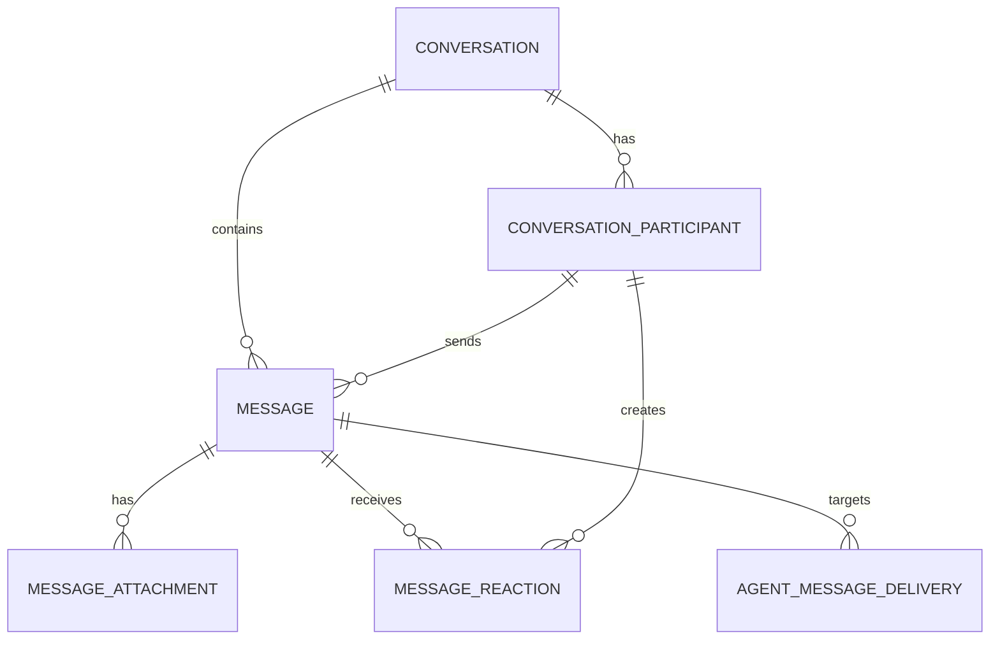

# CoForge IM database schema

Status: proposed baseline

Database: PostgreSQL 16+

This schema models direct messages and group chats with the same conversation,
participant, and message tables. It intentionally keeps Agent execution
`run`/`event` data out of the messaging core.

## Model



### `conversation`

One row represents either a direct conversation (`kind = direct`) or a group
conversation (`kind = group`). `next_message_seq` allocates a monotonically
increasing sequence inside the conversation. Clients paginate and maintain read
watermarks by this sequence rather than by timestamps.

For a direct conversation, the service derives `direct_key` from the two
normalized subjects in stable lexical order. A suitable input is
`<type>:<uuid>|<type>:<uuid>`; the stored value may be this input or its SHA-256
digest. The unique partial index makes concurrent attempts to create the same
DM converge on one conversation, including when it has been archived. The
service should reopen that canonical DM instead of creating a second history.
Group conversations have a null `direct_key`.

### `conversation_participant`

A subject is currently either a workspace member or an Agent. A participant row
is retained when someone leaves or is removed, so old sender and read-state
references remain valid. Rejoining changes `state` back to `active` rather than
inserting another row.

`last_read_seq` is the scalable default for read receipts: every message at or
below the watermark is read. It avoids one receipt row per person per group
message. Exact per-message receipts can be added later if product behavior
requires them.

Application invariants:

- a direct conversation must have exactly two active participants;
- a group must have at least one active owner;
- only active participants may send new messages;
- participant subjects must belong to the same workspace as the conversation.

### `message`

`message` is the canonical, durable chat record. `client_message_id` provides
idempotency for client retries. `seq` is assigned atomically from the owning
conversation. A soft-deleted message keeps its identity and sequence so replies,
pagination, and delivery rows do not break.

The baseline supports text/Markdown in `body_text` and structured messages in
`body_json`. Attachments store metadata and an object-storage key, never the
blob itself. Reactions are unique per participant, message, and emoji.

### `agent_message_delivery`

This is the per-Agent delivery ledger for canonical messages. It is not a
command mailbox and it has no claim or lease fields.

Each targeted Agent receives one row with a database-assigned `seq`. PostgreSQL
uses one identity sequence for all deliveries, so concurrent inserts do not
collide and no counter table or row lock is needed. Gaps are valid; each Agent's
subset remains monotonic and can be replayed in `seq` order. After commit, the
backend may offer the delivery to an online workspace-daemon. The workspace
child returns `delivery.accepted` only after it has inserted the delivery into
its local durable inbox, or confirmed that the same `delivery_id` is already
there. ACK therefore means **durably accepted by the local runtime**, not
**Agent run completed** or handed to ACP.

The server accepts an ACK only when workspace, Agent, delivery ID, and sequence
match, then sets `acked_at`. On reconnect or retry it resends unacknowledged rows
with their original sequence. The local durable inbox uniquely constrains
`delivery_id`, turning a repeated offer into an idempotent no-op before ACK. A
WebSocket connection outbox remains an in-memory write queue and is not
represented by a database table.

The local inbox/outbox schema is intentionally deferred to the SQLite spool ADR;
it is not part of this PostgreSQL migration.

## Atomic write paths

### Send a canonical message

1. Start a transaction and lock the conversation row.
2. Verify the sender is an active participant.
3. Read and increment `conversation.next_message_seq` with `UPDATE ... RETURNING`.
4. Insert `message`, treating a duplicate `(sender_participant_id,
   client_message_id)` as an idempotent retry.
5. Insert one `agent_message_delivery` per targeted Agent; PostgreSQL assigns
   each row's delivery sequence.
6. Commit, then attempt online WebSocket delivery. Failed or skipped sends remain
   discoverable as `acked_at IS NULL`.

Example message-sequence allocation:

```sql
UPDATE conversation
SET next_message_seq = next_message_seq + 1,
    updated_at = now()
WHERE workspace_id = $1 AND id = $2
RETURNING next_message_seq - 1 AS seq;
```

### Create or find a direct conversation

Insert `conversation(kind = 'direct', direct_key = ...)` and its two participant
rows in one transaction. On a unique-key conflict, select the existing canonical
conversation by `(workspace_id, direct_key)`. The service must prevent a member
or Agent from opening a DM with itself unless that becomes an explicit feature.

## Identity boundaries

The initial DDL deliberately does not add foreign keys from `workspace_id`,
`subject_id`, or `agent_id` to identity tables, because those tables are not yet
part of the repository contract. Add those foreign keys when workspace, member,
and Agent ownership schemas stabilize. Internal messaging references are fully
constrained now.

## Retention and indexing

- Use keyset pagination on `(conversation_id, seq)`; do not use timestamp offset
  pagination for message history.
- Query inbox membership through the active-participant partial index.
- Query pending Agent delivery through `(workspace_id, agent_id, seq) WHERE
  acked_at IS NULL`.
- Keep canonical messages and delivery rows long enough to satisfy replay and
  audit requirements. If hard deletion is required, delete delivery, reaction,
  attachment, and message data as one explicit retention workflow.
- Treat `body_json` as versioned application data. Do not use it as a substitute
  for columns needed by relational filters or integrity rules.

The executable baseline is in [`database/0001_im_core.sql`](../database/0001_im_core.sql).
