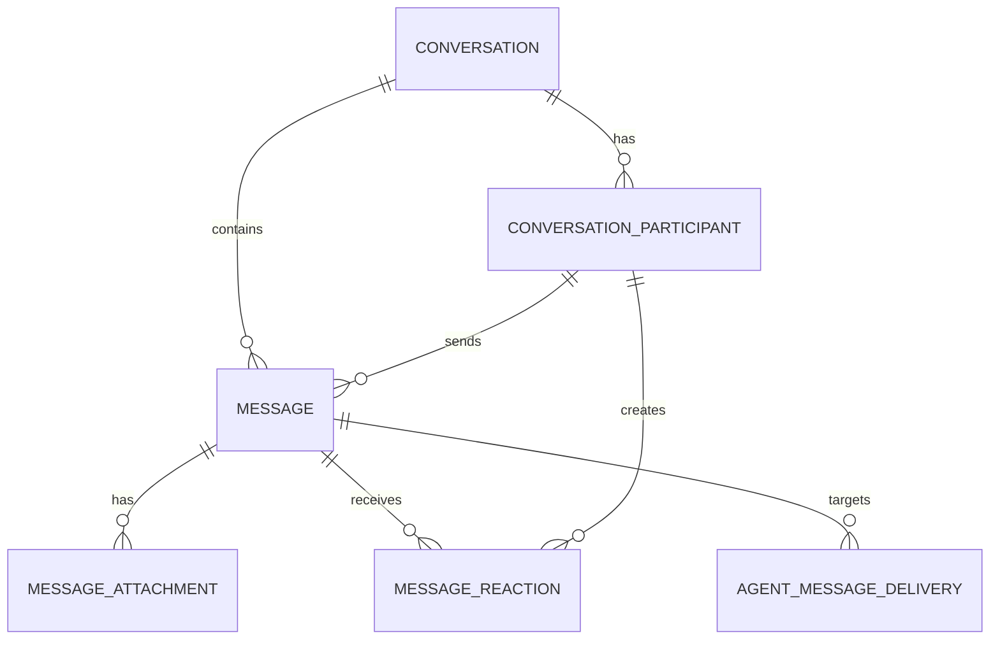

# CoForge database schema

Status: approved setup identity schema plus discussion draft messaging schema

Database: PostgreSQL 16+

This schema models direct messages and group chats with the same conversation,
participant, and message tables. It intentionally keeps Agent execution
`run`/`event` data out of the messaging core.

## Implementation contract

When implementation starts, use this layout and workflow unless a later ADR
supersedes it:

```text
apps/web/
├── prisma/
│   ├── schema.prisma
│   └── migrations/
└── src/server/
    └── db/
        ├── client.server.ts
        └── repositories/
```

- `schema.prisma` is the single declarative model for tables owned by
  Web/backend. Generated client output is an implementation artifact and must
  not be hand-edited or imported by browser code.
- `prisma migrate dev` is for a developer's isolated Docker PostgreSQL only;
  `prisma migrate deploy` is the only migration command for shared/staging/
  production databases. `prisma db push` and `prisma db reset` are not part of
  the team workflow.
- The minimum database scripts are `db:validate`, `db:generate`,
  `db:migrate:dev`, `db:migrate:deploy`, and `db:studio`. The exact package
  script wiring is implementation work, but names should remain stable for
  code agents and CI.
- `DATABASE_URL` is injected at runtime. Local Docker PostgreSQL uses a
  developer-only credential and private network; no password, endpoint, or
  production connection string belongs in the repository.
- A migration is complete only when its generated SQL, clean-database apply,
  rollback/forward-compatibility impact, and affected repository tests have
  been reviewed. Destructive or long-running migrations require an explicit
  deployment plan before implementation.

## Model

### Approved setup identity models

Setup persistence consists of exactly four PostgreSQL models: `Workspace`,
`WorkspaceMembership`, `Computer`, and `WorkspaceComputer`. `WorkspaceComputer`
is the durable binding and contains the workspace/computer foreign keys. Its
database `id` is an internal storage primary key; the business identity is the
composite `(workspaceId, computerId)` key. That unique constraint makes
repeated setup converge on the same binding. There is no registration-idempotency table, token hash, or
temporary registration state. JWTs are stateless: every authorized retry may
issue a fresh worker JWT for the existing binding.

The repository must use database `upsert` operations and explicit unique-conflict
handling, never placeholder UUID rows. Concurrent requests may both reach the
upserts, but PostgreSQL uniqueness ensures one Computer and one
WorkspaceComputer binding; a deployment with stronger all-or-nothing behavior
may wrap the operations in a transaction. Token issuance occurs after the
durable binding is found or created, so an issuer failure is safely retryable.



### `conversation`

One row represents either a direct conversation (`kind = direct`) or a group
conversation (`kind = group`). `next_message_seq` allocates a monotonically
increasing sequence inside the conversation. Clients paginate and maintain read
watermarks by this sequence rather than by timestamps.

For a direct conversation, the service derives `direct_key` from the two
normalized subjects in stable lexical order. A suitable input is
`<type>:<uuid>|<type>:<uuid>`; the stored value may be this input or its SHA-256
digest. The unique partial index makes concurrent attempts to create the same
DM converge on one conversation, including when it has been archived. The
service should reopen that canonical DM instead of creating a second history.
Group conversations have a null `direct_key`.

### `conversation_participant`

A subject is currently either a workspace member or an Agent. A participant row
is retained when someone leaves or is removed, so old sender and read-state
references remain valid. Rejoining changes `state` back to `active` rather than
inserting another row.

`last_read_seq` is the scalable default for read receipts: every message at or
below the watermark is read. It avoids one receipt row per person per group
message. Exact per-message receipts can be added later if product behavior
requires them.

Application invariants:

- a direct conversation must have exactly two active participants;
- a group must have at least one active owner;
- only active participants may send new messages;
- participant subjects must belong to the same workspace as the conversation.

### `message`

`message` is the canonical, durable chat record. `client_message_id` provides
idempotency for client retries. `seq` is assigned atomically from the owning
conversation. A soft-deleted message keeps its identity and sequence so replies,
pagination, and delivery rows do not break.

The baseline supports text/Markdown in `body_text` and structured messages in
`body_json`. Attachments store metadata and an object-storage key, never the
blob itself. Reactions are unique per participant, message, and emoji.

### `message_attachment`

A `message_attachment` row represents an attachment already bound to a committed
canonical message. It stores the stable `attachment_id`, provider-independent
`object_key`, original filename metadata, declared and verified content type,
byte size, and any integrity metadata approved by the backend design. It never
stores object bytes, a bucket, endpoint, delivery-provider discriminator, or an
expiring OSS/CDN signed URL. The backend derives download authorization only
after reaching the row through a committed message visible to the requesting
participant. Physical bucket and delivery-domain mappings are adapter deployment
configuration, so switching delivery from direct OSS to private CDN does not
rewrite this row or copy the object.

Before that row exists, the backend maintains a durable, expiring upload intent
bound to the creating participant, workspace, conversation, server-generated
exact object key, and expected object metadata. The same creator may consume a
verified intent once, only by binding it to a message committed in that same
conversation. Expired, failed, consumed, or mismatched intents cannot create a
`message_attachment`; orphan objects are removed by a retention workflow. This
is a conceptual lifecycle invariant, not approval of a particular intent table
or set of SQL status columns.

The canonical object key is generated by the backend and scoped by workspace:

```text
workspaces/{workspace_id}/attachments/{attachment_id}/original
```

Conversation and message relationships remain relational data and are not
encoded into the object key. The original filename is metadata only and is
never concatenated into an authorization prefix. Exact lifecycle/status
columns remain part of the later reviewed migration; this document does not
turn the upload flow into an approved SQL schema.

The same immutable `object_key` is the resource identity used by both delivery
adapters. A direct OSS adapter signs an exact-key GET request; a private CDN
adapter signs the corresponding canonical path at `files.coforge.cn`. Both are
reached only after the provider-neutral attachment-download authorizer verifies
the committed message and requester visibility. Neither adapter may persist its
returned bearer URL, and a content replacement receives a new `attachment_id`
and object key rather than overwriting the object behind an existing row.

### `agent_message_delivery`

This is the per-Agent delivery ledger for canonical messages. It is not a
command mailbox and it has no claim or lease fields.

Each targeted Agent receives one row with a database-assigned `seq`. PostgreSQL
uses one identity sequence for all deliveries, so concurrent inserts do not
collide and no counter table or row lock is needed. Gaps are valid; each Agent's
subset remains monotonic and can be replayed in `seq` order. After commit, the
backend may offer the delivery to an online workspace worker. The worker
returns a durable-accept response only after it has inserted the delivery
into its local durable inbox, or confirmed that the same `delivery_id` is
already there. The exact response method and envelope remain gated by the
separate wire-protocol approval. ACK therefore means **durably accepted by the
local runtime**, not **Agent run completed** or handed to ACP.

The server accepts an ACK only when workspace, Agent, delivery ID, and sequence
match, then sets `acked_at`. On reconnect or retry it resends unacknowledged rows
with their original sequence. The local durable inbox uniquely constrains
`delivery_id`, turning a repeated offer into an idempotent no-op before ACK. A
WebSocket connection outbox remains an in-memory write queue and is not
represented by a database table.

The local inbox/outbox schema is intentionally deferred to a later discussion;
it is not part of this cloud data-model draft.

## Atomic write paths

### Send a canonical message

1. Start a transaction and lock the conversation row.
2. Verify the sender is an active participant.
3. Read and increment `conversation.next_message_seq` with `UPDATE ... RETURNING`.
4. Insert `message`, treating a duplicate `(sender_participant_id,
   client_message_id)` as an idempotent retry.
5. Insert one `agent_message_delivery` per targeted Agent; PostgreSQL assigns
   each row's delivery sequence.
6. Commit, then attempt online WebSocket delivery. Failed or skipped sends remain
   discoverable as `acked_at IS NULL`.

Example message-sequence allocation:

```sql
UPDATE conversation
SET next_message_seq = next_message_seq + 1,
    updated_at = now()
WHERE workspace_id = $1 AND id = $2
RETURNING next_message_seq - 1 AS seq;
```

### Create or find a direct conversation

Insert `conversation(kind = 'direct', direct_key = ...)` and its two participant
rows in one transaction. On a unique-key conflict, select the existing canonical
conversation by `(workspace_id, direct_key)`. The service must prevent a member
or Agent from opening a DM with itself unless that becomes an explicit feature.

## Identity boundaries

This draft deliberately does not define foreign keys from `workspace_id`,
`subject_id`, or `agent_id` to identity tables, because those tables are not yet
part of the repository contract. Add those foreign keys when workspace, member,
and Agent ownership schemas stabilize. Internal messaging references are fully
constrained now.

## Retention and indexing

- Use keyset pagination on `(conversation_id, seq)`; do not use timestamp offset
  pagination for message history.
- Query inbox membership through the active-participant partial index.
- Query pending Agent delivery through `(workspace_id, agent_id, seq) WHERE
  acked_at IS NULL`.
- Keep canonical messages and delivery rows long enough to satisfy replay and
  audit requirements. If hard deletion is required, delete delivery, reaction,
  attachment, and message data as one explicit retention workflow.
- Treat `body_json` as versioned application data. Do not use it as a substitute
  for columns needed by relational filters or integrity rules.

The messaging table design remains a discussion draft and is not included in the
setup migration. Setup-owned identity and Workspace connection tables are
implemented separately under `apps/web/prisma/schema.prisma` and its migration.
The project-level data-access choice is recorded in
[`ADR 0003`](adr/0003-prisma-as-postgresql-data-access.md): approved
implementations use Prisma schema, generated Prisma Client, and Prisma Migrate.
That approval does not approve the draft messaging tables or their future SQL
migrations.
