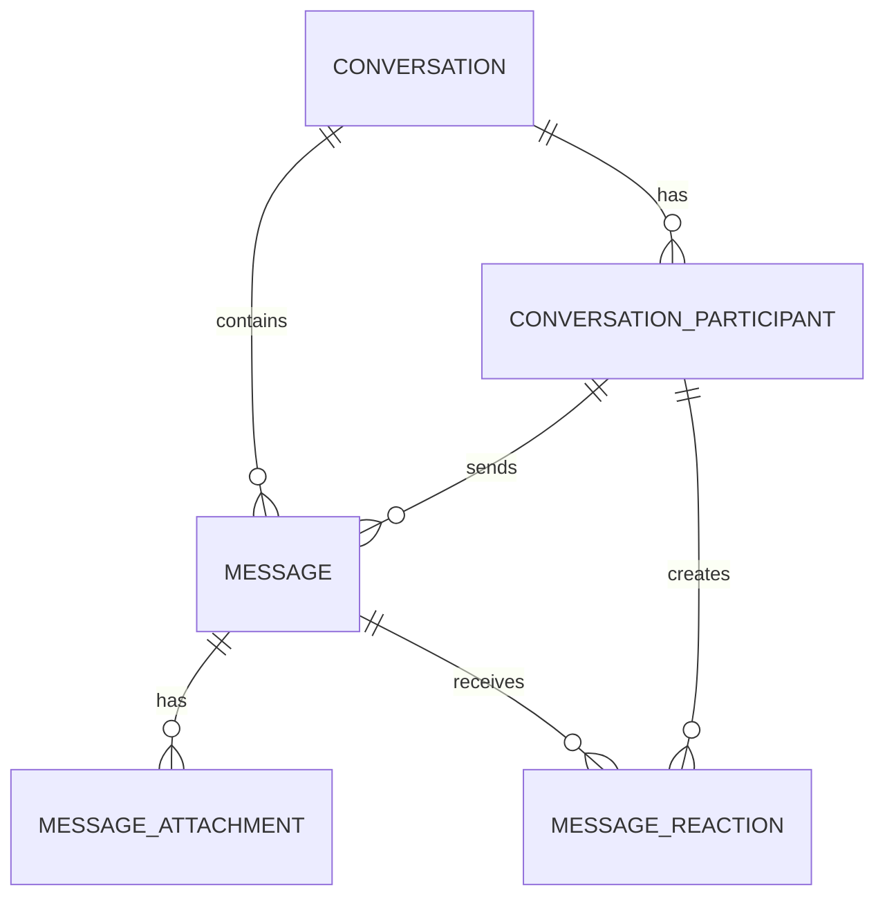

# CoForge database schema

Status: approved setup identity schema plus approved DirectConversation MVP slice

Database: PostgreSQL 16+

This schema currently models only User↔Agent direct messages. Group chat is
explicitly deferred and has no database kind, role, or broadcast fields. It
intentionally keeps Agent execution
`run`/`event` data out of the messaging core.

## Implementation contract

When implementation starts, use this layout and workflow unless a later ADR
supersedes it:

```text
apps/web/
├── prisma/
│   ├── schema.prisma
│   └── migrations/
└── src/server/
    └── db/
        ├── client.server.ts
        └── repositories/
```

- `schema.prisma` is the single declarative model for tables owned by
  Web/backend. Generated client output is an implementation artifact and must
  not be hand-edited or imported by browser code.
- `prisma migrate dev` is for a developer's isolated Docker PostgreSQL only;
  `prisma migrate deploy` is the only migration command for shared/staging/
  production databases. `prisma db push` and `prisma db reset` are not part of
  the team workflow.
- The minimum database scripts are `db:validate`, `db:generate`,
  `db:migrate:dev`, `db:migrate:deploy`, and `db:studio`. The exact package
  script wiring is implementation work, but names should remain stable for
  code agents and CI.
- `DATABASE_URL` is injected at runtime. Local Docker PostgreSQL uses a
  developer-only credential and private network; no password, endpoint, or
  production connection string belongs in the repository.
- A migration is complete only when its generated SQL, clean-database apply,
  rollback/forward-compatibility impact, and affected repository tests have
  been reviewed. Destructive or long-running migrations require an explicit
  deployment plan before implementation.

## Model

### Approved setup identity models

`User` is the internal business subject with a stable UUID and required unique
internal `username`. Public user targets are `@${User.username}`; provider
subjects are never usernames. Existing users are deterministically backfilled
as `user-` plus the full hyphenless UUID. On first identity creation a valid
Authing `preferred_username` is preferred; otherwise the backend derives a
normalized email local-part with a stable suffix from the already-generated
User UUID. The username is not changed by later logins. `UserIdentity` maps
an external provider and subject to that User; provider subjects are never
business foreign keys. Membership, Agent ownership, and Computer ownership use
the internal User UUID. Existing rows are backfilled by the migration before
the legacy external column is removed.

`User.displayName` stores the user's optional editable name override; when it
is null, the application displays the current identity-provider name.
`User.description` stores the editable profile description. The optional
`avatarObjectKey` and `avatarContentType` identify the user's current private
avatar in the shared user-files store; image bytes and delivery URLs are never
stored in PostgreSQL. Replacing an avatar writes a new immutable object before
the row points to it, then removes the previous object.

Setup persistence consists of `User`, `UserIdentity`, `Workspace`,
`WorkspaceMembership`, `Computer`, and `WorkspaceComputer`. `WorkspaceComputer`
is the durable binding and contains the workspace/computer foreign keys. Its
database `id` is an internal storage primary key; the business identity is the
composite `(workspaceId, computerId)` key. That unique constraint makes
repeated setup converge on the same binding. `DaemonApiKey` stores only the
hash of the long-lived, revocable Daemon API key and its Workspace/Computer
binding; the plaintext key is returned once and persisted only in the native
credential store.

`AgentApiKey` stores only the SHA-256 `apiKeyHash` plus its Agent, Workspace,
owner, and Computer binding; plaintext `sk_agent_...` values are returned once
and never persisted. Key creation locks the owning Agent row with PostgreSQL
`FOR UPDATE`, revokes all active keys for that Agent, and inserts the replacement
inside one transaction. Exact-key revocation remains idempotent.

The repository must use database `upsert` operations and explicit unique-conflict
handling, never placeholder UUID rows. Concurrent requests may both reach the
upserts, but PostgreSQL uniqueness ensures one Computer and one
WorkspaceComputer binding; a deployment with stronger all-or-nothing behavior
may wrap the operations in a transaction. Token issuance occurs after the
durable binding is found or created, so an API-key creation failure is safely
retryable.



### `conversation` (DirectConversation only)

One row represents a User↔Agent direct conversation. `directKey` is unique per
workspace and derived from the two stable subject UUIDs in lexical order.

For a direct conversation, the service derives `direct_key` from the two
normalized subjects in stable lexical order. A suitable input is
`<type>:<uuid>|<type>:<uuid>`; the stored value may be this input or its SHA-256
digest. The unique partial index makes concurrent attempts to create the same
DM converge on one conversation, including when it has been archived. The
service should reopen that canonical DM instead of creating a second history.
Group conversations have a null `direct_key`.

### `conversation_member`

A subject is either a User or an Agent through real nullable foreign keys, with a
database XOR check. The MVP creates exactly two members and validates both
workspace membership and Agent ownership before creation.

The database also carries `workspaceId` on the member and enforces composite
foreign keys to `(Conversation.id, Conversation.workspaceId)` and
`(Agent.id, Agent.workspaceId)`. Prisma represents these relations; the XOR
condition itself is PostgreSQL-only because Prisma schema relations cannot
express a `CHECK` constraint. The migration is therefore the source of truth
for `ConversationMember_subject_check`.

`last_read_seq` is the scalable default for read receipts: every message at or
below the watermark is read. It avoids one receipt row per person per group
message. Exact per-message receipts can be added later if product behavior
requires them.

Application invariants:

- a direct conversation must have exactly two members, one User and one Agent;
- only conversation members may send new messages;
- member subjects must belong to the same workspace as the conversation;
- group conversations are not implemented in this MVP.

### `message`

`Message` is the canonical, durable chat record. Its current columns include
`id`, `conversationId`, `workspaceId`, `senderMemberId`, `body`, `sequence`, and
`createdAt`; it has no client-request identifier or database uniqueness
constraint for send idempotency. `sequence` is assigned atomically within the
owning conversation and is unique with `conversationId`.

Agent→Web send retries carry a stable `request_id`. For the MVP, Web keeps the
request result in bounded, expiring Redis idempotency state and returns that
same result when the same authorized sender retries the request. Redis loss may
lose this short-term deduplication state; PostgreSQL does not persist
`request_id`, and this decision does not add a Prisma model, column, migration,
or unique constraint for request idempotency.

The MVP stores `workspaceId` on each message solely to support composite foreign
keys: both its conversation and its sender member must have that workspace and
the sender member must therefore belong to that conversation. This is a
database integrity field, not a second application tenancy concept.

The baseline supports text/Markdown in `body_text` and structured messages in
`body_json`. Attachments store metadata and an object-storage key, never the
blob itself. Reactions are unique per participant, message, and emoji.

### `message_attachment`

A `message_attachment` row represents an attachment already bound to a committed
canonical message. It stores the stable `attachment_id`, provider-independent
`object_key`, original filename metadata, declared and verified content type,
byte size, and any integrity metadata approved by the backend design. It never
stores object bytes, a bucket, endpoint, delivery-provider discriminator, or an
expiring OSS/CDN signed URL. The backend derives download authorization only
after reaching the row through a committed message visible to the requesting
participant. Physical bucket and delivery-domain mappings are adapter deployment
configuration, so switching delivery from direct OSS to private CDN does not
rewrite this row or copy the object.

Before that row exists, the backend maintains a durable, expiring upload intent
bound to the creating participant, workspace, conversation, server-generated
exact object key, and expected object metadata. The same creator may consume a
verified intent once, only by binding it to a message committed in that same
conversation. Expired, failed, consumed, or mismatched intents cannot create a
`message_attachment`; orphan objects are removed by a retention workflow. This
is a conceptual lifecycle invariant, not approval of a particular intent table
or set of SQL status columns.

The canonical object key is generated by the backend and scoped by workspace:

```text
workspaces/{workspace_id}/attachments/{attachment_id}/original
```

Conversation and message relationships remain relational data and are not
encoded into the object key. The original filename is metadata only and is
never concatenated into an authorization prefix. Exact lifecycle/status
columns remain part of the later reviewed migration; this document does not
turn the upload flow into an approved SQL schema.

The same immutable `object_key` is the resource identity used by both delivery
adapters. A direct OSS adapter signs an exact-key GET request; a private CDN
adapter signs the corresponding canonical path at `files.coforge.cn`. Both are
reached only after the provider-neutral attachment-download authorizer verifies
the committed message and requester visibility. Neither adapter may persist its
returned bearer URL, and a content replacement receives a new `attachment_id`
and object key rather than overwriting the object behind an existing row.

### Agent attention and recovery

The current MVP has no complete per-Agent delivery-ledger table and no local
durable message inbox/outbox. The canonical `Message` plus each conversation
member's read boundary is the recovery model. A daemon ACK means only that
`AgentSession`/`notify` successfully accepted the volatile attention; it
does not mean an Agent run completed. Agent read/send uses the independent
HTTPS RPC, and a logical send retries the same `request_id` after an uncertain
result. Agent Activity is a best-effort observation and has no local spool or
database recovery role.

## Atomic write paths

### Send a canonical message

1. Check or reserve the authorized sender's stable `request_id` in the bounded,
   expiring Redis idempotency state; return its stored result on a retry.
2. Verify that the sender is one of the User↔Agent direct conversation's two
   members.
3. Start a transaction, lock the conversation row, read the current maximum
   `Message.sequence`, and allocate the next value.
4. Insert `Message`; there is no
   database request-id uniqueness check.
5. Commit and record the result for `request_id` in Redis, then publish a
   volatile attention to the targeted online Agent.
   Missed attention is recovered from canonical Message/read state, not a
   delivery-ledger row.

The current sequence allocator serializes writers by locking the conversation
row before reading `MAX(Message.sequence) + 1`. `Conversation` has no stored
next-sequence counter; `(conversationId, sequence)` is the database uniqueness
constraint.

### Create or find a direct conversation

Insert `Conversation(workspaceId, directKey)` and its User and Agent
`ConversationMember` rows. On a unique-key conflict, select the existing
canonical conversation by `(workspaceId, directKey)`. There is no conversation
kind column because the current schema supports only User↔Agent direct chat.

## Identity boundaries

This draft deliberately does not define foreign keys from `workspace_id`,
`subject_id`, or `agent_id` to identity tables, because those tables are not yet
part of the repository contract. Add those foreign keys when workspace, member,
and Agent ownership schemas stabilize. Internal messaging references are fully
constrained now.

## Retention and indexing

- Use keyset pagination on `(conversation_id, seq)`; do not use timestamp offset
  pagination for message history.
- Query inbox membership through the active-participant partial index.
- Keep canonical messages long enough to satisfy read-boundary recovery and
  audit requirements. If hard deletion is required, delete reaction,
  attachment, and message data as one explicit retention workflow.
- Treat `body_json` as versioned application data. Do not use it as a substitute
  for columns needed by relational filters or integrity rules.

The DirectConversation, ConversationMember, and Message tables are included in
the `20260828000003_direct_conversations` migration. Setup-owned identity and Workspace connection tables are
implemented separately under `apps/web/prisma/schema.prisma` and its migration.
The project-level data-access choice is recorded in
[`ADR 0003`](adr/0003-prisma-as-postgresql-data-access.md): approved
implementations use Prisma schema, generated Prisma Client, and Prisma Migrate.
That approval does not approve the draft messaging tables or their future SQL
migrations.
