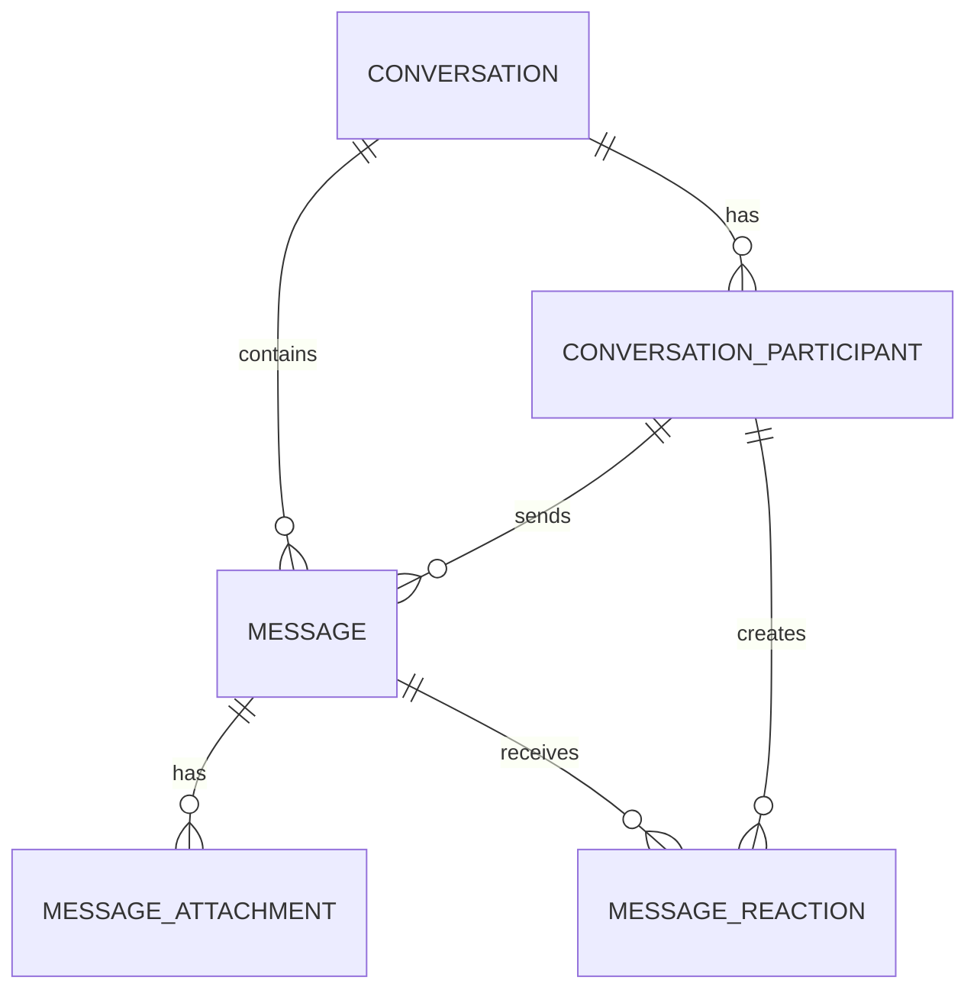

# Conversation model

## `conversation` (DirectConversation only)

One row represents a User↔Agent direct conversation. `directKey` is unique per
workspace and derived from the two stable subject UUIDs in lexical order.

For a direct conversation, the service derives `direct_key` from the two
normalized subjects in stable lexical order. A suitable input is
`<type>:<uuid>|<type>:<uuid>`; the stored value may be this input or its SHA-256
digest. The unique partial index makes concurrent attempts to create the same
DM converge on one conversation, including when it has been archived. The
service should reopen that canonical DM instead of creating a second history.
Group conversations have a null `direct_key`.

## `conversation_member`

A subject is either a User or an Agent through real nullable foreign keys, with a
database XOR check. The MVP creates exactly two members and validates both
workspace membership and Agent ownership before creation.

The database also carries `workspaceId` on the member and enforces composite
foreign keys to `(Conversation.id, Conversation.workspaceId)` and
`(Agent.id, Agent.workspaceId)`. Prisma represents these relations; the XOR
condition itself is PostgreSQL-only because Prisma schema relations cannot
express a `CHECK` constraint. The migration is therefore the source of truth
for `ConversationMember_subject_check`.

`last_read_seq` is the scalable default for read receipts: every message at or
below the watermark is read. It avoids one receipt row per person per group
message. Exact per-message receipts can be added later if product behavior
requires them.

Application invariants:

- a direct conversation must have exactly two members, one User and one Agent;
- only conversation members may send new messages;
- member subjects must belong to the same workspace as the conversation;
- group conversations are not implemented in this MVP.
