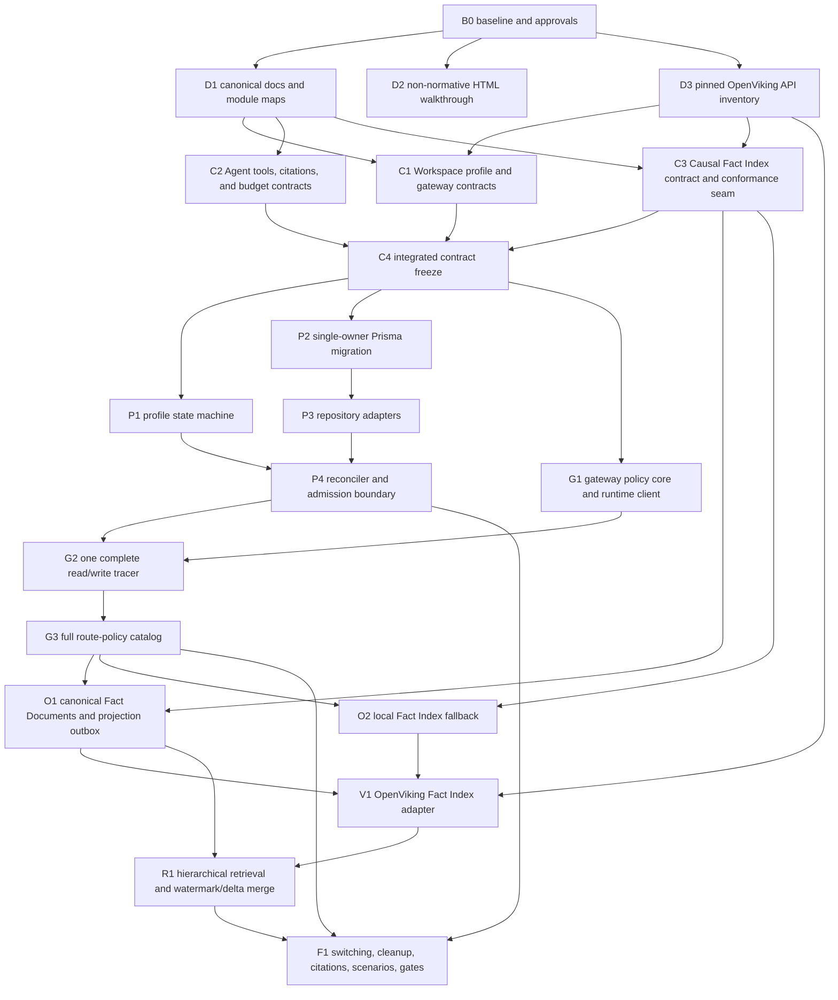

# OpenViking and Causal Memory Workspace profiles implementation plan

> **Superseded 2026-09-22:** the causal direction was falsified; Workspace memory is OpenViking-only ([ADR 0062](../adr/0062-openviking-only-workspace-memory.md)). This task graph is a historical record.


**Status:** design frozen; implementation plan pending final shared-understanding confirmation and required Frank approvals.  
**Primary worktree:** `feat/causal-memory` at `/home/zhoujie22/river2_0/.worktrees/coforge-causal-memory`.  
**External source trees:** `/home/zhoujie22/river2_0/causal-memory` (patched Causal Memory runtime) and `/home/zhoujie22/river2_0/OpenViking` (read-only during the prototype).  
**Decision sources:** [ADR 0058](../adr/0058-causal-memory-workspace-tenant.md), [ADR 0059](../adr/0059-causal-memory-internal-fact-index.md), [ADR 0060](../adr/0060-workspace-openviking-memory-profiles.md), [ADR 0061](../adr/0061-policy-gateway-for-complete-openviking.md), [`CONTEXT.md`](../../CONTEXT.md), and the [architecture baseline](../architecture.md).  
**Existing causal-only plan:** [causal-memory-parallel-plan.md](causal-memory-parallel-plan.md) remains the record of the already implemented causal vertical slice; this plan extends it rather than silently rewriting its history.

## Goal and fixed delivery shape

Each Workspace selects exactly one desired memory profile:

```text
off | openviking | causal_openviking
```

`openviking` exposes complete OpenViking backend capability through a private, deny-by-default CoForge policy gateway. `causal_openviking` retains that complete OpenViking capability and adds Causal Memory as the canonical causal layer. Causal Memory projects active Fact Documents into a dedicated OpenViking namespace through its internal Fact Index seam; OpenViking never becomes the authority for causal facts, admitted provenance, correction, or graph semantics.

The implementation must preserve these invariants:

1. Profile selection is Workspace-wide, not per Agent or per query.
2. Automatic team-memory admission is identical in both profiles: completed Task windows and PublicChannel quiet windows only; DirectConversation is always excluded.
3. One admitted segment is processed by exactly one team-memory extractor for its active profile.
4. OpenViking and Causal Memory citations are distinct tagged evidence types; an OpenViking URI never stands in for admitted causal provenance.
5. Causal reads share 4,800 tokens per triggering Message, default to 1,600 per read, allow at most 3,200 for one read, return at most ten candidates, perform at most three reads, and publish at most one visible Memory Offer.
6. Causal OpenViking retrieval targets only the Managed Causal Projection, disables query expansion and OpenViking session context, and uses OpenViking only to rank deterministic L0/L1/L2 candidates.
7. Causal search merges the OpenViking watermark with canonical local deltas, then rejects stale, superseded, unknown, or tenant-mismatched candidates before Hippocampus sees them.
8. OpenViking failure degrades causal candidate recall to a local SQLite adapter; it never blocks ordinary messaging or identifier-based causal graph operations.
9. The initial OpenViking integration is an AGPL-license-review-gated, synthetic-data-only prototype. It defaults off and is excluded from default Compose, release manifests, staging, and production.
10. LanceDB is out of scope. A later LanceDB implementation belongs behind OpenViking's `CollectionAdapter`, not behind a new CoForge seam.
11. No OpenViking source modification is planned. A patch requires a separately recorded gap, license review, rollback plan, and explicit approval.
12. No UI unit tests are added. If a later slice adds UI, it records the affected UI and the manual verification checklist required by `docs/agents/testing.md`.

Official upstream references used to verify the prototype contract must be pinned during Stage 1: [OpenViking](https://github.com/volcengine/OpenViking), [Causal Memory at the currently reviewed base](https://github.com/JingxuanC/causal-memory/tree/9657b24), and the framework/runtime documentation already required by repository guidance. Repository and API inventory findings are evidence, not a second architecture source.

## Approval and execution preconditions

This plan does not itself authorize broad implementation changes. Before mutating architecture, schema, wire contracts, licensing boundaries, or security boundaries:

- the user must explicitly confirm that the final architecture summary and this plan are the shared understanding that ends the grilling session;
- Frank must explicitly approve the architecture, exact Prisma schema/migration, Agent wire-contract changes, policy-gateway security boundary, and prototype license gate as required by repository rules;
- the coordinator must verify ownership in `#coforge` before touching files claimed by another contributor;
- parallel mutators must start from one recorded integration base. The current feature worktree contains substantial uncommitted work and is behind `origin/main`; do not run parallel agents in that same physical worktree. Preserve it, record its SHA and patch state, and create isolated short-lived worktrees only after the owner authorizes the required branch/commit operation;
- no task may commit, rebase, merge, or push unless the user explicitly requests that Git operation.

## Dependency graph

The numbered stages preserve Q31's tracer-bullet order. The Agent-tool and prototype-infrastructure lanes may run beside the main chain after their stated gates, but they cannot enable production behavior or bypass the main chain.



### Parallel waves

| Wave | Work that may run concurrently | Barrier before next wave |
|---|---|---|
| 0 | B0 only | Fixed integration base, ownership, final shared-understanding confirmation, and an approval ledger are recorded. Frank's architecture/prototype-security approval gates Stage 1; later exact schema/wire gates stay visibly pending until their proposed diffs exist. |
| 1 | D1 architecture/module map, D2 HTML rewrite, D3 read-only OpenViking inventory | Canonical architecture describes both profiles; the HTML is explicitly non-normative; exact OpenViking revision and route inventory exist. |
| 2 | C1 Web profile/gateway contracts, C2 SDK Agent/citation/budget contracts, C3 Rust Fact Index contract | C4 integration review freezes names, JSON shapes, state transitions, errors, generations, watermarks, and test seams. |
| 3 | P1 profile core, P2 single-owner schema/migration, G1 gateway pure core; Agent lane A1–A3 and infra lane I1 may also start | P3 repositories and P4 reconciler expose a ready profile/binding; G1 tests pass with fakes. |
| 4 | G2 gateway tracer only on the main chain; remaining Agent/infra lane work may continue | One authorized read and one authorized mutation traverse CoForge → private OpenViking with identity stripping and audit evidence. |
| 5 | G3 route families may be classified in separate files; typed admin-control work may run in parallel | The aggregator classifies every route in the pinned inventory as generic data-plane, typed-control-only, or denied. Unknown routes remain denied. |
| 6 | O1 canonical outbox and O2 local fallback may run in parallel if they do not share the SQLite migration/store file | Canonical fact mutation and outbox commit atomically; the local adapter passes the shared conformance suite. |
| 7 | V1 adapter mapping, apply/reset, and search work may split by implementation file after its interface is fixed | The complete OpenViking Fact Index adapter passes conformance against a fake client, then synthetic real-runtime tests. |
| 8 | R1 hierarchical retrieval configuration and canonical delta/hydration may run in parallel | End-to-end causal search proves budget, watermark merge, tenant checks, active-only semantics, and fallback. |
| 9 | F1 switching, cleanup, citation/Offer integration, scenarios, smoke, docs, and independent review split by disjoint files | All targeted and repository gates pass; no license-gated artifact enters a release path. |

## Stage 0 — execution baseline and approvals

### B0 — establish a safe integration base

- **Owner:** coordinator only.
- **Scope:** Git/worktree state, ownership coordination, approval evidence; no feature implementation.
- **Inputs:** current `feat/causal-memory` worktree status, `origin/main`, ADRs 0058–0061, final architecture summary, current owners in `#coforge`.
- **Outputs:** recorded base SHA and dirty-patch inventory; allocated short-lived worktrees/branches; file-ownership ledger; explicit final shared-understanding confirmation; an approval ledger naming every required Frank gate, its owner, its status, and the first task it blocks.
- **Acceptance:** no uncommitted work is lost; no two agents are assigned the same hotspot; every downstream task names its base and owner; Stage 1 architecture mutation has explicit approval; later schema, wire, and security mutations remain blocked until their exact proposed changes receive the corresponding approval; no destructive Git command, commit, rebase, merge, or push occurs without authorization.
- **Depends on:** none.
- **Blocks:** every mutating task.

## Stage 1 — canonical documentation and source inventory

### D1 — update canonical architecture and Web module map

- **Owner:** architecture owner; sole writer for `docs/architecture.md` and `apps/web/AGENTS.md` during this stage.
- **Scope:** document ownership only, not runtime implementation.
- **Inputs:** ADRs 0058–0061, `CONTEXT.md`, this plan, current architecture section “Causal Memory group-memory runtime,” current Web module rules.
- **Outputs:**
  - `docs/architecture.md` updated with private OpenViking and Causal Memory runtimes, Workspace profile desired/observed state, common admission, separate write domains, Managed Causal Projection, Fact Index/outbox ownership, gateway authority, dual citations, degradation, cleanup, and prototype/license gate;
  - `apps/web/AGENTS.md` updated before new modules are added, assigning `server/workspace-memory/`, `server/openviking/`, `server/causal-memory/`, their repository adapters, thin routes, and one background-lifecycle composition owner.
- **Acceptance:** `docs/architecture.md` remains the only canonical architecture source; it no longer describes Causal Memory as the only possible Workspace memory profile; it explicitly states that the projection outbox is Causal Memory SQLite state, not Web PostgreSQL state; module dependencies point downward and routes remain thin.
- **Depends on:** B0 and Frank's explicit architecture/prototype-security approval.
- **Parallel with:** D2, D3.

### D2 — rewrite the existing architecture walkthrough

- **Owner:** walkthrough owner; sole writer for `/home/zhoujie22/river2_0/causal-memory-vs-openviking.html`.
- **Scope:** replace the rejected peer-runtime intent Router in chapter 3 with Workspace profiles and the internal Fact Index pipeline. Do not create another HTML document.
- **Inputs:** final architecture summary, ADRs 0059–0061, D1 terminology.
- **Outputs:** revised chapter 3, diagrams, object mapping, retrieval walkthrough, and implementation-order section.
- **Acceptance:** the HTML labels itself as a non-normative explanatory walkthrough and links readers to `docs/architecture.md`; it shows complete OpenViking in both profiles, one extractor per admitted segment, canonical CM ownership, deterministic projection partitions, dual citations, watermark/delta merge, and local fallback; no diagram uses natural-language routing to choose between peer memory truths.
- **Depends on:** B0; final terminology is reconciled with D1 before C4.
- **Parallel with:** D1, D3.

### D3 — pin and inventory the OpenViking public runtime interface

- **Owner:** OpenViking inventory owner; `/home/zhoujie22/river2_0/OpenViking` is read-only.
- **Scope:** official-source and local-source inspection only.
- **Inputs:** exact local OpenViking checkout, official repository/docs, ADR 0061.
- **Outputs:** `docs/research/openviking-prototype-interface-inventory.md` containing exact revision, license evidence, runtime compatibility, endpoint method/path inventory, auth/account/user/ACL model, identity headers, resource/filesystem/memory/skill/session/search/task/watch/pack/snapshot/observer families, deterministic-search flags, metadata round-trip, health, deletion, and known gaps. Every route is initially unclassified.
- **Acceptance:** every interface fact cites an official source or exact source path/revision; experimental or undocumented behavior is marked; no project data or code is sent to a third party; the inventory states whether stable metadata and deterministic retrieval can be achieved without modifying OpenViking.
- **Depends on:** B0.
- **Parallel with:** D1, D2.

**Stage 1 barrier:** D1–D3 reviewed together. Any source-discovered conflict with ADR 0059–0061 returns to `#coforge`; it is not silently turned into code.

## Stage 2 — contract freeze

All contract work is test-first. Contract tests must fail before implementation accepts the new shape.

### C1 — Workspace profile, gateway, and generic admission contracts

- **Owner:** Web contract owner.
- **Scope:** new framework-free files under `apps/web/src/server/workspace-memory/` and `apps/web/src/server/openviking/`; no Prisma, fetch, TanStack route, or concrete runtime dependency.
- **Inputs:** D1 module map, D3 inventory, ADRs 0060–0061.
- **Outputs:** contracts for:
  - `off | openviking | causal_openviking` desired profile;
  - `provisioning | ready | degraded | switching | error` observed state;
  - monotonic profile generation and activation cursor;
  - `WorkspaceMemoryProfileStore`, `OpenVikingBindingStore`, provisioning ports, actor/identity mapping, sanitized failures;
  - `AdmittedPublicChannelSegment` with profile generation and immutable source lineage;
  - policy classifications `data-plane | typed-control-only | denied`.
- **Acceptance:** state transitions, no-backfill activation boundary, fail-closed prototype gate, generation fencing, and unknown-route denial are frozen by focused tests; pure contracts import no Prisma or transport framework.
- **Depends on:** D1, D3, and Frank's explicit approval of the proposed policy-gateway security contract before contract code is mutated.
- **Parallel with:** C2, C3.

### C2 — Agent tools, citations, and budget wire contracts

- **Owner:** SDK contract owner; sole writer for `packages/coforge-sdk/src/agent/causal-memory.ts`, new memory/OpenViking contract files, `packages/coforge-sdk/src/agent/index.ts`, routes, relevant codec files, and their contract tests.
- **Scope:** framework-free Agent JSON and launch-fence vocabulary only.
- **Inputs:** ADR 0059 token rules, ADR 0060 profile-specific tools and citation definitions, existing causal protocol.
- **Outputs:**
  - distinct `OpenVikingCitation` and versioned `CausalMemoryCitation` variants with an explicit discriminator;
  - `ov_find`, `ov_search_context`, and `ov_read` read-only commands/responses;
  - causal command budget fields/validation for shared 4,800 tokens, default 1,600, per-read maximum 3,200, candidate maximum ten, three reads, and one Offer;
  - profile-specific tool-fence values kept distinct from Workspace profile persistence;
  - sanitized error vocabulary and stable operation IDs.
- **Acceptance:** malformed, mixed, or unversioned citations fail closed; OpenViking citations cannot satisfy correction provenance; limits above ten or budgets above the remaining shared budget are rejected or clamped exactly as the contract states; tenant credentials never appear in the wire shape.
- **Depends on:** D1 and D3 naming, plus Frank's explicit approval of the proposed Agent wire-contract change before contract code is mutated.
- **Parallel with:** C1, C3.

### C3 — Causal Memory Fact Index and projection contracts

- **Owner:** Causal Memory contract owner; sole writer for the new core port/DTO and conformance harness in `/home/zhoujie22/river2_0/causal-memory`.
- **Scope:** core Rust interface and tests, not HTTP composition or a concrete OpenViking adapter.
- **Inputs:** ADR 0059, D3 deterministic-search/metadata findings, current Causal Memory store/query module inventory.
- **Outputs:** `FactIndex` with exactly `apply(batch, generation)`, `search(query, limit)`, and `reset(generation)`; projection commands for active upsert/remove/dirty partition; candidate ID, score, matched level, fact version, generation, and watermark; conformance suite reusable by local and OpenViking adapters.
- **Acceptance:** replay/no-op, generation mismatch, reset, active-only behavior, tenant namespace, monotonic watermark, and sanitized adapter failure are executable tests through the public interface; OpenViking URI, embedding, collection, and task details do not enter the core interface.
- **Depends on:** D1, D3.
- **Parallel with:** C1, C2.

### C4 — integrated contract freeze

- **Owner:** coordinator/reviewer; no independent feature additions.
- **Inputs:** C1–C3 and their failing/passing contract tests.
- **Outputs:** one cross-reference matrix mapping Workspace profile → Agent fence → Web gateway → Causal runtime → citation type; frozen names and JSON/Rust DTO shapes.
- **Acceptance:** no duplicate meaning has different names; Workspace profile is not confused with Agent tool profile; common admission and activation cursor are represented; all external input has one validation owner; downstream implementers can work without editing contract files.
- **Depends on:** C1, C2, C3.
- **Blocks:** all behavior implementation.

## Parallel side lane A — profile-specific Agent tools

This lane starts after C4 and may run beside Stages 3–8. It cannot be connected to production composition until Stage 9.

### A1 — Agent fenced tool assembly and shared token budget

- **Owner:** Agent runtime owner; sole writer for `packages/agent/src/runner.ts` and `packages/agent/test/causal-memory-tools.test.ts` during the task.
- **Inputs:** C2.
- **Outputs:** profile-driven read-only tool assembly; one per-trigger shared budget object; OpenViking-only and causal-plus-OpenViking allowlists; no shell/filesystem/generic network under either Memory Agent fence.
- **Acceptance:** exact tool sets, fourth-read denial, second-Offer denial, aggregate token exhaustion, per-read dynamic allocation, candidate limit, reset per triggering Message, and no mutation tools are covered through the public tool factory.
- **Depends on:** C4.
- **Parallel with:** A2, A3, Stage 3.

### A2 — Daemon OpenViking read proxy

- **Owner:** Daemon proxy owner; sole writer for `packages/daemon/src/agent-proxy.ts`, the runtime forwarding method it consumes, and focused proxy tests.
- **Inputs:** C2, C1 identity contract.
- **Outputs:** separate classified local OpenViking read route/handler; token-binding identity; cloud forwarding without exposing Workspace or OpenViking credentials.
- **Acceptance:** malformed body, wrong method/path, missing/revoked local token, profile mismatch, and mutation attempts fail closed; valid reads preserve stable operation IDs; Daemon does not interpret memory semantics.
- **Depends on:** C4.
- **Parallel with:** A1, A3, Stage 3.

### A3 — profile-specific standing instructions

- **Owner:** Daemon instructions owner; sole writer for `packages/daemon/src/code-agent/agent-instructions.ts` and its tests.
- **Inputs:** C2 exact tool names and capability sets.
- **Outputs:** OpenViking-only and causal-plus-OpenViking Memory Agent sections.
- **Acceptance:** prompts name only actually available tools; both profiles prohibit direct mutation; the causal profile preserves explicit `@memory` query and correction-proposal rules; no token, credential, or hidden endpoint is rendered.
- **Depends on:** C4.
- **Parallel with:** A1, A2, Stage 3.

## Parallel side lane I — license-gated prototype infrastructure

### I1 — isolated OpenViking runtime and operations skeleton

- **Owner:** infrastructure/operations owner; no application or external upstream source edits.
- **Scope:** a separate development Compose override and OpenViking prototype runbook. Do not alter default Compose behavior, release manifests, staging, or production.
- **Inputs:** D3 exact runtime revision/configuration and ADR 0060 license gate.
- **Outputs:** default-off `OPENVIKING_PROTOTYPE_ENABLED` composition, private network, owner-only secrets/volumes, health check, resource envelope, synthetic seed/cleanup, backup/restore/reindex notes, and `non-production / license-review-required` labels.
- **Acceptance:** default repository startup does not launch OpenViking; no public Caddy route exists; credentials are absent from browser, Agent environment, command arguments, logs, and fixtures; only synthetic data is documented or accepted.
- **Depends on:** D1, D3 and Frank's prototype-security approval.
- **Parallel with:** Stages 2–8.

## Stage 3 — Workspace profile aggregate and reconciliation skeleton

### P1 — profile state machine with in-memory ports

- **Owner:** Workspace memory core owner.
- **Scope:** `apps/web/src/server/workspace-memory/` only; no Prisma or HTTP runtime calls.
- **Inputs:** C1.
- **Outputs:** `WorkspaceMemoryProfiles` intent module and generation-fenced `WorkspaceMemoryProfileReconciler` state machine using fake stores/provisioners.
- **Acceptance:** test-first coverage for off→openviking, openviking→causal_openviking, reverse switching, retry after partial provisioning, stale generation rejection, sanitized errors, and retaining data on switch/off.
- **Depends on:** C4.
- **Parallel with:** P2, G1, A1–A3, I1.

### P2 — one reviewed Prisma schema and migration

- **Owner:** schema owner; sole writer for `apps/web/prisma/schema.prisma`, the new migration, generated Prisma client effects, and migration tests.
- **Scope:** all schema required by this plan in one coordinated design; existing causal migrations remain immutable.
- **Inputs:** C1 and C2; exact schema proposal approved by Frank before mutation.
- **Outputs:** additive models/relations for `WorkspaceMemoryProfile`, `OpenVikingBinding`, generic admitted segment/source lineage and activation generation, distinct OpenViking citation records and typed Offer citation references, and durable observable Workspace-memory cleanup work. Credential plaintext is never stored. Causal delivery ledger remains causally named or is migrated explicitly; it is not silently reused as a generic profile record.
- **Acceptance:** reviewed SQL has Workspace-scoped uniqueness/FKs/indexes; PostgreSQL migration tests prove replay, tenant isolation, activation cursor, citation-kind integrity, and cleanup retention; no SQLite substitute and no silent test skip.
- **Depends on:** C4 and Frank's explicit schema/security approval.
- **Parallel with:** P1 and G1, but no other schema writer.

### P3 — Prisma repository adapters

- **Owner split after P2 lands:** profile repository owner, OpenViking binding repository owner, and admission/citation repository owner may work in parallel in separate files.
- **Scope:** `apps/web/src/server/db/repositories/workspace-memory-*.server.ts` and `openviking-binding.repositories.server.ts`; do not add new methods to the already broad `PrismaCausalMemoryRepository` unless the Causal module itself requires them.
- **Inputs:** C1 ports and generated client from P2.
- **Outputs:** concrete stores with Workspace scope, generation compare-and-set, immutable source lineage, citation-kind integrity, and cleanup work leasing/settlement.
- **Acceptance:** every adapter passes the same port behavior tests as the in-memory fake; cross-Workspace reads/writes and stale-generation updates fail; retryable cleanup remains visible after remote failure.
- **Depends on:** P2.
- **Parallel with:** separate repository files only.

### P4 — production reconciler and common admission boundary

- **Owner:** Workspace memory integration owner; sole writer for old `causal-memory/admission*.ts`, the new dispatcher/sweep, and background lifecycle composition during migration.
- **Scope:** move profile-neutral admission ownership to `server/workspace-memory/`; retain Causal-specific ingestion below it.
- **Inputs:** P1, P3, existing `detectAdmittedSegments`, Redis lock, current causal sweep, OpenViking/Causal provisioner ports.
- **Outputs:**
  - reconciler that provisions one OpenViking account per Workspace, mapped users/service identity, optional Causal tenant, namespace, and health before observed `ready`;
  - common immutable admitted segment with profile generation and activation cursor;
  - dispatcher that sends an admitted segment to exactly one sink;
  - explicit server-owned background composition independent of incidental Centrifugo traffic.
- **Acceptance:** switching to causal does not scan pre-activation history; `off`, provisioning, stale generation, and deletion states do not ingest; DirectConversation never appears; multiple backend replicas cannot double-dispatch; a memory failure does not block Message persistence.
- **Depends on:** P1 and P3. Production OpenViking provisioning may use a fake until G2.
- **Parallel with:** G1, A lane, I1; not with another editor of admission/sweep/composition files.

## Stage 4 — deny-by-default gateway tracer

### G1 — route policy core and runtime client

- **Owner split:** policy owner writes pure policy/catalog files; runtime-client owner writes `runtime-client.server.ts`. They may work in parallel and share no target file.
- **Inputs:** C1, D3 inventory, ADR 0061.
- **Outputs:** pure route classifier; actor classes; identity/account header denylist; request/response streaming rules; sanitized timeout/transport errors; private OpenViking runtime client.
- **Acceptance:** tests prove unknown route denial, path normalization, encoded traversal rejection, identity-header stripping, body/stream limits, timeout/abort, and no authorization inside the low-level client.
- **Depends on:** C4.
- **Parallel with:** Stage 3 and side lanes.

### G2 — one complete authorized read/write tracer

- **Owner:** gateway tracer owner; sole writer for the gateway composition and first thin splat route.
- **Scope:** one representative read and one representative non-admin mutation through the real CoForge authorization path; not the full route catalog.
- **Inputs:** G1, P4 ready profile/binding, C1 actor mapping, private fake or synthetic OpenViking runtime.
- **Outputs:** `OpenVikingPolicyGateway.forward(...)`, a thin TanStack raw HTTP adapter under `src/routes/api/`, typed provisioning/binding composition, and tracer integration tests. Before editing the TanStack route, load the repository's matching TanStack server-route guidance.
- **Acceptance:** Owner/Admin/member/ordinary Agent/Memory Agent/projection-worker identities produce the expected allow/deny result; client identity headers are ignored; the runtime sees only the mapped server-owned identity; one read and one authorized write round-trip without exposing credentials; Memory Agent mutation is denied.
- **Depends on:** G1 and P4.
- **Blocks:** G3.

## Stage 5 — complete route-policy catalog

“Complete” means every route in the pinned D3 inventory has an explicit disposition, not that every caller may invoke every route.

### G3.1–G3.4 — classify route families in parallel

- **Owners/files:** one owner per separate policy manifest and test file:
  - G3.1 resources, filesystem, content, find/search/context;
  - G3.2 memory, skill, session/commit, compile/evolution;
  - G3.3 task, watch, pack, snapshot, reindex, consistency, observer/stats;
  - G3.4 account, user, group, key, ACL, destructive administration.
- **Inputs:** D3 inventory and the proven G2 policy shape.
- **Outputs:** explicit method/path patterns, actor/capability requirements, body/stream limits, and `data-plane | typed-control-only | denied` classification. Admin/identity/destructive routes use typed control modules rather than generic proxy access.
- **Acceptance:** positive and negative tests per family; Memory Agent receives only approved reads; ordinary Actors cannot cross account/Workspace scope; root/cross-account operations never enter the generic path.
- **Depends on:** G2.
- **Parallel with:** each other because manifests/tests are separate.

### G3.5 — aggregate and detect upstream drift

- **Owner:** route-catalog integrator; sole writer for the catalog aggregator.
- **Inputs:** G3.1–G3.4 and D3 inventory.
- **Outputs:** complete catalog, inventory coverage test, and documented process for adding a newly introduced upstream route.
- **Acceptance:** every pinned route is classified exactly once; duplicate/overlapping patterns fail; an unknown future route remains denied; complete OpenViking backend capability is reachable through either the authorized generic data plane or an explicit typed control module.
- **Depends on:** G3.1–G3.4.
- **Blocks:** Stage 6, preserving Q31 order.

## Stage 6 — Causal canonical projection outbox and local fallback

### O1 — canonical Fact Document lifecycle and transactional outbox

- **Owner:** Causal store/outbox owner; sole writer for the relevant SQLite migration and canonical store transaction files in `/home/zhoujie22/river2_0/causal-memory`.
- **Inputs:** C3; existing CoForge Causal extension facts/edges/provenance; G3.5 barrier.
- **Outputs:** canonical Fact Document ID/content/provenance/active lifecycle/projection version; deterministic Fact Partition membership; durable outbox sequence/generation/command/hash/attempt/failure state committed in the same SQLite transaction as fact lifecycle changes.
- **Acceptance:** crash-injection tests prove no committed fact change lacks corresponding projection work and no outbox-only fact is visible; duplicate operation is a no-op; supersession queues removal while preserving canonical history; Task and Channel/month partition paths are deterministic.
- **Depends on:** C3 and G3.5.
- **Parallel with:** O2 only if O2 does not edit the same store/migration files.

### O2 — local SQLite Fact Index fallback

- **Owner:** local adapter owner; separate implementation/test files from O1.
- **Inputs:** C3 conformance suite and canonical active Fact Document read port.
- **Outputs:** local lexical `FactIndex` adapter implementing apply/search/reset shape without pretending to offer OpenViking hierarchy.
- **Acceptance:** shared conformance suite passes; tenant isolation and active-only behavior hold; runtime-unavailable fallback returns candidate IDs/versions/watermark and never constructs a Causal Citation without canonical hydration.
- **Depends on:** C3 and G3.5; final active-change query may wait for O1.
- **Parallel with:** O1.

### O3 — projector, replay, reset, and rebuild orchestration

- **Owner:** Causal projection orchestration owner; no canonical store schema edits.
- **Inputs:** O1 outbox/store port, C3 `FactIndex`, O2 fallback.
- **Outputs:** idempotent worker with bounded retries, sanitized diagnostics, generation reset, full rebuild, and observed watermark.
- **Acceptance:** controlled async tests await receipts/state rather than sleeps; stale generation cannot overwrite a newer rebuild; adapter outage retains work for retry; disabling a profile stops work without deleting data.
- **Depends on:** O1 and O2.

## Stage 7 — OpenViking Fact Index adapter

### V1.1 — deterministic projection mapping

- **Owner:** adapter mapping owner.
- **Inputs:** C3 commands, O1 partition policy, D3 metadata capabilities.
- **Outputs:** stable managed subtree paths, L2 Fact Document representation, partition manifest, canonical fact/version metadata, and L0/L1 dirty/update requests hidden behind the adapter.
- **Acceptance:** the same command always produces the same URI/content hash; user-controlled text cannot escape the managed subtree; URI is never used as canonical identity or causal evidence.
- **Depends on:** O1, O3, D3.
- **Parallel with:** V1.2 fake-client plumbing if files are disjoint.

### V1.2 — `apply` and `reset`

- **Owner:** adapter mutation owner.
- **Inputs:** V1.1 mapping, private OpenViking client, projection service identity.
- **Outputs:** idempotent upsert/remove/partition refresh and generation reset implementation.
- **Acceptance:** replay/no-op, active removal, namespace isolation, partial failure retry, and reset pass C3 conformance; adapter never invokes native session memory extraction for managed facts.
- **Depends on:** V1.1 and O3.

### V1.3 — deterministic `search`

- **Owner:** adapter retrieval owner.
- **Inputs:** D3 search flags, V1.1 metadata, C3 result shape.
- **Outputs:** fixed-target hierarchical search with query expansion off, session context off, long-term extraction off, limit ≤10, matched level and watermark returned.
- **Acceptance:** only managed projection candidates appear; account/namespace isolation is proven; ranking remains candidate-only; fake-client conformance passes.
- **Depends on:** V1.1 and C3.
- **Parallel with:** V1.2 after V1.1.

### V1.4 — synthetic real-runtime conformance

- **Owner:** adapter integration-test owner.
- **Inputs:** V1.2, V1.3, I1 runtime.
- **Outputs:** opt-in adapter integration test using disposable synthetic Workspace/account/namespace.
- **Acceptance:** apply→L0/L1/L2 search→remove→reset works against the pinned runtime; test always cleans up; no production data or default CI dependency.
- **Depends on:** V1.2, V1.3, I1.

## Stage 8 — hierarchical retrieval and watermark-plus-local-delta merge

### R1.1 — hierarchical token planner integration

- **Owner:** causal retrieval-budget owner.
- **Inputs:** C2 budget contract, V1.3 candidates, existing three-read Agent budget.
- **Outputs:** remaining-budget propagation and L0/L1/L2 expansion plan: shared 4,800; default 1,600; single read ≤3,200; candidates ≤10.
- **Acceptance:** deterministic tests cover 1/2/3 reads, dynamic reallocation, exhausted budget, breadth-before-depth behavior, and no implicit fourth read; standalone OpenViking keeps its native configurable budget.
- **Depends on:** V1.3 and A1 contract compatibility.
- **Parallel with:** R1.2.

### R1.2 — canonical delta query and hydration

- **Owner:** Causal canonical query owner; separate files from R1.1.
- **Inputs:** O1 versions/outbox sequence, adapter watermark, admitted provenance.
- **Outputs:** active facts changed after watermark; canonical hydration/validation of adapter candidates.
- **Acceptance:** unknown, stale version, superseded, missing provenance, and foreign tenant candidates are rejected; a newly committed fact remains recallable before projection catches up.
- **Depends on:** O1, O3, V1.3.
- **Parallel with:** R1.1.

### R1.3 — candidate merge and Hippocampus seed integration

- **Owner:** Causal query integrator; sole writer for the final search orchestration hotspot.
- **Inputs:** R1.1, R1.2, O2 fallback, existing Hippocampus search/trace/intervene.
- **Outputs:** OpenViking candidates + local delta dedup/merge, canonical validation, deterministic seeds, fallback selection, and citation construction after graph traversal.
- **Acceptance:** tests prove read-your-writes, stale rejection, active-only results, tenant isolation, OpenViking outage fallback, and unchanged identifier-based trace/intervene. An OpenViking summary never becomes a causal edge or citation provenance.
- **Depends on:** R1.1, R1.2.

## Stage 9 — switching, cleanup, citations, scenarios, and final gates

### F1 — profile-specific admitted-segment delivery

- **Owner:** common admission owner from P4.
- **Inputs:** P4, G3.5, R1.3.
- **Outputs:** `openviking` sink using native session/archive/commit with segment/message lineage; `causal_openviking` sink using Causal audit/distill/outbox; one-sink dispatch ledger.
- **Acceptance:** both profiles use the same admitted segment detector; no segment reaches both extractors; DirectConversation stays excluded; activation cursor prevents automatic historical backfill.
- **Depends on:** P4, G3.5, R1.3.

### F2 — non-destructive profile switching

- **Owner:** profile reconciler owner.
- **Inputs:** P4 provisioners, F1, generation fencing.
- **Outputs:** off/openviking/causal_openviking transitions and observed-state diagnostics.
- **Acceptance:** switching retains OV account/native content and CM tenant; causal activation starts empty at the activation cursor; switching back stops causal admission/retrieval without deletion; partial failures retry without stale-generation takeover.
- **Depends on:** F1.
- **Parallel with:** F3, F4 after shared schema/contracts are stable.

### F3 — durable Workspace deletion cleanup

- **Owner:** cleanup module owner; sole writer for Workspace deletion integration.
- **Inputs:** P3 cleanup store, typed OV administration, Causal tenant deletion, outbox/projector cleanup.
- **Outputs:** observable retryable cleanup operation that removes Causal tenant, OV account, Managed Causal Projection, pending projection work, and bindings before final local settlement according to the approved deletion contract.
- **Acceptance:** each remote failure remains visible and retryable; cleanup is idempotent; a failure is never reported as success; profile switching/off never invokes deletion.
- **Depends on:** P3, G3.5, O3.
- **Parallel with:** F2, F4.

### F4 — dual citations, Offers, and correction narrowing

- **Owner:** citation/Offer integration owner; sole writer for the Agent memory route and Offer composition hotspots.
- **Inputs:** C2 tagged union, P2/P3 citation persistence, A1/A2, existing causal Offer/correction rules.
- **Outputs:** OpenViking Citation binding; Causal Memory Citation with canonical fact version and admitted provenance; mixed Offer citation references; correction accepts only causal evidence; profile-specific read routes/tools.
- **Acceptance:** forged/unserved citations cannot produce an Offer; OV citation cannot satisfy a correction; mixed answers preserve both types; per-trigger read/Offer limits apply in both profiles; Memory Agent cannot mutate OV or CM.
- **Depends on:** C2, P3, A1, A2, G3.5, R1.3.
- **Parallel with:** F2, F3.

### F5 — deterministic profile scenarios

- **Owner:** scenario-test owner; production fixes return to the owning module rather than being patched inside tests.
- **Inputs:** F1–F4 and existing causal scenario harness.
- **Outputs:** deterministic scenarios covering:
  1. complete authorized OpenViking read/write through gateway;
  2. profile activation and no historical backfill;
  3. common PublicChannel admission and one extractor;
  4. canonical causal commit → outbox → managed L0/L1/L2 projection;
  5. watermark + local delta read-your-writes;
  6. stale/superseded/cross-tenant rejection;
  7. OV outage fallback without Message failure;
  8. profile-specific Memory Agent tools and budgets;
  9. dual citation Offer and causal-only correction;
  10. non-destructive switching and durable deletion cleanup.
- **Acceptance:** async tests await public receipts/state, not sleeps; PostgreSQL tests run with a real configured database and do not silently return; two Workspaces prove isolation; no UI unit tests are introduced.
- **Depends on:** F1–F4.

### F6 — explicit opt-in real OpenViking smoke

- **Owner:** smoke/operations owner.
- **Inputs:** I1, G3.5, V1.4, F5.
- **Outputs:** synthetic-only script and runbook invocation covering profile provision, gateway operation, admitted segment, projection, deterministic search, citations, and cleanup.
- **Acceptance:** explicit environment opt-in is required; default CI never starts or downloads OpenViking; disposable identities/data are deleted in `finally`; failure leaves actionable sanitized diagnostics; passing evidence records the exact OpenViking revision.
- **Depends on:** F5 and V1.4.

### F7 — documentation, gates, and independent review

- **Owner:** coordinator plus independent reviewers.
- **Inputs:** all completed tasks.
- **Outputs:** final architecture/operations alignment, exact source pins, known risks, validation evidence, and CR description. No release claim is made while AGPL approval remains unresolved.
- **Acceptance commands:** targeted tests during each slice; then `mise run test`, `mise run check`, and `mise run build` in CoForge; targeted Causal Memory Rust tests/lint/build; `git diff --check`; opt-in smoke separately. If a new mise task is proposed, first follow `docs/agents/mise-tasks.md`; otherwise use package-owned commands.
- **Review:** independent Standards and Spec reviews use ADRs 0058–0061, this plan, and `docs/architecture.md` as the explicit spec source. Reviewers verify public behavior, negative authorization, async completion evidence, license gate, and that no exemption was added or broadened.
- **Depends on:** F5; F6 is required for prototype-complete evidence but remains outside default CI.

## File and module ownership matrix

No two parallel tasks may mutate the same row below. A coordinator transfers ownership only at a documented handoff after the prior owner publishes a stable diff/base.

| Hotspot | Sole owner and phase | Consumers wait for | Conflict avoidance |
|---|---|---|---|
| `docs/architecture.md`, `apps/web/AGENTS.md` | D1 architecture owner | C1–C3 and all Web implementation | One coordinated edit; other docs owners use separate files. |
| `/home/zhoujie22/river2_0/causal-memory-vs-openviking.html` | D2 walkthrough owner | final docs reconciliation | Never edited by architecture owner; remains non-normative. |
| `apps/web/prisma/schema.prisma`, one new migration, generated client | P2 schema owner | P3, F3, F4 | Collect all model needs before one mutation; no parallel migrations for this feature. |
| `packages/coforge-sdk/src/agent/*memory*`, agent routes/index, affected codec | C2 contract owner | A1–A3, F4 | Freeze once at C4; downstream tasks do not edit contracts. |
| `packages/agent/src/runner.ts` and causal tool test | A1 Agent owner | F4/F5 | Tool assembly and budget stay one task; do not split by tool. |
| `packages/daemon/src/agent-proxy.ts` and proxy test | A2 proxy owner | F4/F5 | Instructions are separate, so A3 can run concurrently. |
| `packages/daemon/src/code-agent/agent-instructions.ts` and test | A3 instructions owner | F5 | Consume frozen names; do not edit proxy. |
| old `apps/web/src/server/causal-memory/admission*.ts`, Centrifugo/background composition | P4/F1 admission owner | profile scenarios | Move/refactor in one branch; no profile or causal owner edits concurrently. |
| `apps/web/src/server/causal-memory/module.ts`, Agent causal route | Causal Web owner until F4 handoff | citation integration | Extract ports/runtime client before F4; record handoff rather than concurrent edits. |
| OpenViking policy manifests | G3 family owners | G3.5 | One file/test pair per route family; aggregator edited only by G3.5. |
| Causal SQLite schema/store transaction | O1 store/outbox owner | O2/O3/R1 | O2 uses a read port; no parallel edit to migration/store file. |
| Causal final search orchestration | R1.3 query integrator | F1/F4/F5 | R1.1/R1.2 use separate planner/query files and merge only at R1.3. |
| `infra/docker-compose.yml`, release/staging manifests | no OpenViking task | none | I1 creates a separate dev override; default/release files remain unchanged. |
| `/home/zhoujie22/river2_0/OpenViking/**` | read-only inventory/runtime fixture | all tasks | No mutations in prototype scope. |

### Proposed Web module ownership after D1 approval

```text
apps/web/src/server/
├── workspace-memory/        # profile aggregate, reconciler, common admission, citation policy
├── openviking/              # typed provisioning, route policy, policy gateway, runtime client
├── causal-memory/           # causal intent module, runtime adapter, causal Offer/correction
└── db/repositories/         # Prisma adapters for the three modules above
```

`workspace-memory` coordinates stable business intent but does not know OpenViking HTTP details or Causal SQLite details. `openviking` owns the external runtime adapter and authorization seam but not Workspace profile state transitions. `causal-memory` owns causal semantics but not Workspace profile selection. Routes and background entrypoints only assemble these modules.

## Task handoff contract for parallel agents

Every task handoff must contain:

1. **Base:** exact repository/worktree and base SHA.
2. **Claimed files:** exhaustive paths or directory boundary; no “and nearby files.”
3. **Inputs:** contract revision/commit and upstream revision consumed.
4. **Output:** changed files and public seam exposed.
5. **Validation:** exact commands, exit codes, and whether any environment-dependent test was skipped; a silent PostgreSQL test return is not passing evidence.
6. **Known risks:** unresolved source behavior, license/security implications, and follow-up owner.
7. **No hidden integration:** an agent must not opportunistically edit another module to make its tests pass; it reports the needed contract change to the coordinator.

Use replace-don't-layer integration: once the common admission or new profile module owns behavior, remove the old duplicate composition in the same integration slice rather than leaving two active paths. Fakes and real adapters must exercise the same public interface. Tests assert observable completion through receipts, states, or acknowledgements, never arbitrary sleeps.

## Completion criteria

The prototype is complete only when all of the following are true:

- `docs/architecture.md`, module maps, ADRs, and the non-normative HTML agree on the two Workspace profiles and ownership boundaries.
- One Workspace maps to one OpenViking account with distinct human, Agent, Memory Agent, and projection identities; cross-Workspace and caller-supplied identity attempts fail.
- The policy catalog covers the pinned complete runtime interface, with unknown routes denied and administration/destructive actions routed through typed control modules.
- Both profiles apply identical automatic PublicChannel admission and exclude DirectConversation; switching never silently backfills OpenViking summaries as causal facts.
- Causal canonical Fact Documents, lifecycle, provenance, and outbox commit atomically; the OpenViking projection is rebuildable and active-only.
- Local and OpenViking adapters pass the same Fact Index conformance suite.
- Causal retrieval enforces the exact Q27 budget, deterministic Q28 retrieval, and Q29 watermark-plus-local-delta behavior.
- Memory Agent tools are profile-specific and read-only; OpenViking and Causal citations remain distinct; only causal evidence may drive correction.
- OpenViking outage degrades memory work without blocking ordinary messaging; switching retains data; Workspace deletion is durable, observable, retryable, and idempotent.
- Q30 automated tests pass, including negative authorization and tenant isolation; the real OpenViking smoke is explicit opt-in and synthetic-only.
- OpenViking remains default-off and absent from default Compose/release/staging/production while the AGPL decision is unapproved.
- Targeted checks, `mise run test`, `mise run check`, `mise run build`, Causal Rust gates, diff checks, and independent Standards/Spec reviews pass without new exemptions.

## Explicit blockers and remaining confirmation

The design tree has no remaining product-semantics branch: Q1–Q34 are settled. One process confirmation remains before implementation: the user must explicitly state that the final architecture summary and this implementation plan are the shared understanding that ends grilling. Separately, Frank's explicit approvals remain mandatory implementation gates for architecture, exact database schema, Agent wire protocol, policy-gateway security boundary, and any eventual license/shipping change. If the current user is Frank, that approval should name those gates explicitly rather than being inferred from plan review.
